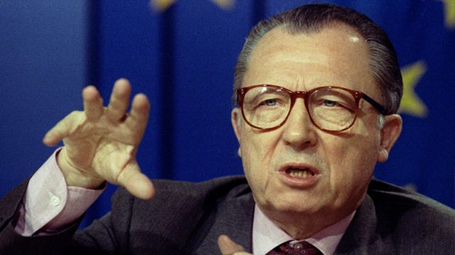
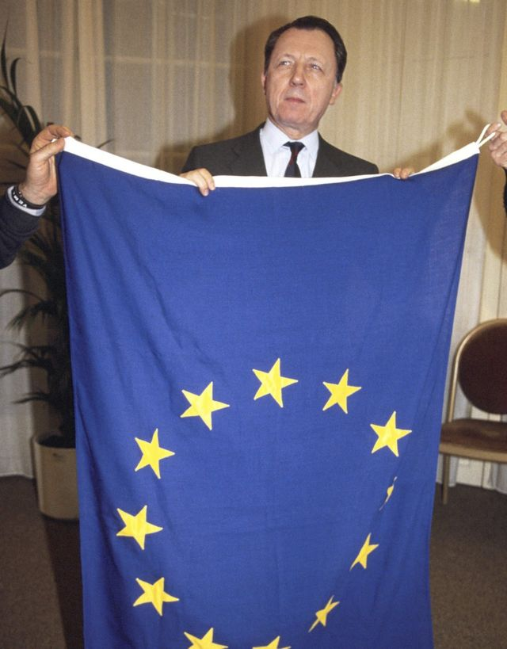
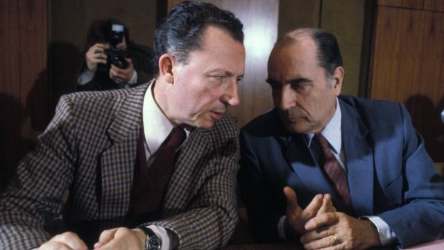
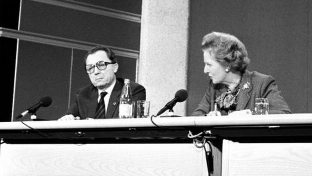
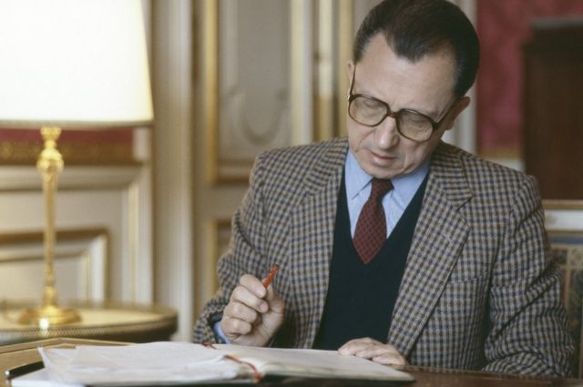
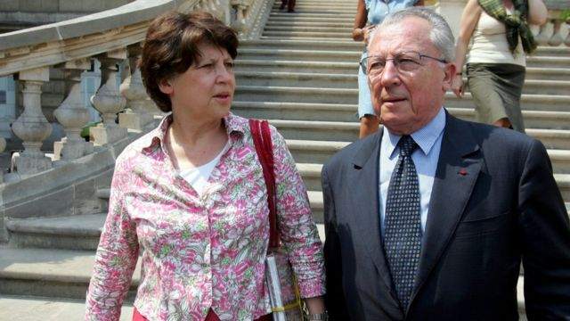

# [World] 雅克·德洛尔：面临激烈反对的欧洲整合之父

#  雅克·德洛尔：面临激烈反对的欧洲整合之父

> 图像来源，  Reuters

**现代欧盟的缔造者雅克·德洛尔（Jacques Delors）去世，享年98岁。**

他在1985年至1995年担任欧盟（前身为欧洲共同体）执行机构欧盟委员会主席，其间他是“一个更加紧密的联盟”（ever closer union）理念的教父，推动采用单一市场和创建欧元。

在英国，他的想法遭到了撒切尔夫人（Margaret Thatcher）、约翰·梅杰（John Major）和英国媒体的强烈反对。他们将其视为是现代版的查理大帝（Charlemagne），一心想在政治上联合欧洲。

他的长寿使其目睹了英国在2016年公投脱欧，完全脱离了他的欧洲计划。

##  坚定的社会主义者

雅克·吕西安·让·德洛尔（Jacques Lucien Jean Delors）于1925年7月20日出生在巴黎市中心的巴士底广场附近。

他的大家庭的政治观点从强烈的社会主义到共产主义不等。他的父亲是法兰西银行（Banque de France）的一名左翼社会主义者。由于在一战中身负重伤，他也是一名坚定的和平主义者。

由于二战爆发，年幼的雅克学业经常被打断，家庭也不断搬家。

德国入侵后不久，他进入斯特拉斯堡大学（University of Strasbourg）学习，但很快被占领军扣留。

由于担心纳粹会把他送到国外当苦力，他决定推迟自己的学生生涯。

> 图像来源，  Getty Images
>
> 图像加注文字，雅克·德洛尔是现代欧盟的缔造者。

1944年，德洛尔一家回到巴黎，不情愿的他在父亲的劝说下加入了法兰西银行。

他通过了该机构行政部门的考试，从此开始了他的金融生涯。

德洛尔和他的妻子玛丽（Marie）参与了在法国影响巨大的天主教工会运动。

他们都不认为宗教信仰应是加入这样一个组织的必要条件，因此他们主张将该组织建成一个更加世俗化的机构。

工会要求他与法国政府合作，促进雇主和工人之间的联系。1968年5月的动荡之后，部长们看中了他关于谈判和扩大合作的想法，邀请德洛尔加入他们的行列。

1969年，德洛尔被任命为保守党总理雅克·沙邦-戴尔马（Jacques Chaban-Delmas）的社会和文化事务首席顾问。

他于1971年加入社会党，但三年后，左翼的弗朗索瓦·密特朗（François Mitterrand）和保守派的瓦莱里·吉斯卡尔·德斯坦（Valéry Giscard d' Estaing）都邀请他加入。

据说，德洛尔喜欢被社会主义者视为右翼，而被戴高乐主义者视为左翼。

他在巴黎北郊的克利希市（Clichy）担任了两年市长。1979年，他被社会党列入欧洲议会首次直接选举的候选人名单。

德洛尔在名单上的排名很低，以至于他没有期望成功。但他凭借出人意料的好成绩获得了一个席位，随即被选为欧洲议会经济和货币事务委员会主席。

##  财政部长

1981年，密特朗在法国总统选举中获胜，成为法国政治的分水岭。

德洛尔无法抗拒加入第五共和国首个社会主义政府的召唤，他成为了财政部长。

他在任期间每天都在为控制公共债务和通货膨胀而战。他试图兑现密特朗的竞选承诺，但却因法郎疲软和持续的贬值威胁而受阻。

最终，他拒绝了密特朗提出的总理职位，转而选择了他真正想要的工作：欧盟委员会（前身为欧洲共同体委员会）主席。

> 图像来源，  Getty Images
>
> 图像加注文字，1981年，雅克·德洛尔与弗朗索瓦·密特朗总统。

在他对欧洲议会的首次演讲中，德洛尔坚持表示欧洲一体化不仅是一个政治概念，更是一种理想。他说，其存在的主要现实理由是保障整个欧洲大陆的和平。

在新领导人的领导下，当时的欧洲共同体面临着冷战结束、两德统一和前南斯拉夫战争等巨大挑战。

欧共体的成员国也在迅速扩大，葡萄牙、西班牙、奥地利、芬兰和瑞典都加入了该集团。

德洛尔于1985年上任，在布鲁塞尔的第一个四年任期内，他加快了建立一个没有货物、劳动力和投资流动障碍的欧洲单一市场的计划。

这一想法并不新鲜，它可以追溯到1957年的《罗马条约》（Treaty of Rome），但他对这一想法的不断倡导，加上欧洲经济复苏和重新谈判的预算框架，给这个被搁置的想法注入了新的活力。

> 图像来源，  Getty Images
>
> 图像加注文字，1986年德洛尔与撒切尔夫人同台。

##  无国界

由此产生的1987年《欧洲单一法案》（Single European Act）要求成员国在1993年之前取消内部贸易壁垒。

这确保了德洛尔连任主席。在此期间，他孜孜不倦地促成了《马斯特里赫特条约》（Maastricht Treaty）的签订，该条约创立了欧元和现代欧洲联盟。

他坚信，欧洲必须建立一个强大的经济联盟——一个无国界的市场——来与美国和日本竞争。

1988年，德洛尔预测，在十年内欧共体将为成员国做出80%的经济和社会决策。

他还决定，欧洲的单一市场不会像美国那样是一个不受约束的资本主义市场。

> 图像来源，  Getty Images
>
> 图像加注文字，德洛尔坚信，单一市场将具有强大的社会维度。

德洛尔认为，任何这样的市场都需要一个强大的社会维度和强有力的中央政府来保证。

欧洲大陆的许多人都接受了他的观点。但撒切尔夫人却认为这些想法是荒谬的。

她说：“一个统一的欧洲，在我有生之年永远不会出现，我希望永远不会。”

《太阳报》也加入了这场辩论，在其头版刊登了一个双指敬礼的图片，并配上了一个现在已成为传奇的标题：去你的，德洛尔！（Up Yours, Delors!）

##  妥协

1992年2月，德洛尔见证了《马斯特里赫特条约》的签署。

这并没有完成他建立一个完全一体化的欧洲的愿景。英国新任首相约翰·梅杰（John Major）通过谈判"退出"协议的社会维度，并且无意加入单一货币。

但德洛尔得到了一个松散的成员国联盟，并在十年内将其变成了一个远不止如此的联盟。

但另一方面，他不得不承认《马斯特里赫特条约》引发了希望进一步一体化的国家与不希望进一步一体化的国家之间的新一轮辩论。

梅杰争取条约获得批准的努力几乎摧毁了保守党。丹麦民众在全民公决中投了反对票，法国人说了“是"，但优势非常微弱。

1994年卸任后，德洛尔决定不再作为社会党候选人竞选法国总统。一些民意调查显示他有可能获胜，但经过几周的思考后，他拒绝了——他后来称这是他一生中最艰难的决定之一。

二十年后，他看着女儿玛蒂娜·奥布里（Martine Aubry）竞选总统，最终在社会党的提名中输给了弗朗索瓦·奥朗德（François Hollande）。她后来成为里尔市市长。

卸任后，他成为布鲁日欧洲学院（College of Europe）院长，继续影响着欧盟的发展。

> 图像来源，  Getty Images
>
> 图像加注文字，德洛尔和他的女儿玛蒂娜·奥布里。

2004年，他甚至似乎承认并非每个成员国都希望进一步联合。德洛尔说，随着欧元区的经济问题日益严重，他可以理解为什么英国拒绝加入欧洲单一货币。

“由于我们（欧盟）未能最大限度地发挥欧元的经济优势，”他承认，“人们可以理解英国人说的‘现在这样挺好。不加入欧元区并没有阻止我们的繁荣’。”

在2016年英国脱欧公投前夕，有传言称他希望英国脱欧，以便其他成员国加快一体化进程。

“我认为英国加入欧盟对英国和欧盟都是一个积极因素。"他坚称。

但几天后，英国以微弱优势投票决定退出欧盟，并寻求与邻国建立另一种关系。

人们将记住雅克·德洛尔，他是一位技术官僚，比大多数民选政治家更具影响力。

在欧盟的历史上，没有人比他更能根据自己的信念来塑造欧盟的发展。

德洛尔希望建立一个强大的组织，能够指导其成员国的政治和经济决策，以促进和平与团结。但他的愿景并未得到普遍认同。

