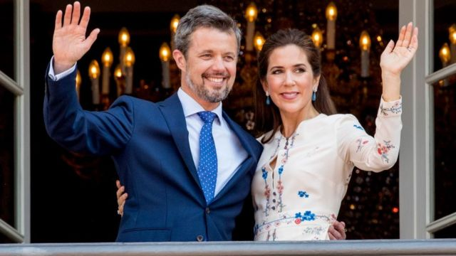
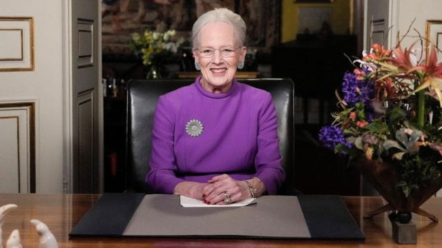
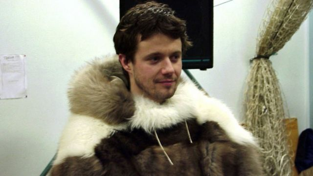
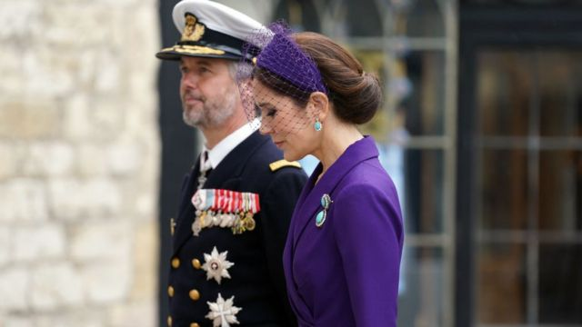

# [World] 从派对王子到国王 即将继位的丹麦王储弗雷德里克是谁

#  从派对王子到国王 即将继位的丹麦王储弗雷德里克是谁

> 图像来源，  Getty Images
>
> 图像加注文字，弗雷德里克王储伉俪在2018年的合照

**新年前夕，83岁的丹麦女王玛格丽特二世（Queen Margrethe II）宣布将于1月14日退位，消息在丹麦引起轰动。**

她至今在位52年，是世界上目前唯一的在位女王以及全欧洲在位时间最长的君主。

她在电视直播中宣布：“我将把王位交给儿子弗雷德里克王储（Crown Prince Frederik）。”

> 图像来源，  Reuters
>
> 图像加注文字，83岁的丹麦女王玛格丽特二世在新年致辞中宣布了这一决定。

这位下一任丹麦国王是谁呢？

1990年代初，弗雷德里克王储在丹麦被称派对王子，但1995年他从奥胡斯大学（Aarhus University）政治学硕士毕业后，人们开始改观。他是首位完成大学教育的丹麦王室成员。

求学期间，他曾以化名弗雷德里克-亨里克森（Frederik Henriksen）赴美国哈佛大学学习。

他曾在丹麦海军服役，绰号“Pingo”。据报道，这个绰号的由来是有一次他的潜水衣进水，要像企鹅一样蹒跚而行。

> 图像来源，  Getty Images
>
> 图像加注文字，弗雷德里克王储在2000年参加横跨格陵兰的滑雪探险。

现年55岁的他以敢于冒险著称，曾在2000年参加为期四个月、横跨格陵兰的滑雪探险，过程中因雪橇和滑板车事故住院。

他曾说“我不想把自己关在堡垒，我想做自己，做一个人”，并指即使登上王位也会坚持这一点。

弗雷德里克王储与英国国王查尔斯三世一样，热衷环保，他誓言要为丹麦的未来“引航”。

他的妻子玛丽公主（Princess Mary）在澳洲的塔斯马尼亚长大，律师出身，两人2000年奥运会期间在悉尼一家酒吧邂逅。

她曾在受访时说，二人相遇时她并不知道对方是丹麦王子： “（相遇）半小时后，有人走过来对我说，‘你知道这些人是谁吗？’”

> 图像来源，  Getty Images
>
> 图像加注文字，弗雷德里克王储伉俪去年5月出席英国查尔斯三世国王加冕典礼。

婚后，他们送四名子女就读公立学校，尽可能让他们如一般人地成长，外界认为这个王室家庭展现了现代价值观。

有别于英国王室传统，弗雷德里克王储不会举行正式的加冕典礼。他的登基将于1月14日当天在哥本哈根的阿马林堡宫（Amalienborg Castle）宣布。

丹麦是君主立宪制国家，他登基后将成为丹麦国王兼国家元首，同时也是格陵兰和法罗群岛的国家元首。

玛格丽特二世女王是世界上唯一在位的女王，也是欧洲在位时间最长的现任君主，她在父亲弗雷德里克九世国王于1972年去世后即位。

她透露，自己在2023年初接受背部手术后决定退位，“手术自然会引发对未来的思考——是否到了把责任交给下一代的时候。”

她说“我决定现在就是合适的时机”，并感谢丹麦人民多年来的支持。

