# [World] 台湾大选2024：夹在中国大陆与台湾之间，“冷战前线”金门的年轻人深感无力

#  台湾大选2024：夹在中国大陆与台湾之间，“冷战前线”金门的年轻人深感无力

  * 常思颖 
  * BBC中文，金门报道 

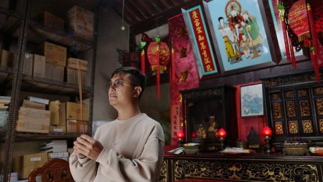

> 图像来源，  Lok Lee/BBC Chinese
>
> 图像加注文字，36岁的汪松威出身于金门世家，他的祖先在清朝落户于金门。

**台湾金门距离中国大陆不到10公里，与厦门隔海相望。冷战期间，金门是两岸对峙的前沿阵地；在当前美国和中国两个大国对抗加剧之时，两岸关系剑拔弩张，给金门笼罩了一层紧张的气氛，也让当地居民感到无助。**

“金门之于中台，就像台湾之于中美，所有政策的决定权都不在自己手中。就像两只大象在吵架，我们是下面的小蚂蚁，” 金门县议员董森堡说。

在这种情况下，台湾大选到来，金门也经历着代际更替。不少年轻人对未来表示担忧，他们尝试改变。但金门传统的社会制度、长期泛蓝的政治倾向，以及根深蒂固的宗亲阶级，让许多人深感无力。

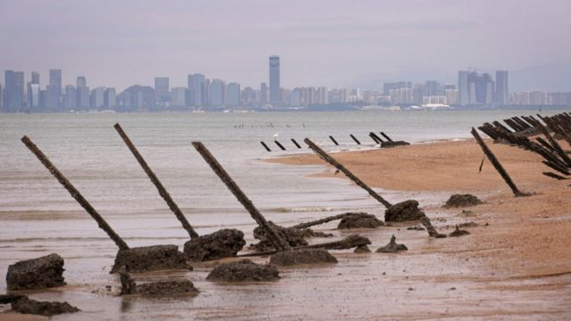

> 图像来源，  Getty Images
>
> 图像加注文字，金门海边的轨条砦，尖端指向中国大陆，在两岸对峙时期用于防御敌船靠岸登陆。

##  战争的阴影

陈淑亭在金门出生，两岁时随家人搬到台北。37岁的她从未经历过战争，但每当想起姑姑的讲述，她的眼里还是泛起泪光。

那是1958年“八二三炮战”期间，原本说好了“单打双不打”（大陆逢单日炮击，双日不炮击），但不知为何，适逢双日的一天，金门响起炮声。她的姑姑们从家里跑出来，躲进村里的防空洞里。但陈淑亭的奶奶还留在院子里，怀里抱着年幼的儿子——也就是陈淑亭的爸爸。突然，奶奶被弹片击中，受伤倒地。

“我姑姑说，那天晚上一直听到她妈妈的声音在叫她的儿子”，陈淑亭说。“当时重男轻女的观念比较严重，奶奶说她好不容易生了个儿子，还没把他抚养长大就这样走了，一直在哭。” 陈淑亭的奶奶在中弹当天过世。

陈淑亭出身金门世家，他的曾祖父在当地开设瓦窑厂，家族曾经富甲一方，村庄里一半人为陈家打工。到了爷爷、奶奶那一辈，国共对峙开始，国军征用陈家工厂做军事设施。后来奶奶中弹身亡，爷爷每天酗酒，从此家道中落。

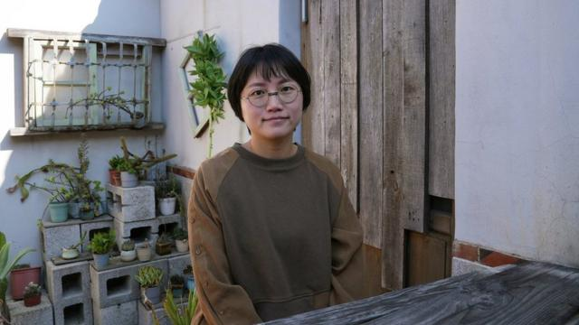

> 图像来源，  Lok Lee/BBC Chinese
>
> 图像加注文字，陈淑亭在金门出生，到台北上大学，后来回到金门经营民宿。

陈淑亭对战争的记忆也是许多祖祖辈辈居住在金门的人的共同回忆。1949年后，国民党退守台湾。往后数十年中，金门经历过多次重大的军事对峙，其中规模最大的便是1958年的“八二三炮战”。据历史记载，那次炮击战造成100多人死亡，300多人受伤，7000多栋建筑物遭到损坏，其中大部分是民房。

开车行驶在金门的街道，许多十字路口都设置有环岛。有些环岛建有英雄纪念碑，旁边写着 “自力更生、独立作战”“把意志变为力量”这类标语。有些则保留了过去的军事堡垒，下方还能看到火炮射击口。这是过去阿兵哥放哨的地方，军事管控期间，居民如果没有通行证，就无法在夜间宵禁时通过这些路口，就算是生病、临产这么要紧的事情也会不被放行。

这些环岛提醒着人们，金门走过的战争历史。

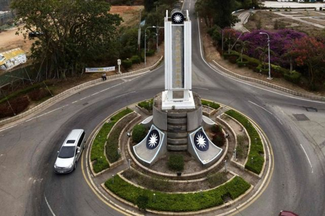

> 图像来源，  Getty Images
>
> 图像加注文字，金门许多十字路口都设有环岛，提醒着人们这里曾有的战争记忆。

目前许多军事设施已经变成观光场所，居民过着和平、宁静的生活，然而在他们的内心深处，对战争的担忧从未消散。

“在台北的时候感受不到，可是在金门，我们真的会担心”，陈淑亭说。她高中毕业后去台北读大学，后来留下工作，九年前返回金门，目前经营民宿。

北京长期认为台湾是中国领土的一部分，不排除使用武力“统一台湾”。近年来，随着中国与美国的关系趋紧，解放军在台湾周边的演习也愈演愈烈。

“就算大家都说，如果中共真的要打来，不需要对金门动武，直接占领就好，但问题是，之后金门的管理权（管制模式）怎么办？”陈淑亭说。

##  中华民国人？台湾人？还是金门人？

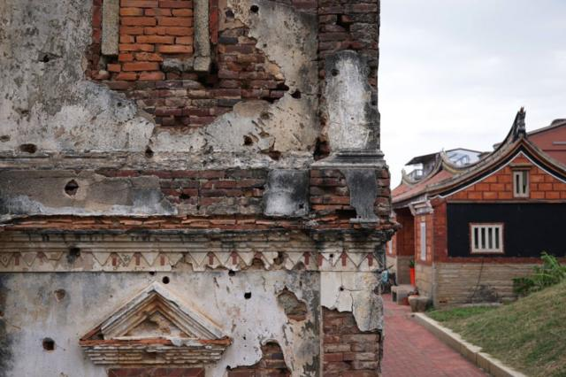

> 图像来源，  Getty Images
>
> 图像加注文字，金门的一些古厝仍然留有过去炮战时的痕迹。

她的这一质问牵出长期以来金门独有的历史遗留问题。国共分治后，中华民国的实际管辖权仅剩下了台、澎、金、马四个群岛。在政府框架中，金门与马祖归属于中华民国福建省；台湾和澎湖则属于中华民国台湾省，延续至今。

凡是在金门出生的人，身份证上的户籍所在地都写着：福建省金门县。每当被问到自己是哪里人，许多人都觉得相当无奈。

“我觉得自己一半是台湾人，一半是金门人 **”** ，陈淑亭说。她在台北和金门生活过同样的时间，基于此做出这样的回答。

陈淑亭的原籍在福建泉州，父辈很大程度上认可自己是中华民国人。爸爸作为祖父家里唯一的男性，继承了家业，并且很早就开始在厦门投资房产，支持“两岸一家亲”的论述。

与父辈不同，陈淑亭对中国大陆没有情感认同。她说， 在家里很少与上一辈交流政治议题的看法。 “交流会吵架，尽量不要讲这一块，听听就好。”

> 图像来源，  Lok Lee/BBC Chinese
>
> 图像加注文字，琼林村拥有金门最大规模的民防坑道，被称为“战斗村”。

陈淑亭的经历代表了金门年轻人的普遍成长轨迹——在金门出生、长大，到台湾岛上大学，后来回到家乡定居。这些年轻人接受了台湾的本土教育，习惯了自由民主的社会制度；与此同时，也对家乡金门抱有浓厚的情感认同。

回乡后，陈淑亭翻阅古书，挖掘村落的历史，试图寻找过去家族瓦窑厂留下的痕迹。她在一本书中找到了一些记载，找到当初设厂的位置，希望收集一些砖头、瓦片，做成文创物品。

只可惜，一片砖头都没有留下。

对于陈淑亭来说，对岸的厦门不过是个“被都市化的城市”。虽然高楼大厦不断涌现，但“街道还是脏脏的，居民的素质也提升不上来”。她每次过去，也不过是当做旅游一样，吃吃逛逛，住一晚就回来了。

在一定程度上，金门年轻人与老一辈之间的代际差异，也从过去大选投票的结果中折射出来。

金门长期是国民党的铁票仓，但在过去两届总统选举中，民进党在金门的支持率均大幅上升。2020 年举行的上届总统选举中，民进党的蔡英文赢得了金门约 22% 的选票，比该党在 2012 年的得票率高出近三倍。而国民党2020年赢得了 75% 的选票，也明显低于该党在前三届中的战绩（分别为 89%、95% 和 94%）。

在今年的总统大选中，陈淑亭依然是民进党支持者。

##  “我的根在这里”

在金门土生土长的39岁吴伟国上一届大选中也投给了民进党的蔡英文，但他今年决定不投票，或者投废票。

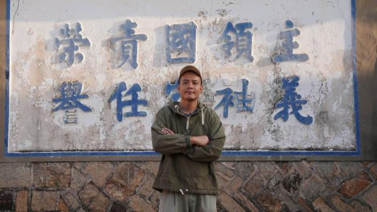

> 图像来源，  Lok Lee/BBC Chinese
>
> 图像加注文字，39岁吴伟国曾在台湾岛当软体工程师，5年前回到家乡金门。

“我没有放弃投票的权力，而是选择用自己的方式来表达，这些人我都不喜欢”，他。

一方面，选择支持民进党可能陷入自相矛盾的困境。一边是生养他的土地，祖辈父辈曾在这里耕耘；另一边是新的观念和生活方式下的新朋友。他希望两边能够对话、交流。

本次大选中，民进党候选人赖清德的政治光谱偏深绿，被认为有更强烈的台湾意识和独立立场，对金门和马祖两个外岛价值的认同也偏向模糊。吴伟国对投票给赖清德表示疑虑，认为他在规划台湾的未来时并没有把金门和马祖包含进去。

另一方面，他也不认为两岸能够做到“一家亲”。他对对岸厦门的情感与老一辈有所不同。

“（到了对岸）我平常习惯用的社群完全不能用，除了透过VPN，” 吴伟国说，“不能用脸书，我不能用Instagram，不能用Line，这些是我平常生活习惯的一切。”

吴伟国在金门读完高中后就去了台湾本岛的基隆读大学，毕业后成为一名软体工程师，一晃就是七年。在这期间，工作、生活虽然顺风顺水，但他一直觉得心里不踏实。

“我一直觉得，我的家在海的另一边金门，我的根在这里，如果不回来看看，可能以后就不会回来了。”2018年，他放弃了在专业方面的多年积累，回到金门定居，目前也在经营民宿。

##  打破固有印象

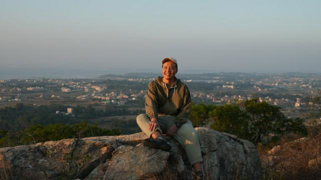

> 图像来源，  Lok Lee/BBC Chinese
>
> 图像加注文字，吴伟国常带游客爬山，他希望向更多人展示金门多样化的生活方式。

吴伟国还记得，七岁那年，他偷拿了家里的相机，沿着一条小路走到海边拍照。一位军人向他吹哨警告，并把相机拿走，抽走了里边的底片。

那时金门正在经历战地政务时期（1956年至1992年），居民生活受到严格的军事管控。金门与世界其他地方的联系中断，岛上实施宵禁、灯火管制，居民禁止持有篮球、排球、救生圈等漂浮物，以防有人逃到对岸。在那期间，金门的驻军大幅增加，岛上的经济主要为军事需求服务，无法进行工业发展。

而远观台湾岛，自1987年解除戒严以后，资产去国有化并产生了大量民营企业，经济迅速腾飞。不仅如此，台湾岛的政治也开始多元化发展，在1996年举行了第一次总统直选，随后本土势力兴起。

这样的历史变迁造就了金门和台湾岛之间的差异，令许多老一辈金门人并不认同自己是台湾人，而在台湾岛成长起来的年轻人中，本土意识越来越强。

吴伟国希望将台湾岛和金门两地之间的联系建立起来，通过展示多元化的金门生活，打破固有的印象。

“我希望能够在闽南古厝这种传统建筑里边呈现一个分享故事的空间，分享给金门本地人，或者从（台湾）本岛来的游客”，吴伟国说。他将自己的民宿空间开放出来，举办各类讲座和兴趣小组。曾涉及到的主题包括无核战争、西班牙油画修复、滑雪等等。

“分享故事的同时，其实就是在建立我们之间的连接，如果这个连接能够越建越深，我们就不会那么容易分开。”

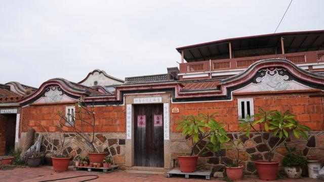

> 图像来源，  Lok Lee/BBC Chinese
>
> 图像加注文字，在金门琼林村，坐落着许多闽南式风格的古厝。

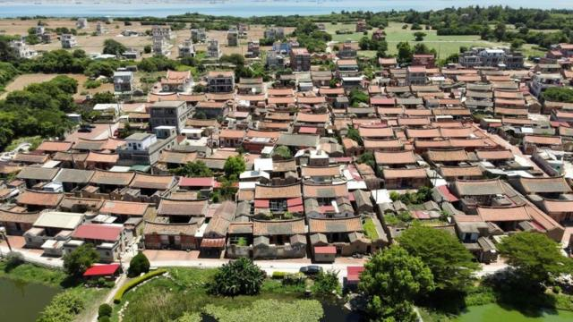

> 图像来源，  Getty Images
>
> 图像加注文字，金门古宁头的传统风格建筑群。

##  由国民党转为支持民众党

金门长期泛蓝，然而即便是在国民党铁票仓的家庭，年轻一代与老一代的不同观念也在带来改变。

在金门镇闹市区有一间文具店，四周环绕着混凝土铸成的现代式住宅小楼，外表看起来很普通。然而走到货仓背后，会发现这是一座古厝改造成的建筑。中庭是小型四合院，正对着的，是摆满祖先牌位的祭祖屋，屋内两旁放着四张厚重的太师椅。

这里是“汪寓”，一个典型的世家大院。汪氏祖先自清朝就落户于此。

36岁的汪松威是汪氏家族年轻的一代。他的祖父辈靠文具生意起家，在国民党退守台湾后与军队建立了良好的合作关系。

“那时候我们家的生意遍及到金门，只要是有驻军的地方，都需要大量的文书，他们都会来我们家拿，或者请我们家送”，汪松威说。

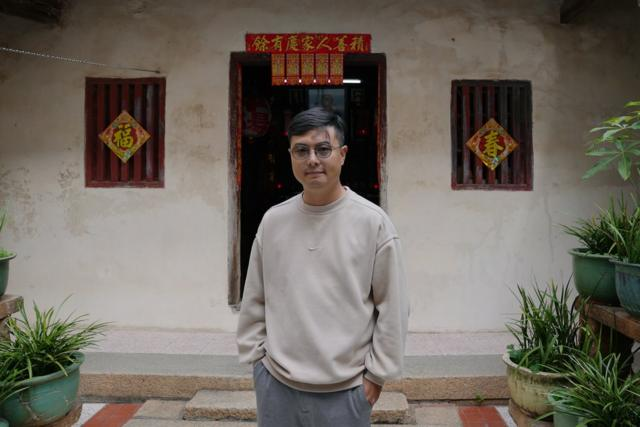

> 图像来源，  Lok Lee/BBC Chinese
>
> 图像加注文字，36岁的汪松威出身金门世家，他对中华文化有着很深的情感认同。

他的外公是国军，随国民党一起撤退到台湾，妈妈在眷村出生、长大。

这样的家庭背景让汪松威从小就对中国大陆产生了极高的情感认同。他在台北出生、长大，10年前回到家乡金门。

他回乡后加入了国民党的竞选团队，但今年大选期间，他改为支持民众党，为总统候选人柯文哲和该党在金门的立委候选人助选。

“老一辈人的思想状态比较偏向于传统的中华文化，而我们这一代比较多元，”汪松威说，“这种转变并不意味着，我完全认可民众党的意识形态，而是我讨厌另一个，我想换一个方向、换一种新的认同，也许是可以的。”

“我思考的是具体的政策，在实质上是不是对我们有帮助。”

在金门这个靠近大陆却遥望台湾岛的地方，实质的政策支持对居民来说尤其重要。比如在经济上，与台湾岛做生意的成本和复杂性远远超过与厦门直接通商。在医疗上，金门只有一家医院，对于人口年龄偏大的金门来说，长远来看弊大于利。就连每日的垃圾处理，也需要垃圾车连夜送往台湾岛。

汪松威认为，柯文哲倡议的金厦大桥（连接金门与厦门的大桥）能够在现实层面上解决这些问题。“他很清楚的知道，金门的发展不可能仰赖台湾，因为带动不起来，所以需要跟大陆接轨，而跟大陆接轨最实际的就是建立一条桥。”

##  对中国大陆心生警觉

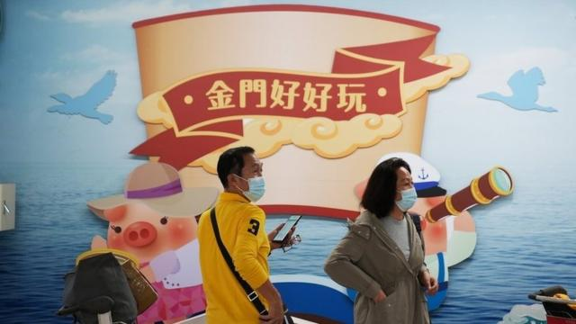

> 图像来源，  Lok Lee/BBC Chinese
>
> 图像加注文字，在金门水头码头的出入境大厅，乘客经由“小三通”在金门与厦门之间往返。

不过，汪松威的转变并不意味着他希望到大陆定居，他甚至对大陆存有一定的警惕。

“大家对于两岸局势的不稳定性，尤其是大陆方面的管控时松时紧，多少还是有点害怕”，他说。疫情前，他和许多朋友还时常往来厦门，把钱存在大陆的银行，但疫情期间，看到大陆的严格管控，一些人变得犹豫不决。

今年9月，中国国务院颁布最新举措，推动建设“两岸融合发展示范区”。其中提出金门与厦门之间融合发展，包括加快两地通电、通气、通桥，以及支持金门共用厦门的新机场。

但对于汪松威来说，吸引他的是大陆广阔的市场空间，而不是政策。“听上去这么好的政策吸引人去了以后，到底最后可能遇到什么事情，会不会血本无归，或者说最后又是一场空？”

他曾从事两岸民间交流方面的工作，但突然的停航导致业务中断。

金门与厦门之间的“小三通”在疫情期间停航三年，今年年初重开。但大陆方面还没有完全开放对台旅行限制，乘客主要是台湾人。12月底的水门码头显得有点冷清，与此前每年约有一百万中国游客去金门的状况相去甚远。

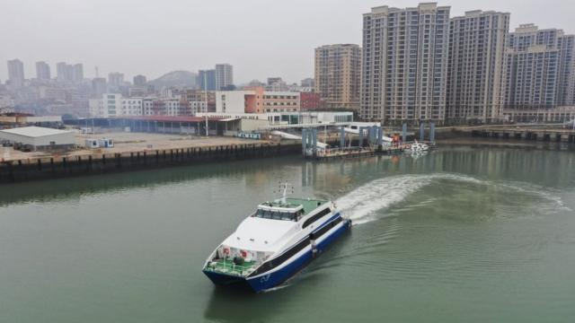

> 图像来源，  Getty Images
>
> 图像加注文字，中国大陆与金门之间的“小三通”在疫情期间停航三年，今年2月恢复。

##  “无力感越来越强”

“如果只想依靠小三通的话，根本不可行，我们不能把鸡蛋全部放在中国大陆那里”，陈淑亭说。

陈淑亭大学毕业后在台北从事服装生意，光鲜亮丽的生活外表下隐藏着疲倦。此时，金门家乡对她来说赋予了另一层意义——一个自然风光极好，有着丰富野生动物资源的地方。她尝试通过推广金门的自然资源来吸引台湾本岛以及国际上的游客。

一年前，她加入金湖镇民代表选举，希望通过参政改变金门固有的社会形态。她提出保育历史建筑、环境永续等议题。不过最终败选。

金门岛的面积不小，约150平方公里，是香港岛面积的两倍。但这里人际关系紧密，家家户户似乎都彼此认识，每当提到对方，都能将其家底道出个一二。这里宗族势力雄厚，几个大姓家族成立由单一姓氏组成的族亲法人组织宗亲会，对选举的影响深远。

陈淑亭所在的陈氏也是其中金门一大姓，她的家族在其乡镇有一定的知名度，这为她传承到一些家族选票。不过，年轻的从政者似乎很难获得信任。她去年曾多次到每个乡镇、村庄拜票，但效果并不明显。

“大家还是喜欢直接拿利益”，陈淑亭说，“我在选举的时候就有人说，怎么不叫你爸爸帮你处理（贿赂）200票呢？但我就是坚持走自己的路。”

金门县议员董森堡说，在金门，长期关心公共事务的年轻人人大概有两、三千人，但当地传统的社会制度，宗亲阶级制度，以及贿选风气都在影响年轻人参与公共政策的意愿。

另外，传统的男尊女卑的思想在金门根深蒂固。过去女性不允许进祠堂，不能参加祭祖典礼，甚至在有些地方，女性在吃饭时要等男性吃完后再上桌。近年来状况有所改善，但在人口年龄偏大的金门，这一风气带来的影响始终存在。

“在这边待得越久，无力感就越强烈”，陈淑亭说。

更重要的是，她现在有了小孩。为了让下一代拥有更广阔的发展空间，她们一家正在思考离开金门。

“我跟我先生都觉得，金门在二、三十年后一定会发生战争，或者面临中共用任何方式接收的命运，我们都担心那一天到来。”

点击以访问

##  候選人對您的承諾是什麼？

選擇您感興趣的主題

基本信息  兩岸  經濟  教育  社會福利  科技創新  性別  醫療

##  基本信息

展開所有  摺疊所有

###  柯文哲 & 吳欣盈

**柯文哲 (64歲)**

學歷： 台灣大學醫學博士

重要經歷： 台大醫學院醫師及教授、台北市市長

**吳欣盈 (45歲)**

學歷： 美國衛斯理學院國際關係及藝術史學士、 英國科陶德藝術學院碩士

重要經歷： 台灣新光人壽慈善基金會執行長、 新光人壽保險公司副總經理、世界經濟論壇全球青年領袖、立法委員

###  賴清德 & 蕭美琴

**賴清德 (64歲)**

學歷： 台灣大學復健學系 、成功大學醫學系、 哈佛大學公共衛生學系碩士

重要經歷： 醫師、立法委員、台南市長、行政院院長、副總統

**蕭美琴 (52歲)**

學歷： 美國歐柏林學院東亞系學士、哥倫比亞大學政治學碩士

重要經歷：陸委員會諮詢委員、民進黨國際事務部主任、 立法委員、台灣駐美代表

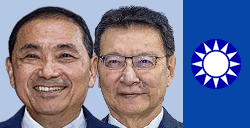

###  侯友宜 & 趙少康

**侯友宜 (66歲)**

學歷： 台灣中央警察大學法學博士

重要經歷： 刑事局局長、桃園縣政府警察局局長、 內政部警政署署長、新北市長

**趙少康 (73歲)**

學歷： 台灣大學機械學系、美國克萊門森大學攻讀機械工程碩士

重要經歷： 台北市議員、 環保署署長 、立法委員、飛碟電台台長、 中廣公司董事長

##  兩岸

展開所有  摺疊所有

###  柯文哲 & 吳欣盈

  * 五個「互相」：互相認識、瞭解、尊重、合作、諒解。 
  * 威懾（deterrence）和交流：台灣要有足夠的防衛能力，願同中國溝通，減少戰爭風險。 
  * 在國民兩黨截然不同的中國政策中，找到一個平衡點：與美國及中國保持等距關係。 
  * 尊重兩岸過去已經簽署的協議和互動的歷史。 
  * 台灣自主、兩岸和平：確保台灣人保有現有的民主自由政治體制和生活方式之下與大陸交流、對話。 
  * 解決兩岸民眾在經商、學習和生活的實際需求。 

###  賴清德 & 蕭美琴

  * 維繫台海和平的四大支柱，並加強臺灣防衛能力，兩岸問題為「維持現狀」等。 
  * 四大支柱：第一，強化國防威懾力；第二，經濟獨立，減低對中國貿易的依賴；第三，與全球民主國家建立伙伴關系；第四，穩定且保持原則的兩岸領導力。 
  * 兩岸維持現狀，符合台灣利益，但也主張在對等、尊嚴、有助兩岸和平與人民福祉的前提下，進行各方面的合作交流。 
  * 強化經濟的韌性及產業安全，在新的供應鏈上站穩位置擴大優勢。 
  * 跟民主陣營肩並肩發揮力量，讓極權主義者不至於誤判，然後輕舉妄動。 
  * 中國籍在台學生，若學籍超過六個月並完成註冊，視同外籍生納入台灣健保。 
  * ECFA早收清單僅占台灣出口3%，中國想用經貿的手段干預台灣大選，ECFA要不要繼續，問題不在台灣是在中國。 

###  侯友宜 & 趙少康

  * 堅守台灣民主自由，持續強化國防軍備，加強兩岸交流，降低兩岸衝突。 
  * 接受合乎《中華民國憲法》的「九二共識」，反對「一國兩制」下的「九二共識」。 
  * 主張「維持現狀」，也要反對「台獨」、反對「一國兩制」，並加強台灣自我防衛能力。 
  * 並稱若當選將快速重啟服貿並廣邀陸生來台就業。 
  * 台灣立國根本大法就是《中華民國憲法》，清楚表明兩岸之間互不承認主權、互不否認治權，台灣的命運是台灣兩千三百萬人決定，目前好好的用這個基礎就可以談。 
  * 所有「共識」都在憲法還有《兩岸人民關係條例》來講。 

##  經濟

展開所有  摺疊所有

###  柯文哲 & 吳欣盈

  * 提出制定《經濟安全保障法》，主要針對「重要物資的穩定供給」、「確保核心基礎建設穩定提供服務」、「開發與保護尖端重要技術」、「防止與國家經濟安全相關之專利外流」。 
  * 成立「經濟安全保障會議」，由政務委員運作，決策重要物資穩定供給、補貼、貸款，有的政府需要去購買、囤積。 
  * 光電、風電應按照正常程序發展，等到再生能源追上發電占比後才關掉核電；另一方面，核二、核三一定要延役，核四是否要蓋則要先體檢。 
  * 主張，台灣參加區域全面經濟夥伴協定（RCEP），並勇敢跟中國談判，「兩岸關係如果和緩，有機會談」。 
  * 兩岸協議監督條例先通過後，再討論貨貿，最後才是服貿。 
  * 贊成開放外勞，啟動壯世代計畫，「讓長者重新回到勞動市場」以及精進自動化技術，讓人機協作以減少依賴人力。 
  * 透過稅制減免措施，獎勵幫員工加薪的企業，並投資高等教育，鼓勵企業提供在職進修制度。 

###  賴清德 & 蕭美琴

  * 持續推動與美、日、歐等理念相近國家簽署雙邊及多邊經貿協定，推動加入CPTPP（跨太平洋夥伴全面進步協定）、IPEF（印太經濟框架），並持續深化新南向政策。 
  * 打造亞洲資產管理中心： 精進台灣的金融規章，並透過公私協力，提供更多元的商品，讓台灣成為亞洲資產管理的中心。 
  * 推動亞洲金融科技創新中心： 積極培育金融數位人才，提升軟硬體基礎設施，協助金融業數位轉型，並完善金融資安防護。 
  * 支持中小企業發展，提供 8 成以上的就業機會，與金融界攜手，共同促進中小企業的綠色轉型和包容成長。 
  * 經濟成長率至少3.5%以上。 
  * 立足台灣、布局全球及行銷全世界。 將透過國際合作，於印太地區設置產業園區，鎖定歐洲、美國、日本及東南亞設立「海外創業中心」分據點，提供海外市場落地服務，協助廠商分散供應鏈與市場風險，強化經濟韌性。 
  * 將打造「創新創業雨林生態系」，目標在5年內創造2萬個新創就業，讓新創投資金額每年達到1500億新台幣，10年內台灣將成為創新解決方案的淨輸出國。 

###  侯友宜 & 趙少康

  * 解決兩岸經濟合作架構協議（ECFA）議題，並在對等、尊嚴與友善下立刻重啟兩岸對話交流。 
  * 面對中國大陸一定採取開放政策，大量開放中國籍遊客及學生來台。中生亦有機會在台灣就業。 
  * 侯友宜則宣示，在任期四年內加入CPTPP。 
  * 鼓勵上市櫃公司提撥稅後盈餘為員工加薪、若公司提撥稅後盈餘為員工加薪比例超過百分之一，超過的部分，扣抵當年營利所得額，可提高至150%。 
  * 逐步調高基本薪資至33000元、低薪上班族所得稅減半。 
  * 促進薪資提升、減輕青年負擔，落實照顧青年。 
  * 開徵富人稅，綜合所得淨額在一千萬元以上，且薪資所得不到三成者，開徵所得稅45 %。 

##  教育

展開所有  摺疊所有

###  柯文哲 & 吳欣盈

  * 班導師要有基本訓練、學校建立輔導老師系統，若輔導老師認為學生有問題，再轉到聯合醫院系統的精神科醫生。 
  * 13年一貫，義務教育向下延伸到5歲。並修法讓高中職納入「準義務教育」，優先從偏鄉地區學校、澎湖及金馬地區試辦。 
  * 簡化學習歷程，取消「修課紀錄」上傳中央資料庫，每學年上傳的「學習成果」從至多6件改為至多3件，並同步減少上傳時間和件數。 
  * 免費提供雙語教材，弭平城鄉資源落差。分科測驗採納國文，英文從2026年上路。 
  * 雙語師資公費培育，包含公費生，縣市聯合或學校自辦教師甄選。 

###  賴清德 & 蕭美琴

  * 0-6歲，推動使用公共托育者補助至每個月7千元，延長送托服務時間，公共幼兒園寒暑假都提供服務。 
  * 6-18歲：落實高中職免學費，特殊教育投資擴大，研擬「身心適應假期」，推動高中職社區化。 
  * 18-22歲：經濟弱勢的私立大專學生，學雜費減免而度最高可達55000元，並每年定額補助私立大專校院學生35000萬元學雜費。 
  * 公立大專經濟弱勢學生減免額度最高可達20000元。 
  * 設立百億圓夢基金：讓台灣年輕學生與國際接觸。並持續穩健推動雙語教育，落實友善的英語學習環境等。 
  * 積極防制校園霸凌，增加校園性平觀念宣導。培養學生數位公民素養。 

###  侯友宜 & 趙少康

  * 召開國是會議，全面檢討108課綱。 
  * 提高教育經費編列下限1%。 
  * 偏遠地區師資採「務實彈性，當聘則聘」。讓在偏遠地區服務多年的優良代理教師，公費進修取得合格教師證後，回任該校成為正式教師。 
  * 公立國小課後照顧免費，延長到晚上七時，寒暑假開班。 
  * 定而補助5歲幼兒就讀私立幼兒園10000元，再加上10000元育兒津貼。 
  * 定額補助私立大學學生學雜費，增加到50000元。 
  * 研擬放寬境外生來台限制。 
  * 學生學貸免繳本息寬限期延長至畢業後2年。 

##  社會福利

展開所有  摺疊所有

###  柯文哲 & 吳欣盈

  * 成立「人口委員會」，由一個政務委員負責跨部會協調，解決「少子化」兩個問題。 
  * 長照預算從600億提高到2300億，財源充足服務到位。並成立中央長照保險局，專人專門負責。 
  * 「住宿型長照機構補助」從10,000元提高到30,000元，確實減輕長照家庭負擔。 
  * 聘請外籍看護工者也可享有基本長照保險照顧，享有居家服務、夜間照顧、家庭托顧等服務，保障更全面。 
  * 提供父母「延托」及「假日多元托育」及「臨托」的服務。 
  * 提供低利貸款給首購的育兒家庭，並且增加育兒家庭抽籤機率的優先補助。 
  * 獎勵開發者運營銀髮出租住宅，政府承諾福利體系與包租代管介入，合作建構 「青銀換居」整合服務。 
  * 中央釋出，並由地方政府出資整修閒置和老舊房舍，取得相當使用年限，開放青年、弱勢和銀髮族群申請租用。 

###  賴清德 & 蕭美琴

  * 擴大居家式長期照顧服務，並另闢財源，提供到宅服務，鼓勵或獎勵長照服務的營運者可以到偏鄉設點。住宿式服務機構使用者補助方案，未來將持續提高至每月最高1萬5000元，1年最高18萬元。 
  * 新增居家或社區的晚間到宅照顧與夜間緊急服務、建立24小時的重度失能者的支持服務；盤點公有土地，由政府興辦機構，提供更多公共化的住宿服務。 
  * 協助地方政府建立單一窗口服務，進行整合各項補助措施包含強化就學、交通補助，確保兒少不同生活階段都能獲得基本的經濟保證。 
  * 保障特殊境遇兒少權益，適當延長替代性的照顧，對依法安置之特殊兒少，依個案需求，給予延長安置的年限。 
  * 強化身心障礙者的社區支持，改善各項公眾使用措施、交通運輸、日常生活等生活環境，以及金融公眾資訊、通訊等服務的友善性便利性。 
  * 建構友善自主的高齡生活環境：推動高齡者服務據點，協助提升高齡者的資訊能力，任內促進65歲以上民眾個人上網率由現在的50.6%能夠提高到65%。 

###  侯友宜 & 趙少康

  * 0至6歲國家養：公托、公幼、準公共化幼兒園一律免月費，私幼、私托則補助每人每月1萬元。 
  * 青年購屋低利貸款從 1000 萬提高至 1200 萬，有生小孩的家庭有補助。 
  * 獎勵民間投入社會住宅，以「容積獎勵」促進都更、危老，並回饋為社會住宅。 
  * 大專私校退場土地，以一定比例優先興建社會住宅與運動中心。 
  * 80歲以上取消巴氏量表，長者可直接申請看護移工。看護移工與長照體系整合，強化移工照護技能與品質，提升高齡長者照護品質，改善健康。 
  * 65歲以上長輩以及55歲至64歲原住民長者，享有排富全額補助健保。 
  * 就業安定基金補助雇主聘用本國看護，提升薪資及工作環境，減輕家屬負擔。 
  * 減輕家庭照顧者的壓力與負擔，讓婦女重回職場，不必再為照顧家中長者而擔憂。 

##  科技創新

展開所有  摺疊所有

###  柯文哲 & 吳欣盈

  * 打造Chatgpt農業資料庫、農業大數據資料庫及全國農地資料庫，打造AI對話產官學科技平台，建立完整產銷履歷，並透過AI與自動化健全產業體質。 
  * 國際資金匯集、台灣新創產業發展、高級人才培養。初期從國際引進高階人才，也培養台灣的本土人才。 
  * 產業轉型，從代工產業轉成創新高附加價值產業為主。 
  * 匯集國際基金、新創產業發展，以色列的「資本投資獎勵法」為標竿：其有提供固定資產、薪資的補助，以及鼓勵外銷跟租稅減免，特別針對創新產業成立部門，主導國內外的新創產業連結及輔導。 
  * 「天使投資法」，如新創公司在前4年，研發部門佔到70%以上，會給予特別的租稅待遇。 
  * 主張核一及核三延役，並對核四進行重啟安全體檢，以穩定電力為目標，再發展綠電。 
  * 建立農業碳匯平台邁向低碳永續，透過碳盤查改變農村建築與種植模式，邁向更健全的農業環境。 

###  賴清德 & 蕭美琴

  * 啟動第二次能源轉型，建構智慧共享：電力去碳化，發展多元綠能及深度節能。 
  * 成立淨零創新科技平台，建構智慧能源，多元減碳。 
  * 「國家希望工程」：大膽投資下一代的科技創新，包含人工智慧、物聯網、AR、VR、量子電腦、低軌道衛星等太空科技都。 
  * 人工智慧在台灣產業化：未來將在印太地區成立產業園區，並在日本、美國、歐洲以及印太等地，設立海外創業中心，提供金融、法制等協助，讓台灣企業全球布局。 
  * 「前瞻科技研發平台」，布局下一代前瞻科技，包括半導體、資安、量子電腦、太空科技、次世代（低軌）通訊、人工智慧、精準健康及腦科學等下世代科技。 
  * 「推動金融創新與發展」：法令鬆綁以及建置新法案等，提供金融沙盒，加速金融科技創新，以及協助產業推動ESG發展，並擴大普惠金融。 

###  侯友宜 & 趙少康

  * 以綠永續：增加再生能源發電，善用既存核電以降低碳排即空汙。 
  * 結合AI科技推動產業創新與轉型，強化產業競爭力」。 
  * 推動「工業4.0+」，加強人工智慧與數位科技應用協助產業全面智慧化。 
  * 持續發展新興科技領域，例如AI（含資訊安全）、新能源、電動車、物聯網、健康醫療以及web3.0相關的區塊鏈與元宇宙等創新技術應用。 
  * 擴大產業研發、智慧製造與節能減碳的租稅獎勵。 
  * 放寬國發基金與私募基金的應用，積極投入台灣具未來性且有潛力發展的產業或公司。 
  * 擴大數據中心聚落，將「算力」（HashRate）列為國家戰略資源，同時鼓勵獎勵民間企業及團體釋出閒置空間，做為創業者的共享辦公室。 

##  性別

展開所有  摺疊所有

###  柯文哲 & 吳欣盈

  * 各級政府首長、部門主管及民代，女性比例都要達到3分之1，除了建築等男性為主的工作。 
  * 育嬰全薪水補助。 
  * 補助企業保障女性育嬰後返回原職的多元選擇性，並開辦「長照保險」減輕家庭照顧負擔，由政府提供一定金額給家庭照顧者。 
  * 修改《人工生殖法》草案，讓更多人可以生兒育女。 
  * 懷孕補助金5萬元、生育補助金10萬元等以解決台灣少子化問題。先以提高到10週的育嬰假為目標，再往國際標準的14週前進。 

###  賴清德 & 蕭美琴

  * 打造性別平權的工作環境、鼓勵婦女踴躍投入職場，盼促成「雙就業、雙照顧」的多元尊重職場環境。 
  * 鼓勵落實性別平等，共同分攤育兒責任，未來將持續推動「0到6歲國家一起養2.0」、「長照3.0」、「0到22歲擴大社會投資」。 
  * 行政院女性內閣首長努力達到⅓。 
  * 擴大「住宿式服務機構使用者補助」，未來最高提供1年18萬元補助。 
  * 改善「巴氏量表」，建立多元標準，服務需要的照護的病患。 
  * 鬆綁代理孕母。 

###  侯友宜 & 趙少康

  * 女性閣員占比達三分之一，目標40%。 
  * 生育能獲得6個月的投保薪資全薪的補助，增加公立托兒所及補助。 
  * 強化勞動檢查，確保男女同工同酬，享有與平等升遷機會。 
  * 廢止巴式量表:讓80歲以上老年人能直接聘請外籍看護，70歲以上罹患癌症二期，也能取消巴氏量表。 

##  醫療

展開所有  摺疊所有

###  柯文哲 & 吳欣盈

  * 醫療衛生支出達到國民生產毛額（ＧＤＰ）的8%。 
  * 老弱申請移工看護不需採用巴氏量表。 
  * 落實家醫、分級、轉診、論人計酬，提高護理薪資。 
  * 65歲以上長者健保費全額補助。 
  * 增加公費疫苗種類，如輪狀病毒、腸病毒、加強型水痘疫苗等。 
  * 提倡健康生活型態，包含推廣戒菸、減重、癌症篩檢。 
  * 放寬自費醫療市場，對單人病房解禁，但仍保障健保房。 

###  賴清德 & 蕭美琴

  * 提升醫療人員的待遇和環境，解決醫療人力荒，推動「三班護病比」。 
  * 針對各個醫療領域的醫事人員，給予待遇的提升，應該要增加護理系所的招生員額。 
  * 通過「健康憲章」，未來施政不得違背憲章中健康主流化原則。 
  * 持續以公務預算挹注健保，同時推動智慧醫療，導入人工智慧，結合科技協助醫療體系提升品質。 
  * 健保署持續推動在宅醫療、大家醫計畫，讓醫師走入社區為民眾服務。 
  * 推動兒少醫療照護網，降低新生兒死亡率。 
  * 2028年以前建立100所以上心理衛生中心，支持精神疾病家庭，讓病人在社區中獲得照顧。 
  * 依據原民健康法，提升原民地區醫療服務布建，縮短原民平均餘命與一般國人的落差。 
  * 承諾將建立「百億癌藥基金」，縮短病人與新藥可近性的距離。 

###  侯友宜 & 趙少康

  * 優先投資醫療保健預算支出，任內逐年達到GDP的8％。 
  * 優化發展智慧醫療與照護，縮小城鄉數位落差，改善偏鄉醫療環境。 
  * 提高醫療預算，賦予醫療給付彈性，並成立癌症基金、擴充疫苗基金，確保癌友能用到救命藥。 
  * 優先照顧兒童及婦幼。在行政院成立跨部會協調委員會，專責兒童健康，並全面檢討現行兒童照護政策，降低嬰兒死亡率。 
  * 優先推動高風險癌症預防。跨部會公私協力推動國家級慢性病預防與健康管理計畫、重視骨質疏鬆的檢測及預防、針對PM2.5過去五年超標縣市民眾放寬低劑量電腦斷層掃瞄（LDCT）免費標準。 
  * 並放寬五癌篩檢之適用範圍、降低乳癌、大腸癌篩檢年齡。 
  * 推動「國民心理健康計畫」，全面推動心理及健康促進跨專業合作，提供多元形式之心理健康服務，並優化「年輕族群心理健康支持方案」。 

更换主题 

  

影像來源：Getty Images、台灣總統府、台灣駐美經濟文化代表處。

