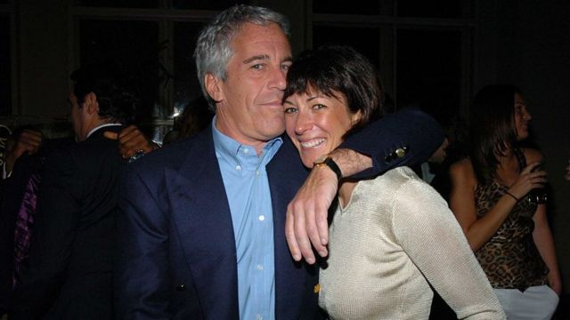
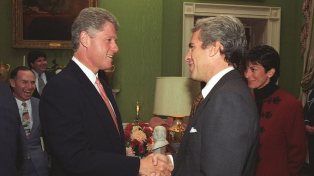
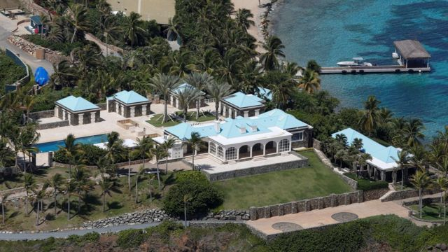
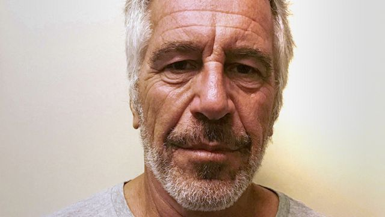

# [World] 美国爱泼斯坦性侵案：解密文件披露百多名政商名人

#  美国爱泼斯坦性侵案：解密文件披露百多名政商名人

  * 小伯恩德·德布斯曼（Bernd Debusmann Jr） 
  * BBC記者 发自華盛頓 

> 图像来源，  Getty Images
>
> 图像加注文字，爱泼斯坦（左）的前女友马克斯韦尔（右）早前因协助爱泼斯坦诱拐未成年少女，被判刑20年。其律师对判决提出上诉。

**美国已故富商爱泼斯坦（Jeffrey Epstein）生前涉及性侵少女和性交易案，纽约地区法院日前公开多达900页的文件，披露多达100人的名字，包括前总统克林顿（Bill Clinton）和英国安德鲁王子（Prince Andrew）。**

解密文件源于受害者弗吉妮娅·尤弗里（Virginia Giuffre，又译朱弗里）控告爱泼斯坦前女友马克斯韦尔（Ghislaine Maxwell）的案件，后者因协助男友诱骗未成年少女卖淫而入狱。

安德鲁王子曾被指控性侵一名女性，但他否认。

至今，这些文件仅揭露了爱泼斯坦与众多政商名人的关系，但未有新的重大指控，也没有揭露其同伙。

文件中出现的名字还有歌手迈克尔-杰克逊（Michael Jackson）和魔术师大卫-科波菲尔（David Copperfield），但没有指控他们从事不法行为。

美国前总统克林顿的名字出现在部分文件中。他承认曾是爱泼斯坦的同事，但坚决否认对爱泼斯坦的罪行知情。

纽约法官洛蕾塔·普雷斯卡（Loretta Preska）指出，许多名单上的人已经被媒体或在马克斯韦尔的刑事审判中指认。她说，还有许多人没有对公布文件提出异议。而基于保护受害者身份的考量，她下令修改一些名字。

在名单上的百多人中，部分人对其他人提出指控，或者是潜在的证人，预计未来几天还会有更多文件披露。

爱泼斯坦于2009年承认诱骗未成年人士卖淫，他在2019年等待审判期间自杀身亡。

##  安德鲁王子

解密文件提到，受害者约翰娜·舍伯格（Johanna Sjoberg）称2001年曾到爱泼斯坦的曼哈顿大宅，在沙发上被安德鲁摸胸。

白金汉宫此前表示有关指控“完全失实”。英国王室拒绝评论最新解密文件，称约克公爵已不再履行王室责任，因此不再代表他发言。BBC已联系安德鲁王子但未获回应。

在一份曾被公开的证词中，斯约伯格称安德鲁王子把手放在她的胸部，让她与另一名受害者尤弗里和一个写着“安德鲁王子”的木偶合影。

2022年，安德鲁王子向尤弗里支付数百万美元和解费，后者指控安德鲁王子在她年仅17岁时性侵她。

安德鲁王子否认指控并称从未见过尤弗里。

##  克林顿

> 图像来源，  William J Clinton Presidential Library
>
> 图像加注文字，1993年，比尔·克林顿会见杰弗里·爱泼斯坦资料照片。

美国前总统克林顿的名字出现在解密文件中，但没有被控违法。其代表受访时提到克林顿在2019年发表的声明，称他对爱泼斯坦的罪行“一无所知”。

根据记录，斯约伯格女士作证说，爱泼斯坦曾告诉她克林顿“喜欢年轻的女孩”。

档案包括麦克斯韦尔的证词，证实克林顿曾乘坐爱泼斯坦的私人飞机，但她不知道乘坐了多少次。

克林顿曾在2000年代初乘坐爱泼斯坦的飞机前往非洲进行所谓的人道主义旅行，当时他赞扬爱泼斯坦是坚定的慈善家，但后来他表示与爱泼斯坦断绝了关系。

克林顿在2019年的声明中说，他乘坐爱泼斯坦的专机时，有其慈善机构克林顿基金会的工作人员和支持者陪同。

他在声明中说：“他的特勤局随行人员参加了每次旅行的每一段行程。”

> 图像来源，  Reuters
>
> 图像加注文字，杰弗里·爱泼斯坦的小圣詹姆斯岛鸟瞰图。

法庭文件中有一部分，是爱泼斯坦前女友马克斯韦尔（Ghislaine Maxwell）的律师试图驳斥媒体的报道，即克林顿在2001年1月卸任后不久，曾到爱泼斯坦在加勒比海的私人岛屿。

麦克斯韦尔的律师说，这位美国前总统“在2001年1月1日至2003年1月1日期间，没有去过小圣詹姆斯岛（Little St James Island），也不在岛上”。

该律师还说，若这说法属实，特勤局特工必须提交旅行日志。

##  为什么提到特朗普？

解密文件还有约翰娜·舍伯格的证词，她称2001年爱泼斯坦告诉她，在他们前往特朗普在新泽西州的一家赌场途中，他会联系特朗普。

她作证说：“爱泼斯坦说，‘太好了，我们给特朗普打个电话’，当时飞行员说飞机不能在纽约降落，需要在新泽西州大西洋城停留。”

文件中没有指控特朗普有任何不当行为。

在法庭上，舍伯格女士被问及是否曾为特朗普按摩，她回答说：“没有。”

##  解密文件还有哪些名人？

**迈克尔·杰克逊（Michael Jackson）** 与 **大卫·科波菲尔（David Copperfield）** ： 舍伯格女士说，她通过爱泼斯坦认识这位歌手和魔术师，但并未指控他们有任何不当行为。

**让-吕克·布鲁内尔（Jean-Luc Brunel）** ：这名法国模特经纪人多次出现在文件中， 他2022年在等待强奸案审判期间，在巴黎监狱自杀身亡。

尤弗里女士在证词中说，她被迫与新墨西哥州州长比尔·理查森（Bill Richardson）等知名人士发生性行为。理查森去年去世前否认曾与尤弗里见过面，他也没有被指控犯有任何罪行。

**阿尔弗雷多·罗德里格斯（Alfredo Rodriguez）** ：他是爱泼斯坦的家庭雇员，负责保安工作，根据法庭文件，他在证词中将爱泼斯坦前女友马克斯韦尔（Ghislaine Maxwell）描述为“老板”。

罗德里格斯于2015年去世，他被告知要随时携带现金，交给高中女生以及协助爱泼斯坦招募的女孩。

##  爱泼斯坦和女友马克斯韦尔

> 图像来源，  Reuters
>
> 图像加注文字，爱泼斯坦2019年的死因被纽约法医裁定为自杀。

爱泼斯坦2019年的死因被纽约法医裁定为自杀。

其前女友马克斯韦尔是出版业大亨罗伯特·马克斯韦尔（Robert Maxwell）的女儿，她早前因协助爱泼斯坦诱拐未成年少女，被判刑20年。其律师对判决提出上诉。

美国有线电视新闻网（CNN）周三引述马克斯韦尔的律师声明称： “她一直坚决维护自己的清白。”

