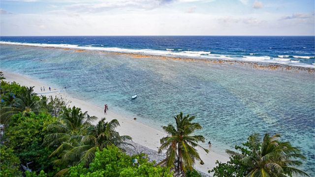
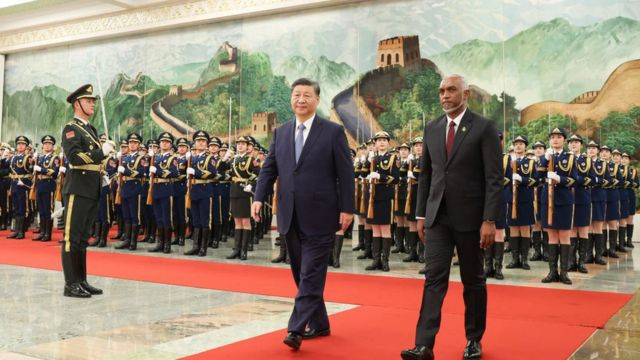
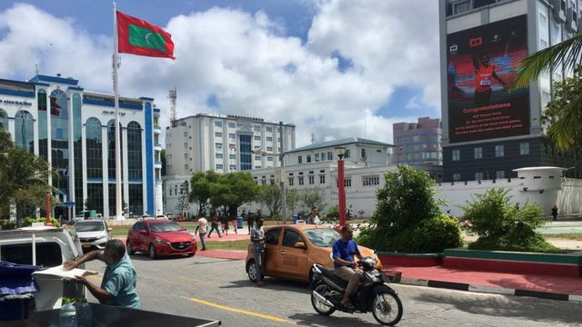

# [World] 马尔代夫印度外交争执升级 驻马印军被下最后通牒

#  马尔代夫印度外交争执升级 驻马印军被下最后通牒

  * 安巴拉桑·埃希拉扬（Anbarasan Ethirajan） 
  * BBC记者 

> 图像来源，  Getty Images
>
> 图像加注文字，最近几周，马尔代夫和印度之间的外交紧张局势加剧。

**马尔代夫与印度的双边关系在最近几周跌至低谷，而在马累正式要求德里3月15日之前从该国撤军之后，两国关系进一步恶化。**

周日（1月14日），在马尔代夫首都马累举行的双方高级别核心小组第一次会议上，马尔代夫向印方传达了这一要求。

“印度军事人员不能留在马尔代夫。这是本届政府的政策。”总统穆罕默德·穆伊祖（Mohamed Muizzu）办公室公共政策秘书阿卜杜拉·纳齐姆·易卜拉欣（Abdulla Nazim Ibrahim）说。

目前，马尔代夫有大约80名印度军人。德里称，他们驻扎在那里是为了维护和操作两架救援侦察直升机和一架几年前捐赠的多尼尔（Dornier）飞机。

穆伊祖去年11月中旬就任马尔代夫总统，从这个岛国撤走印度军事人员是他的竞选承诺。其竞选活动以“让印度撤出”政策为中心，承诺将印度军队送回国并削弱德里的影响力。

周日，德里表示，两国官员讨论了“寻找相互可行的解决方案，以使为马尔代夫人民提供人道主义援助和紧急医疗运送服务的印度航空平台能够继续运行”。

但印度外交部的声明并未提及印度士兵从马尔代夫撤出的时间表。

在马尔代夫与印度官员会晤前一天，穆伊祖结束了对中国的国事访问。他在中国会见了国家主席习近平和其他高级官员。北京和马累同意将两国关系提升为全面战略合作伙伴关系。

在穆伊祖出访之前，马尔代夫三位副部长因在社交媒体上对印度总理莫迪（Narendra Modi）发表贬损性评论，导致两国之间爆发了一场外交纷争。在该事件引起轩然大波后，这三位副部长被停职。​

> 图像来源，  Getty Images
>
> 图像加注文字，穆伊祖（右）最近在北京会见了中国国家主席习近平。

穆伊祖从北京回国后出席记者会时，向印度表达了反抗的态度。

他说，马尔代夫将推动食品进口和海外医疗服务的多样化，是为了减少该国对印度的依赖。

穆伊祖还宣布从土耳其进口食品、从欧洲和美国进口药品的计划，并表示符合国家医保计划条件的马尔代夫人可前往迪拜和泰国接受治疗。目前，大多数人会去印度和斯里兰卡就医。

“我们不是一个在别国后院的国家。我们是一个独立的国家。”他补充说。

穆伊祖的结束语是：“我们也许很小，但这并不意味着你们可以欺负我们。”

这被视为对上述三位副部长涉及莫迪的有争议言论在社交媒体上引发的大规模反弹的回应。上周，在印度社交媒体上，呼吁抵制马尔代夫一直是热门话题。

分析人士表示，这可能是穆伊祖上任以来发表的最强烈的言论，表明他的外交政策路线并非以印度为中心。

“如果马累正在寻求通过外交途径解决与德里之间的现有分歧，那么总统公开发表这样的言论，牵连马尔代夫最亲密的双边伙伴，也会适得其反。”马尔代夫政治分析人士阿齐姆·查希尔（Azim Zahir）告诉BBC。

他说，这种言论“可能对印度与马尔代夫的关系造成不可逆转的损害”。

许多马尔代夫人认为，穆伊祖减少对印度食品进口或药品依赖的计划并不现实。

“你可以从世界任何地方进口食品，包括土耳其。但这样做经济吗？运输成本将比从印度进口食品更贵。”民主党高级领导人阿里·阿齐姆（Ali Azim）对BBC说道。

他补充说，穆伊祖试图在3月即将举行的议会选举前，煽动“反印情绪”。

> 图像加注文字，马累民众担心与德里的争端的后果。

马尔代夫专家指出，穆伊祖之所以对德里采取强硬立场，因为他知道该国的伊斯兰强硬派（包括极端保守的萨拉菲派）支持他的对印政策。

对德里来说，在最新争端发生之际，印度政府的支持者一直在强调其“强有力的外交政策”，以及印度作为经济和军事大国的崛起。

不过，印度外交部长苏杰生（S. Jaishankar）对印马持续的外交争端做出了克制的回应。

“政治归政治。我不能保证在每个国家、每一天，每个人都会支持我们或同意我们的观点。”周日，他在印度城市那格浦尔的一个集会上说。

作为一个小岛屿国家，马尔代夫的大部分粮食、基建和医疗保健都依赖其庞大的邻国印度。

马累的一些居民说，虽然他们担忧德里对目前的外交争端的回应，但他们也对印度在该国的“专横存在”感到不满。

政治分析者查希尔说：“我认为，如果印度方面不做出一些让步，德里和马累之间发生严重争吵的风险会增加。”

