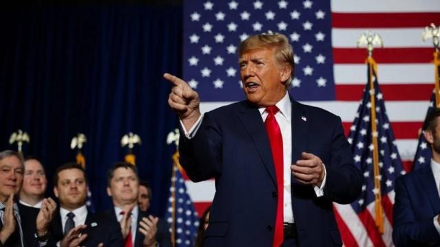
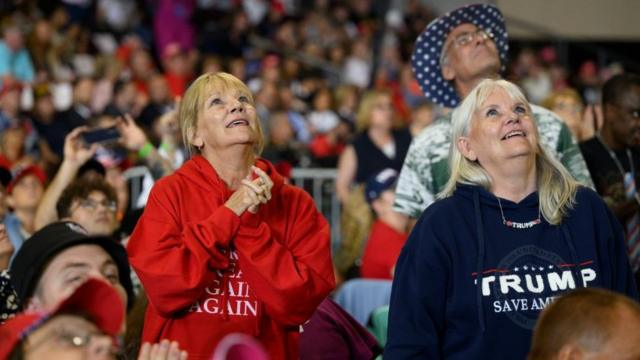
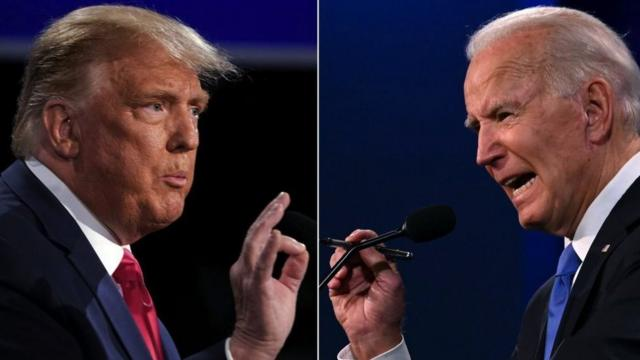
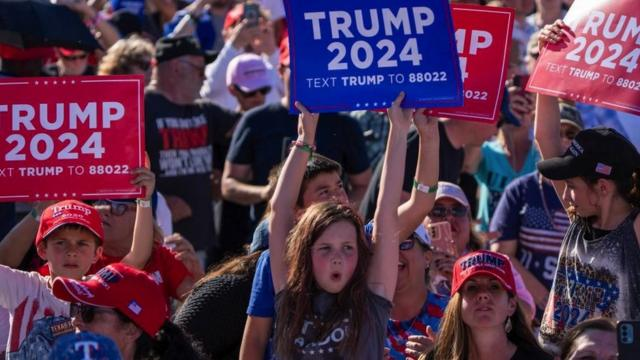
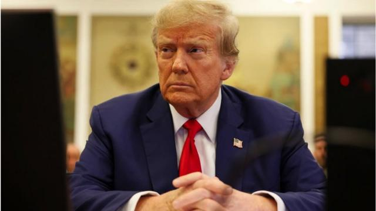
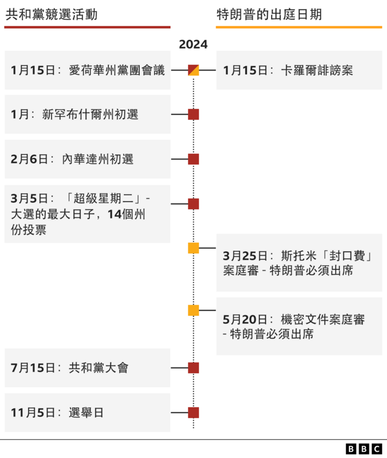
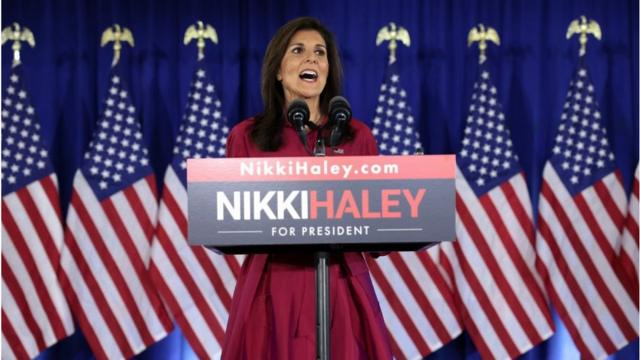

# [World] 美国大选2024：为何特朗普仍然如此受共和党人欢迎

#  美国大选2024：为何特朗普仍然如此受共和党人欢迎

> 图像来源，  Getty Images

**不管你喜欢还是讨厌他，他都回来了。**

美国前总统唐纳德·特朗普（Donal Trump，又译川普）在爱荷华州的共和党初选“党团会议”（ Caucus ）投票中大胜，这也巩固了他在2024年共和党初选明确的领先地位。他的获胜使他现在获得的选票超过了所有其他候选人的总和。

随后，曾经在早期初选辩论中引起轰动，但未能在党内初选取得进展的生物科技商人维韦克·拉马斯瓦米（Vivek Ramaswamy）宣布退选，并转而支持特朗普。

另一名对手阿萨·哈钦森（Asa Hutchinson）随后也宣布退出。

如果特朗普能够获得提名并赢得预定于11月5日举行的选举，他将成为美国当代历史上第一位在执政后输掉一场选举，然后再次回到白宫的美国总统。上一位做到这一点的美国总统，那是1892年的格罗弗·克里夫兰（Grover Cleveland）。

尽管美国第60任总统的竞选还处于初期阶段，但特朗普在党內初选就先以大胜局面开启参选之路，这表明他在共和党内的受欢迎程度仍然持续。以下是一些原因及分析。

> 图像来源，  Getty Images
>
> 图像加注文字，2023年，特朗普的支持者在宾州的一场集会上。

##  经济

在被问及为什么她希望看到这位前总统重回政府时，美国爱荷华州的一位特朗普支持者说：“他将振兴经济，将汽油价格降下来。”

她在这方面的看法并非孤例，因为经济一直是特朗普团队竞选给出的重要信息。

特朗普的儿子埃里克·特朗普（Eric Trump）告诉BBC播客说：“人们希望这个国家繁荣而强大。“

> 图像来源，  Getty Images
>
> 图像加注文字，许多共和党人表示，特朗普的强烈个性与拜登形成鲜明对比。

他说：“我的父亲在任时，这个国家有着最棒的经济，最低的失业率，最低的通胀率，最低的油价。”

确实，在新冠疫情爆发之前，也就是特朗普执政期间，美国经济表现出色。但美国这个时期的经济强劲是在民主党奥巴马（Barack Obama，欧巴马）政府治理时便开始的趋势。

当然，由于新冠疫情爆发后，2020年美国经济随后受到有史以来最大的经济收缩的打击。

在继任者拜登（Joe Biden）总统任内，乌克兰战争使能源成本飙升，通货膨胀率达到40年来的最高点，尽管现在已大幅下降，而且去年美国经济表现得比预期更好。

##  “活力”特朗普与“瞌睡乔”

> 图像来源，  Getty Images
>
> 图像加注文字，许多共和党人表示，特朗普的强烈个性与拜登形成鲜明对比

2020年特朗普竞选活动的前媒体主管马克·洛特（Marc Lotter）认为，这两个人的过往履历对特朗普有利。他告诉BBC：“乔·拜登在我参与2020年竞选活动时唯一缺乏的就是一份履历。”

他又补充解释说：“他（拜登）现在有了一份总统履历，但人们不喜欢它。”

特朗普支持者比利·布拉特拉斯（Billy Blathras）则认为特朗普是一位“充满活力的领导者”。他告诉BBC：“我们在他的第一任期看到了他的表现。我们想要再次看到这点。在拜登总统任内，我们看到了我们国家的衰落。”

他还说：“我们真的希望看到特朗普在白宫时为美国人民带来的热情支持。”

另一位爱荷华州的特朗普支持者认为，特朗普的商业和名人背景，而不是政治背景，仍然是一个关键因素：“这个国家不需要由另一位政治家来管理，我相信最好的候选人应该是知道如何经营生意的人。”

许多共和党人表示，特朗普的强烈个性与拜登形成鲜明对比。批评者说，拜登在第26届联合国气候变化大会（COP26）上被摄影机捕捉到他似乎打瞌睡的画面，因此被一些人戏称为“瞌睡乔”（Sleepy Joe）。

当然，上一次两人正面交锋时，拜登拿下了胜利。

##  移民和“污染国家血液”言论

> 图像来源，  Getty Images
>
> 图像加注文字，拜登之后抨击特朗普使用了类似纳粹德国时的言论。

在去年十月份接受美国右翼网媒《国家脉搏》(The National Pulse）访谈时，特朗普表示移民正在“污染我们国家的血液”（poisoning the blood of our country），引发舆论哗然。拜登抨击特朗普使用了类似纳粹德国时的言论。

当时拜登发出的新闻稿说：“特朗普表示，如果他再次上任，他将追击所有反对他的人，消灭他所称之为美国的害虫 ，这是一个具体的词汇，有着具体含义。这与你在30年代纳粹德国听到的语言相呼应，而这甚至不是特朗普第一次这样说。”

研究纳粹德国宣传的历史学家和专家告诉BBC，拜登这样比较是准确的。美国宾夕法尼亚大学历史学教授安妮·伯格（Anne Berg）告诉BBC：“不仅是我们在纳粹德国听到这样的语言，那实际上就是他们所做的。”她还引用了纳粹党在掌权后对政治对手的攻击为例。

然而， BBC在美国的合作伙伴哥伦比亚广播公司（CBS）的民调发现，共和党忠实支持特朗普的言论。

在CBS访问注册的共和党选民对特朗普的声明是否同意或不同意，采用了两种提问方式。一半的受访者仅被问及“污染血液”的言论，而未指明发言者，另一半被告知是特朗普说的。

无论如何，大多数共和党选民都同意这样的说法。在不知道发言者是谁的共和党人中，有72％的人同意这个说法；而在了解这个言论来自特朗普时，高达82％的人同意这种说法，这都表明特朗普对移民的立场继续吸引着他的支持者。

##  年轻美国人的强烈支持

> 图像来源，  Getty Images
>
> 图像加注文字，年轻人的选票能否帮助特朗普在11月成为美国总统？

特朗普最近有一个意外令选情提振的消息是民调显示，他可能在年轻选民中领先于拜登。美国《纽约时报》和锡耶纳学院（Siena College）去年12月中旬发布的一项民意调查显示，他在18至29岁选民中领先六 个百分点。

专家们正在辩论这一个明显趋势的内涵，但这都表明了现在与上一次2020年选举截然不同的局面，因为当时特朗普在同一年龄组中大大落后拜登24个百分点。

造成这种情况的部分原因可能是拜登未能与年轻选民建立联系，而且有迹象表明，他们对拜登处理以色列- 哈马斯战争的方式感到沮丧。这也影响到特朗普，让他开始受年轻选民欢迎。

然而，爱荷华州年轻共和党人组织的负责人玛丽·韦斯顿（Mary Weston）告诉BBC说，她认为年轻的共和党人是被特朗普的舞台魅力所吸引，“你会对他的举止和言谈感到惊叹，”她表示。

现年23岁的她在特朗普担任总统时还在上高中，她表示，由于对特朗普的支持，很多人“嘲笑和骚扰”她。但她认为“他为自己所信仰的事情奋斗”和“他不害怕成为他想成为的人”吸引了年轻选民。

她还补充强调，对特访普的声援其实意味着“我们很多基层民众想要为他奋斗，向民主党证明我们仍然会支持他”。

##  法庭诉讼被视为“迫害”

> 图像来源，  Getty Images
>
> 图像加注文字，2024年，特朗普将在一系列的审判中出庭应讯。

当他再次角逐美国总统大位时，特朗普已经被刑事起诉四次，并将在一系列的审判中出庭应讯。

他业已在纽约被起诉，并在乔治亚州、佛罗里达州、曼哈顿和华盛顿都遭到起诉，其他联邦和州检察官也开展了多项调查。

在一些州，相关诉讼也试图取消特朗普参选总统的资格，主张他在三年前的美国国会大厦暴动中参与了叛乱。

尽管你可能期望未决的法律诉讼会让特朗普的支持者们却步，但经验丰富的民意调查专家法兰克·兰斯（Frank Lance）告诉BBC，这实际上有助于特朗普。

他说：“特朗普成功地提出了他是受害者的观点，不仅仅是受到起诉，而且是受到迫害，而这是一场政治迫害，”他说道。

> 图像来源，  Getty Images
>
> 图像加注文字，前联合国大使尼基·哈利可能在新罕布什尔州党内初选中对特朗普构成挑战。

兰斯还说，“每次被起诉，他的支持率都上升。每次他被从选票中除名，譬如在缅因和科罗拉多州，他的支持率都上升。每次你对付特朗普，他都能利用这一点。我们在美国从未见过像他这样的人物。”

不过，值得注意的是，尽管特朗普在爱荷华州获胜，在当地有很多人持完全不同的观点，比如朱迪便告诉BBC说，特朗普“很可怕，绝对令人恶心。我不明白为什么人们会投票给他。”

如果特朗普要成为共和党提名人，他还有很多工作要做。

他预计在下周的新罕布什尔州党内初选中将面临来自前联合国大使尼基·黑利（Nikki Haley）的更强烈挑战，而民意调查显示他曾经在当地主宰的领先优势已被削弱到接近单位数字。

但是，在爱荷华州的首次考验中获得共和党选民的支持后，他仍然是竞选中压倒性的热门人选。

