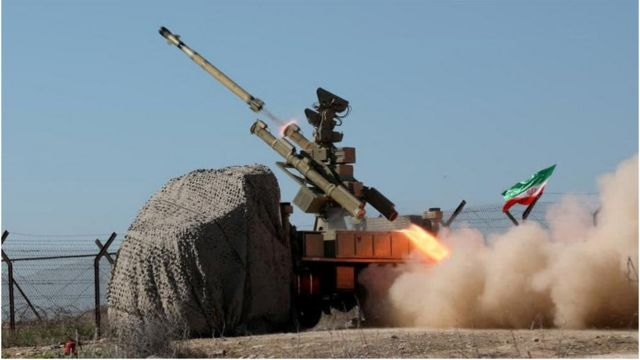
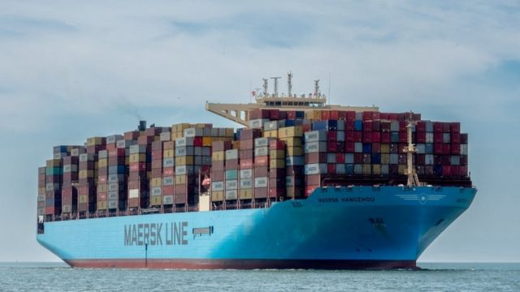
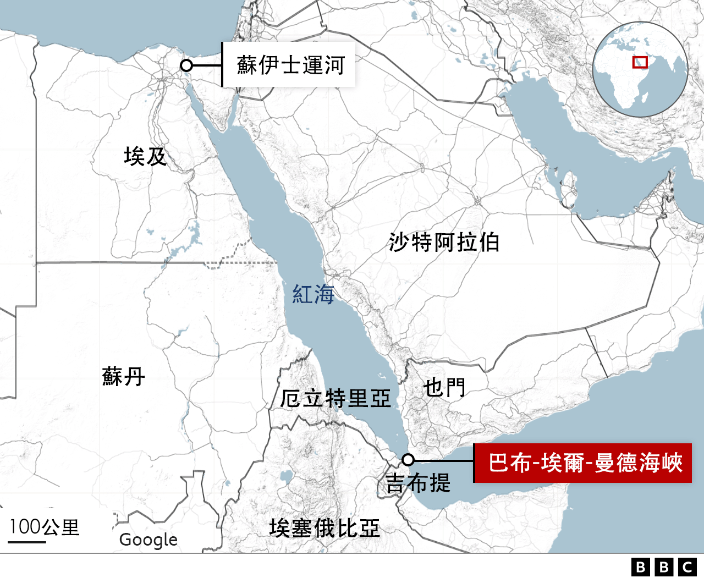
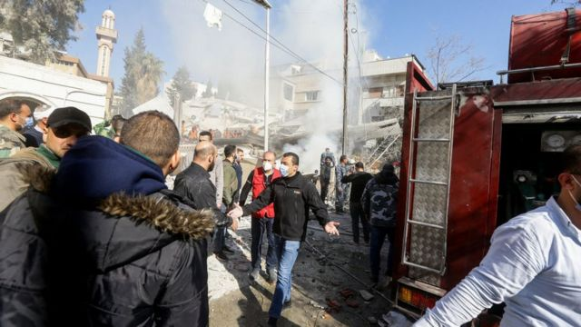
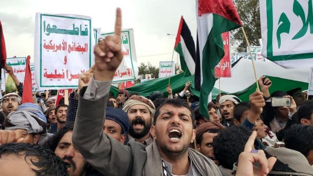
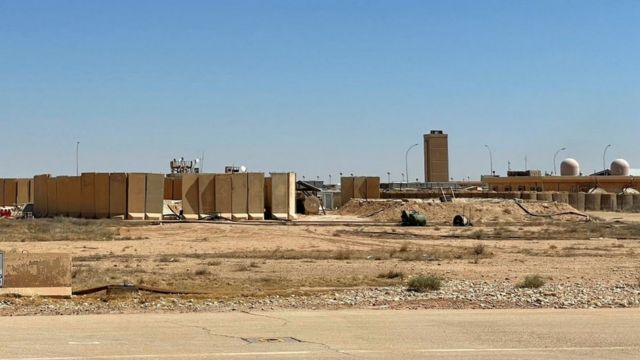

# [World] 中东导弹袭击：过去一周发生了哪些袭击事件

#  中东导弹袭击：过去一周发生了哪些袭击事件

  * 拉菲·伯格（Raffi Berg） 
  * BBC新闻网中东事务编辑 

> 图像来源，  Reuters
>
> 图像加注文字，伊朗军演导弹发射资料照片。

**中东多地在过去一周发生了新一轮的袭击事件，加深了人们对冲突在本已不稳定的地区蔓延的担忧。**

以下是BBC记者对所发生袭击事件以及可能导致局面的简要汇总。

##  伊朗和巴基斯坦

1月16日，伊朗出人意料地对巴基斯坦领土发动了导弹和无人机袭击。伊朗表示，其目标是伊朗逊尼派穆斯林激进组织“正义军”（Jaish al- Adl），伊朗声称指该组织在其境内发动了袭击。

巴基斯坦表示，两名儿童在袭击中被杀，并随后对伊朗发动了反击，向伊朗一侧边境它所称的巴基斯坦“恐怖分子藏身处”发射了导弹。伊朗方面表示，有三名妇女、两名男子和四名儿童在袭击中被杀。

这场冲突加剧了这个已经历多重危机地区的紧张局势。

尽管针锋相对的袭击地点远离中东主要战区，但边境局势动荡，如果激进组织“正义军”对伊朗袭击进行报复，那么这里再发生任何事件，局势就可能会迅速升级。

##  也门和红海

> 图像来源，  Reuters
>
> 图像加注文字，胡塞叛军去年12月在红海用一枚导弹袭击了“马士基杭州”号（“马士基杭州”号2018年资料照片）。

红海是世界贸易的关键水道，在胡塞武装上周袭击红海航运船只之后，美国海军对也门的胡塞武装——“扎伊迪什叶派运动”进行了多轮导弹袭击。

加沙战争爆发后，胡塞武装在伊朗的支持下在去年11月加强了袭击。他们发誓，只要以色列在加沙的进攻持续，就会袭击"与以色列有关联"的船只，以示对巴勒斯坦人的声援。

红海国际水域的所有商船都因此受到威胁，西方大国对此无法容忍。

美国和英国在盟友的支持下，从1月12日开始对胡塞武装发动了首次军事打击，试图警告并阻吓胡塞武装，但该组织仍保持挑衅姿态，并在此后多次袭击船只。

1月15日，胡塞武装发射的一枚反舰弹道导弹击中了一艘在亚丁湾航行的美国货船，这似乎是胡塞武装自行动开始以来首次成功袭击美国船只。

1月17日，亚丁湾发生第二起袭击事件——胡塞武装袭击了美国另一艘货船，胡塞武装发誓要继续行动，这引发了美国进一步发动袭击反击的可能，以及伊朗是否会感到被迫做出回应的问题。

##  以色列，真主党和伊朗

1月15日，经常被描述为宿敌的以色列和伊朗之间长达数年的“影子战争”愈演愈烈，伊朗向位于伊拉克半自治库尔德斯坦地区埃尔比勒的以色列“摩萨德”（Mossad）间谍机构总部发射导弹，造成四人死亡。

对以色列怀有敌意的伊拉克是伊朗的盟友。但事件发生后，伊拉克否认“摩萨德”总部在那里，并谴责了这次袭击。

伊朗表示，此次袭击是对以色列最近杀害叙利亚一名伊朗高级指挥官和两名伊朗支持的黎巴嫩武装分子高级成员的回应。袭击中被杀的其中一人是什叶派武装运动“真主党”的指挥官，另一名是巴勒斯坦组织哈马斯的副领导人。

以色列和黎巴嫩边境是该地区最危险的前线之一，自哈马斯袭击以色列和10月7日加沙战争爆发以来，以色列和真主党在该地区相互频繁进行攻击。全副武装的真主党则由伊朗资助。

以色列国防军参谋长1月17日表示，“未来几个月（在以色列北部）发生（战争）的可能性比过去高得多。”

##  伊朗与“伊斯兰国”

在袭击伊拉克的同时，伊朗向叙利亚西北部一个叛军控制的省份发射了导弹，称其目标是所谓的“伊斯兰国”（IS）组织的基地，以报复该组织1月3日在伊朗南部发动的自杀式炸弹爆炸事件，该事件导致94人死亡。

逊尼派圣战组织“伊斯兰国”认为什叶派穆斯林是异端，而伊朗是该地区什叶派的主导势力。

虽然伊朗是叙利亚政府的重要盟友，但直接打击叙利亚叛军控制地区的武装分子是罕见的一步，也是向对手发出信号，表明伊朗准备在远方采取行动。

##  以色列、叙利亚和伊朗

> 图像来源，  Getty Images
>
> 图像加注文字，大马士革梅泽区遭空袭后的现场情景。

叙利亚人权观察组织称，以色列星期六（1月20日）对叙利亚首都大马士革的空袭造成至少10人死亡，其中五人是伊朗精英伊斯兰革命卫队的高级成员，包括革命卫队驻叙利亚的情报主管。

袭击发生后，叙利亚和伊朗对以色列提出指责，伊朗发誓要报复。

伊朗总统表示，对叙利亚首都造成五名伊朗安全部队高级成员死亡的空袭，“不会坐视不理”。易卜拉欣·莱西表示，以色列应对此次袭击负责，此次袭击还造成多名叙利亚军人死亡。

以色列尚未对此发表评论。多年来，它对叙利亚境内以方所称的与伊朗有关的目标进行了数百次袭击。

而在上周早些时候，叙利亚首都大马士革周围也发生了类似的袭击事件。

如果叙利亚防空部队拦截（空袭）战斗机，或叙利亚展开致命报复，都可能会在这个饱受战争困扰的地区引发新的危机。目前这还尚未发生。

##  以色列与加沙

以色列和哈马斯在加沙的激烈战斗仍在继续，目前战争已进入第15周。

据哈马斯的卫生部门称，自上周日（1月14日）以来，至少有713名巴勒斯坦人在以色列的轰炸中丧生，使10月7日以来的死亡人数增加到近25,000人。以色列方面，同期有八名士兵死亡，使其战斗死亡人数达到188人。

以色列军方表示，以色列上周加强了对南部城市汗尤尼斯的攻势，以军部队已到达战争开始以来的最南端。

与此同时，据以色列电视台报道，以色列总理内塔尼亚胡表示，加沙冲突可能会持续到2025年。

1月15日，以色列还发生了疑似驾车撞人和持刀伤人的袭击事件，以色列警方从被占领的约旦河西岸逮捕了两名巴勒斯坦嫌疑人。此次袭击造成一名妇女死亡、另外 17 人受伤。

巴勒斯坦激进组织哈马斯称此次袭击是“对占领军大屠杀及其对巴勒斯坦人民持续侵略的自然反应”。

此次袭击发生之际，以色列与巴勒斯坦进组织哈马斯的战争在1月14日刚届满100天。这是自加沙战争爆发以来以色列境内首次发生此类袭击事件之一，加剧了仍在遭受10月7日袭击事件影响的以色列人的焦虑。

随着战争的发生，约旦河西岸的暴力事件也不断升级。医护人员称，以色列1月17日的空袭造成九名巴勒斯坦人死亡。以色列表示，至少有五名死者当时正在计划立即发动袭击。

##  中东其他地方

> 图像来源，  EPA
>
> 图像加注文字，也门萨那的反美抗议活动。

中东其他地方在上周也发生了一国对另一国的袭击事件。

土耳其国防部表示，土耳其上周对伊拉克北部的库尔德武装分子和叙利亚北部由美国支持的库尔德人领导的民兵联盟进行了空袭。

最近的袭击是土耳其与库尔德武装团体之间长达数十年的血腥冲突的一部分，拥有大量库尔德少数民族的土耳其将这些武装团体视为“恐怖组织”。据报道，其中一次是袭击了一所关押着3000多名“伊斯兰国”囚犯的监狱。

上周，约旦也对叙利亚边境进行了罕见的空袭。据报道，包括儿童在内的十人被杀。据认为，该行动的目标是毒品走私者。约旦指控伊朗支持的叙利亚民兵将安非他命“芬乃他林”（Captagon）贩运到该国，并转运至海湾阿拉伯国家。

##  伊拉克基地遭袭，多名美军受伤

> 图像来源，  Getty Images
>
> 图像加注文字，伊拉克阿萨德空军基地遭到导弹和火箭袭击。

伊拉克西部空军基地遭导弹袭击，造成多名美军人员受伤。

美军中央司令部表示，伊朗支持的民兵周六（1月20日）晚上用弹道导弹和火箭袭击了美军驻扎的阿萨德空军基地。

据报有数量不详的美国人员正在“接受脑外伤评估”。至少一名伊拉克军人在袭击中受伤。

一个自称“伊拉克伊斯兰抵抗运动”的组织声称对基地发动的袭击负责。据美国华盛顿近东政策研究所称，该组织于2023年底出现，由多个在伊拉克活动的伊朗附属武装团体组成。

该组织还声称对最近几周针对美军的其他袭击事件负责。而阿萨德基地近年来屡遭袭击。

美国军方表示，周六发射的大部分导弹都被拦截，但有一些导弹避开了防空系统并击中了基地。美军补充说，对损失的评估正在进行中。

