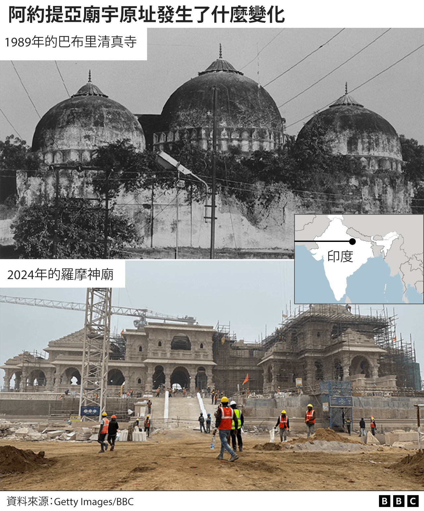
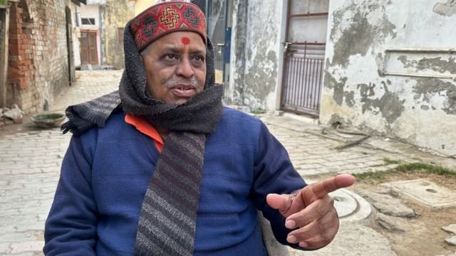
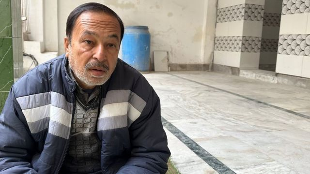
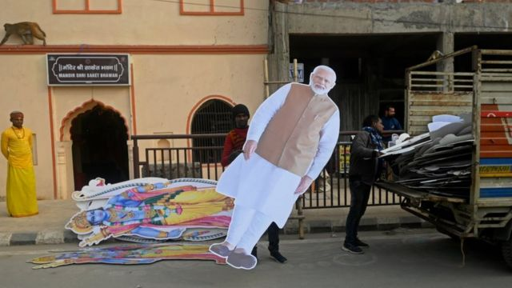
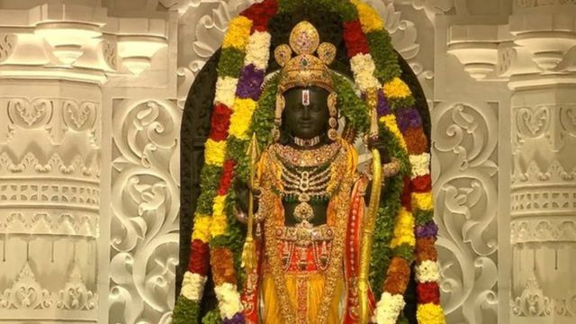

# [World] 在清真寺遗址上盖的摩罗神庙揭幕，为何撕裂印度

#  在清真寺遗址上盖的摩罗神庙揭幕，为何撕裂印度

  * 约吉塔·利马耶（Yogita Limaye） 
  * BBC记者 发自印度阿约提亚 

> 图像加注文字，莫迪此举被指具有政治意味，为今年稍晚的大选赢取印度教选民支持。

**印度古城阿约提亚（Ayodhya）一座大型印度教罗摩神（Lord Ram）神庙周一（1月22日）揭幕，该国总理莫迪（Narendra Modi ）出席了揭幕礼。**

这座引发巨大争议的神庙取代了1992年被印度教暴徒夷为平地的一座16世纪清真寺。那次清真寺拆除引发了全国性骚乱，造成近2000人死亡。

数千名受邀嘉宾，包括顶级电影明星和板球运动员，出席了在阿约提亚举行的活动。

但一些印度教先知和大多数反对派抵制这个活动，莫迪此举被指具有政治意味，为今年稍晚的大选赢取印度教选民支持。

桑托什-杜比（Santosh Dubey）说，他并不后悔暴力摧毁清真寺。

“这是一项宗教工作，我来到这个世界就是为了完成这项任务。”他说。“这不是犯罪或罪过。”

杜比是一名“卡尔塞瓦克”（Kar sevak”，即宗教志愿者），他是1992年12月6日在阿约提亚拆除16世纪巴布里清真寺（Babri Masjid）的数万名印度教徒之一。

当天是印度独立后最黑暗的日子之一。这个有争议的地点位于印度最大的宗教分裂地区之一，数千人曾在骚乱中丧生。

30多年后，在清真寺曾经矗立之处，将供奉印度教最受尊敬的罗摩神，而印度总理莫迪为这座宏伟新庙宇揭幕。这在奉行世俗宪法的国家是很有争议的，尤其是因为该遗址在历史上造成的分裂。

周一的仪式被视为莫迪今年竞选连任的非正式开始，向印度占多数的印度教徒示好。全国数以百万印度教徒正准备像庆祝盛大节日般庆祝这一天，而莫迪联邦政府的雇员可以休假半天。

宗教志愿者杜比的家位于阿约提亚市一条窄巷中，墙壁上的油漆和灰泥已经剥落。他坐在破败不堪的家中，说为自己的成就感到骄傲。

“如果没有我们所做的一切，这座寺庙就不可能建成。”他说。“宗教情感大于宪法。我现在非常高兴。我曾发誓，在罗摩神得到他的神庙之前，我不会修缮我的家。”

但对于印度最大的少数族群穆斯林而言，这一天将唤起他们的恐惧和痛苦回忆。一些人会把孩子送出城外，担心当来自全国各地的印度教徒挤满街道时，可能会激化紧张局势。

穆罕默德·沙希德（Mohammad Shahid）说：“我们被背叛过，所以我们感到恐惧。许多外人会来到阿约提亚，外人一来就会有麻烦。”

> 图像加注文字，莫迪出席了揭幕礼。

1992年12月6日是印度历史上一个决定性日子，也是印度教右翼政治势力崛起的关键事件，而该势力目前正寻求连续第三次执政。

许多印度教徒认为，穆斯林皇帝巴布尔（Babur）在500多年前摧毁了罗摩神诞生地的一座寺庙，并在其上兴建清真寺。

多年来，杜比与另外数十人曾面临指控并入狱服刑，但没有人因拆除清真寺而被定罪。

杜比不认为自己的行为违法。

“那些说摧毁清真寺不是印度教的人都是白痴。他们是异端、左派、极端分子和恐怖分子。”

“我们没有去另一个国家摧毁他们的礼拜场所，但如果他们摧毁了我们的礼拜场所，那么我们就应该把它们夺回来。”

> 图像加注文字，桑托什·杜比是1992年拆毁清真寺的暴徒之一。

穆斯林一直都在清真寺内祈祷，直到1949年，据称是印度教神职人员在寺内放置了罗摩神像。随后，法院下令关闭清真寺的大门，到1986年重开，许多人认为是当时执政的国大党（Congress party）授意的，据说是为了吸引占多数的印度教徒。

1990年，当时还只是个小政党的印度民族主义党“印度人民党”（BJP），带头发起在该遗址修建印度教寺庙的群众运动。这场运动后来被视为是将印度人民党，提升为当今几乎难以撼动的政治巨人的关键时刻之一，而莫迪现为该党领袖。

那一年，成千上万的宗教志愿者聚集在阿约提亚。当他们开始向有争议的地点前进时，警察向他们开火，造成数十人死亡。在枪击事件中受伤的杜比说：“这些子弹激起了我们的愤怒。”

两年后，宗教志愿者再次聚集在阿约提亚。

> 图像加注文字，杜比展示旧报纸上的照片，表示对自己的行为不后悔。

“当时有人在守卫有争议的建筑（清真寺），他们看到一大群人拿着刀和锤子向他们走来，就逃走了。我们之前已经练习过。我们爬上穹顶，几小时内就把它拆下来了。”

杜比向我们展示一张刊登在报纸上的黑白照片，照片中一群人高举武器，脸上洋溢着灿烂的笑容。他说这是在清真寺被夷为平地之前拍下的。

“我们很开心，因为我们知道那天会发生什么。”他指着照片中的自己说。

对阿约提亚的穆斯林来说，那是恐怖的一天。

现年65岁的安瓦里-贝古姆（Anwari Begum）说：“成千上万的人遍布阿约提亚。他们手持棍棒、刀剑和三叉戟。我们的房子被他们包围。”

“我们从家里跑出来。我带着六个月大的婴儿和孩子们跑。我丈夫跑在我们后面。当我转身时，我看到他被一些人抓住了。我们不得不继续逃命。”

第二天，她发现丈夫穆罕默德-阿明（Mohammad Amin）遇害，他是当天在阿约提亚发生的骇人暴力事件中丧生的至少17名穆斯林之一。

“一位目击者告诉我们，他被抓住了，手脚被砍断，被扔进一个麻袋带走了。我们一直没找到他的遗体，”她情绪崩溃地说。

> 图像加注文字，现年65岁的安瓦里-贝古姆在事件中丧偶。

她回到家，发现房子被烧成了灰烬。多年来，他们一家设法在原址重建两室一厅的小房子。

“我丈夫过去一直在照顾我们的家庭。剩下我一个人带着六个小孩。我们从政府那里得到了一些钱，但还是不够。我的生活从那天起就毁了。”她说。

清真寺被推倒后，引发印度各地骚乱，造成近2000人丧生。仅在金融首都孟买就有900多人死亡，其中约三分之二是穆斯林。斋浦尔（Jaipur）、博帕尔（Bhopal）、艾哈迈达巴德（Ahmedabad）和海德拉巴（Hyderabad）等城市也发生屠杀事件。

在阿约提亚，穆罕默德-沙希德（Mohammad Shahid）的父亲穆罕默德-萨比尔（Mohammad Sabir ）也惨遭杀害。

“他们殴打他，然后往他和我叔叔身上泼油，放火焚烧。我们找到了他们的遗体。”他说。“国家想忘记发生的一切。但穆斯林永远不会忘记。对我们来说，那是黑暗的一天。”

他们家曾为阿约提亚的寺庙提供木雕。作坊被夷为平地，沙希德不得不当人力车夫谋生。

和沙希德一样，安瓦里·贝古姆（Anwari Begum）也希望她30多岁的儿子索赫拉卜（Sohrab）能在揭幕礼前后离开，以保障他的安全。

他告诉BBC：“我不害怕，但我很紧张。据说有七万到十万人会来。气氛可能会变得很紧张，这就是穆斯林考虑离开的原因。但我不会走。我认为不会发生什么。”

> 图像加注文字，摩罗神庙开幕后预计将有大批印度教徒涌进城内。

在阿约提亚，寺庙所在地一片繁忙，起重机和挖掘机在落成典礼前将尘土撒向空中。数以千计头戴安全帽的工人遍布该地区。

神庙信托基金表示，建造神庙的费用为2.17亿美元（1.7 亿英镑），资金来自私人捐款。这座城市的改造工作由政府负责，估计耗资超过30亿美元。

在施工过程中，成百上千的朝拜者络绎不绝前来一睹罗摩神像的风采，新寺庙的供奉仪式已经开始。

40岁的普南·奥里（Poonam Ohri）喜极而泣。“因为莫迪和印度人民党政府，我们的梦想成真了。我太激动了。”

年迈的农民巴德里·纳拉扬（Badri Narayan）跋涉数百英里来到这里，他说自己的幸福难以言表。

“我以前来的时候，罗摩神的神像还在临时搭建的帐篷里。神像被雨淋湿了。看到那样，我就忍不住眼泪。”他对BBC说。“现在因为莫迪，他被释放了。”

> 图像加注文字，印度教徒普南·奥里为神庙开幕喜极而泣。

总理莫迪要求人们不要在1月22日前往阿约提亚，只需要在家中点灯。但他也表示，所有人都可以从第二天起到阿约提亚。

正是官方仪式后的那几天，让穆斯林社区感到担忧。

穆斯林社区领袖阿扎姆·卡德里（Azam Qadri）说：“如果政府联系我们，保证不会发生任何事情，那就能阻止人们离开，但至今他们还没有这么做。”

穆斯林索赫拉卜说：“政治领导人本应该来对我们说，发生在你们身上的事情是错误的——他们本应该表示同情，但他们没有。”

至于即将开放的新寺庙，他说：“我们为他们修建寺庙感到高兴，但我们也很难过，因为寺庙是在摧毁清真寺后修建的。”

> 图像加注文字，穆斯林社区领袖穆罕默德-沙希德

穆罕默德·沙希德（Mohammad Shahid）说，在最高法院将土地交给印度教徒后，他们有权建造这座寺庙。“我们没有欣然接受这一决定，但我们又能做什么呢？”他说。

经过多年诉讼，最高法院于2019年裁定，将有争议地点移交给印度教徒，尽管法官也认为拆除清真寺是非法的。判决依据的是考古证据，该证据显示清真寺地基的特征“表明其起源于印度教"。

裁决还指出，记录在案的证据证明了印度教的信仰和信念，认为该遗址是罗摩神的诞生地。

没有证据证明，当日为了修建清真寺而摧毁了寺庙。

法院还下令为穆斯林提供一块单独的土地来建造清真寺。它距阿约提亚15英里，杂草丛生，空无一人。

穆斯林社区领袖卡德里说：“如果政府像对待寺庙一样重视修建道路和环路，那么工程早就在那里开始了。”

> 图像来源，  Getty Images
>
> 图像加注文字，许多人指责莫迪及其政党违反宪法，将宗教活动变成国家支持的活动。

在神庙揭幕礼之后，预计莫迪总理和印度人民党将今年稍晚的大选获胜。

许多人指责他及其政党违反宪法，将宗教活动变成国家支持的活动。

但印度人民党的地方议员拉鲁·辛格（Lallu Singh）认为，莫迪没有理由不出席。

“如果总理是印度教徒，他为什么不能访问印度教最大的信仰中心呢？有什么理由阻止他呢？罗摩神是这个国家文化的代表，”他告诉 BBC。

“大多数人的文化在这个国家占主导地位，因此总理参与开幕礼是百分之百正确的。这并不意味着我们有宗教歧视。”

此外，将神像移入未完工的寺庙也引起争议，有印度教领袖指责政府将选举利益置于神圣宗教仪式之上。

“我不想评论宗教领袖的言论。但放置神像的圣所已经完工。现在更多朝拜者可以轻松前来，这就是我们开放它的原因，”这位国会议员说。

早在1992年，印度人民党的高级领导人就曾对清真寺被拆表示遗憾，并说这种事情不该发生。

拉鲁·辛格被问及现在的感想时回应说：“我认为发生过的事情是正确的。”

BBC采访的大多数穆斯林和印度教徒都认为，从长远来看，阿约提亚不会有更多敌对行动。

但部分人认为，阿约提亚只是一个开始——在另外两座城市马图拉（Mathura）和瓦拉纳西（Varanasi，古称Kashi），也有清真寺争端和法庭案件进行中。

“我们等待了450年才得到罗摩神的诞生地。我希望瓦拉纳西和马图拉也能很快成为我们的家园。”21岁的印度教信徒阿卡什·贾达夫（Aakash Jadhav）说。

> 图像加注文字，新阿约提亚神庙中的罗摩神像。

