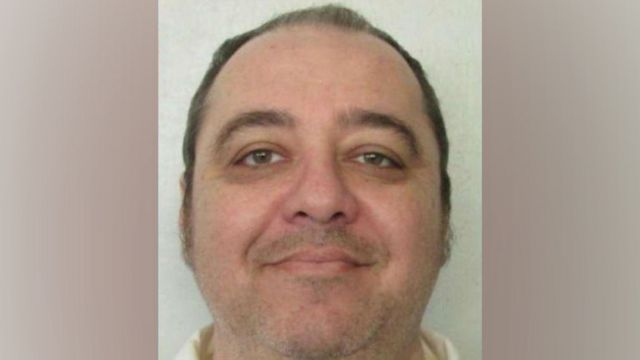
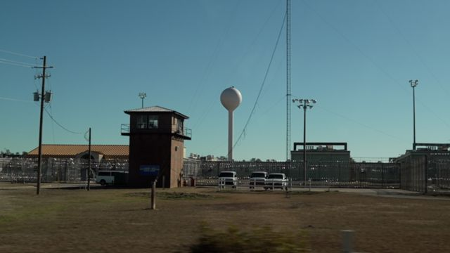

# [World] 美国首名将遭氮气处决者称，等待期宛如“酷刑”

#  美国首名将遭氮气处决者称，等待期宛如“酷刑”

  * 汤姆·贝特曼（Tom Bateman） 
  * BBC News，阿拉巴马州霍尔曼惩教所报道 

> 图像来源，  Alabama Department of Corrections
>
> 图像加注文字，肯尼思·尤金·史密斯因1988年谋杀案面临死刑。

**肯尼斯·尤金·史密斯（Kenneth Eugene Smith）即将成为美国首名接受氮气窒息处决的人。他说，当他在死囚牢房度过最后的时光时，他一直因这种未经检验的程序而感到焦虑。**

警告：本文包含对行刑方式的具体描述，可能会让部分读者感到不安。

——

当史密斯第一次面临死亡时，阿拉巴马州的处刑者有几个小时的时间来杀死他。

他们将这名死囚绑在霍尔曼惩教所（Holman Correctional Facility）所谓“处决室”的轮床上，试图为他注射致命的混合化学物质。

但他们失败了。

史密斯的律师说，由于无法显露静脉，史密斯身上留下了许多切口。当午夜钟声敲响、州死刑令到期时，他们放弃了这一尝试。

那是2022年11月。阿拉巴马州将再次试图执行这种死刑。

这一次，该州批准了一项计划，即在史密斯的脸上绑上密闭面罩，强迫他吸入纯氮，这种惰性气体会让他的身体缺氧，从而窒息死亡。

联合国人权事务高级专员上周表示，这种从未使用过的方法可能构成酷刑或其他残忍、不人道或有辱人格的处罚，呼吁停止行刑。

在联邦法院驳回史密斯律师的禁制令申请后，最终上诉裁决仍然悬而未决，而史密斯将于本周四（1月25日）被执行死刑。

史密斯被认定是1989年受雇谋杀一名牧师之妻伊丽莎白·塞内特（Elizabeth Sennett）的两名男子之一。塞内特在这起价值1000美元（786英镑）的买凶杀人案中被捅伤并殴打致死。

> 图像加注文字，史密斯在霍尔曼惩教所的死囚牢房里度过了数十年。

史密斯是现代美国为数不多两次被执行死刑的人，也是首名面临氮气窒息处决的人。

他通过中间人回答了我们的问题：“我的身体正在垮掉，体重一直在下降。”

阿拉巴马州禁止记者与死囚面对面会面。上周末，我们通过电话联系到了他，但他要求不要进行采访，因为他说自己已经严重不适。

“我一直感到恶心，恐慌症经常发作。这只是我每天所面对的一小部分。基本上就是折磨。”他写道。他呼吁阿拉巴马州“停止（处决），以免为时已晚”。

但该州坚称，氮气行刑会让人很快失去知觉，但未提供任何可信的证据。

Skip podcast promotion and continue reading

* BBC 時事一周 Newsweek (Cantonese)   **

BBC國際台粵語節目，重溫一周國際大事，兩岸四地消息，英國境況。並備有專題環節：〈記者來鴻〉、〈英國生活點滴〉和〈華人談天下〉。

分集

End of podcast promotion

医学专家和活动人士警告说，氮气行刑有可能导致灾难性的意外，从剧烈抽搐到沦为植物人，甚至有可能导致面罩中的气体泄漏，殃及房间里的其他人，包括他的宗教顾问。

“我确信肯尼斯并不怕死，他已经说得很清楚了。但我认为他害怕在这一过程中受到更多折磨。”他的精神顾问杰夫·胡德牧师（Jeff Hood）说。他已经签署了一份法律免责声明，该文件阐明了氮气泄漏的危险性。

“我会离他几英尺远，各种医学专家一再警告我，我这样做是冒着生命危险的。如果软管有任何泄漏、面罩有任何泄漏，或他脸部周围的密封圈有任何泄漏，肯定会导致氮气泄漏到房间里。”胡德博士告诉BBC。

一名参与撰写了一份提交给联合国的调查报告的专家表示，这相当于一种无法容忍的危险程度。

埃默里大学（Emory University）医学院麻醉学副教授乔尔·齐沃特（Joel Zivot）博士指责阿拉巴马州当局在“残忍”处决方面有着“可怕”的记录。

齐沃特博士告诉BBC：“我想我不得不得出结论，肯尼斯·史密斯一定是美国最坏的人，因为阿拉巴马州如此坚决地要杀死他，甚至不惜杀死其他人来杀死他。”

“想象一下，在行刑室，所有的见证人都在你要处决的人旁边，你让他们都签署免责声明，因为事实证明你找来的人枪法并不好，所以他们也有可能向你开枪。所以，这些都是我能想象到的用氮气可能发生的一些情况。”他说。

“我们对氮气的了解是，在一项对健康志愿者的早期研究中，几乎所有人在呼吸15到20秒时都会有全身性癫痫发作。”他说道。

在这种情况下，史密斯可能会失去知觉或出现一系列剧烈痉挛。

阿拉巴马州是美国人均死刑执行率最高的州之一，目前有165人被判死刑。

自2018年以来，该州已经发生了三次注射死刑失败的事件。在这些事件中，死刑犯得以幸存。这些失败引发了内部审查，而审查结果主要归咎于囚犯本身。

审查称，他们的律师为了挽救生命而采用“拖延战术”，在最后一刻向法院上诉，要求暂缓死刑，这给行刑人造成了“不必要的最后期限压力”。

处决史密斯的小组此次将获得更长的“时间段”，而不是需在午夜前完成死刑执行。

阿拉巴马州州长凯·艾维（Kay Ivey）有权停止司法处决，但她拒绝就专家警告和对该州的指控发表评论。总检察长办公室称，联合国的担忧“与史密斯的担忧一样毫无根据”。

它在一份声明中说，“审判庭审查了史密斯的质疑，听取了多位医学专家的意见，认定史密斯对氮气窒息的担忧是‘推测性’和‘假设性’的。”

声明还说：“我们打算在1月25日对他执行死刑。”

共和党州议员里德·英格拉姆（Reed Ingram）曾投票赞成授权使用氮气执行死刑，他拒绝接受联合国的批评。

“我不知道是否有辱人格，也不知道是否不人道，我认为我们正在进步。我认为这个过程可能比他对受害者所做的要好。”他告诉BBC。

“我们的州长是一名基督徒。她参与了对整件事的辩论，她认为这样做是有分寸的。我相信她的心情一定很沉重，但这就是法律。”他说。

BBC联系了塞内特的家人，他们表示在周四之前不会发表任何评论。

1996年，陪审团建议判处史密斯终身监禁，不得假释，但法官驳回了该提议，判处他死刑。在审判中，他承认受害者被杀时他在场，但表示他没有参与袭击。

