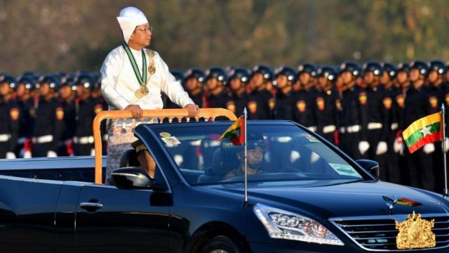
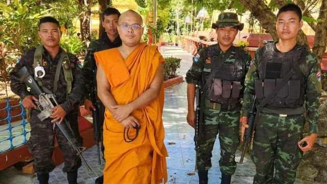
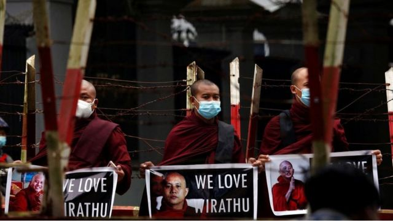
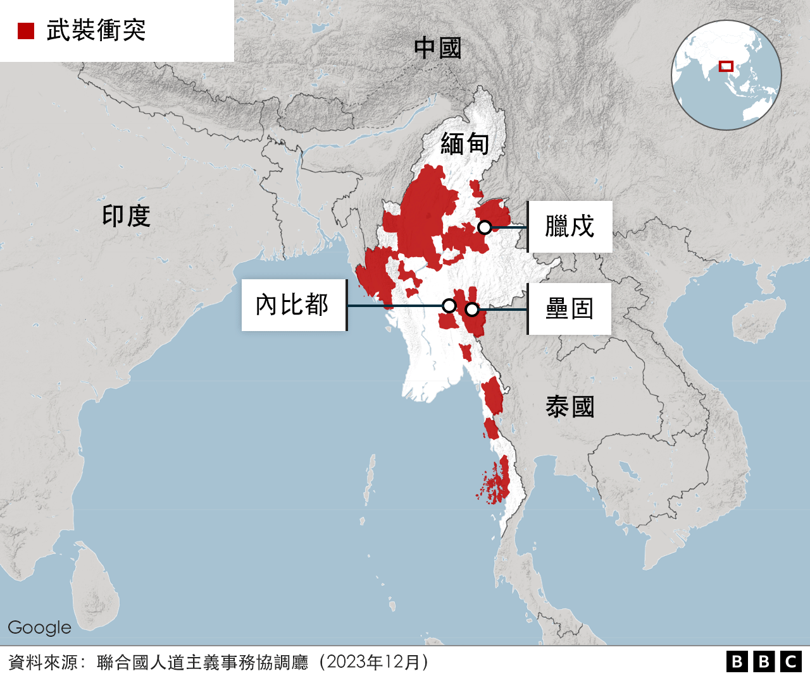
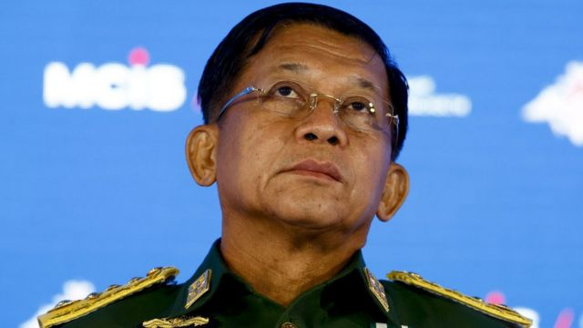
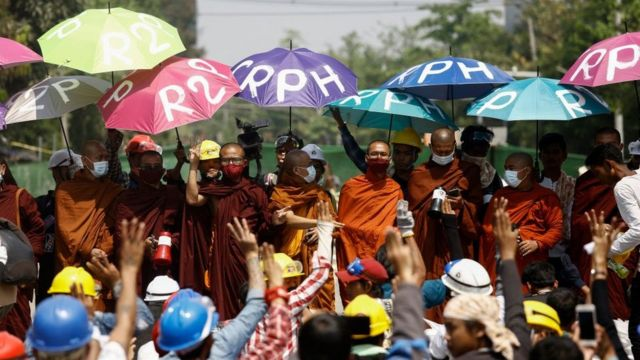

# [World] 缅甸政府军节节败退，敏昂莱是否已四面楚歌

#  缅甸政府军节节败退，敏昂莱是否已四面楚歌

  * 乔纳森·赫德（Jonathan Head） 
  * BBC东南亚事务记者 

> 图像来源，  Getty Images
>
> 图像加注文字，敏昂莱自2021年政变以来一直领导着缅甸。

**上周二，在缅甸著名山城彬乌伦（Pyin Oo Lwin）的一个小广场上，几百人喧嚣地聚集在一起，听一位戴眼镜的僧人提出了一个石破天惊的建议。**

他说，缅甸的军政府领导人敏昂莱（Min Aung Hlaing）应该下台，让他的副手梭温（Soe Win）将军接管政权。

敏昂莱是2021年推翻民选昂山素季（Aung San Suu Kyi）政府的政变的领导者。这场政变引发了灾难性的内战，使其遭到国际社会的大量谴责和国内民众的厌恶。

不过，这次的批评来自一个不同寻常的群体。这名僧人名叫包哥杜（Pauk Ko Taw，音译），是佛教徒中极端民族主义边缘群体的一员，该群体迄今为止一直坚定地支持军政府。

但最近几周，缅甸政府军在与少数民族反叛武装的战斗中遭受了一系列惨败，这促使敏昂莱曾经的“拉拉队”开始重新考虑。

##  盟友倒戈

“看看梭温的脸。”包哥杜对人群说。“这才是真正的军人的脸。敏昂莱无法应对。他应该转任文职。”

目前还不清楚包哥杜与军队的联系，但他的言论与其他军政府支持者的言论如出一辙，他们对缅甸军方领导人似乎无力扭转颓势越来越感到沮丧。包哥杜拒绝接受BBC缅甸语的采访。

他选择在彬乌伦演讲，这无疑为其演讲平添了更多影响力。这个曾经是英国殖民时代避暑山城的地方现在是知名的国防服务学院（Defence Services Academy）的所在地，军队的高级将领都在这里接受培训。

他们几乎不可能错过这个隐晦的警告：他们的朋友已经不多了。

> 图像来源，  Facebook
>
> 图像加注文字，包哥杜与亲军方的佛教民兵成员合影。

在缅甸，军队和僧侣之间的联系并不是什么新鲜事。

从1930年代的反殖民运动到1988年和2007年反对军事统治的抗争，缅甸僧侣有着悠久的政治活动传统，通常是反权威的激进主义。许多僧侣反对2021年的政变，有些人放弃了袈裟，拿起武器反抗军政府。

但也有一些人与将军们合作，与他们一样认为佛教和缅甸文化都需要抵御外来影响。

2012年，若开邦发生了当地佛教徒与穆斯林罗兴亚人之间的暴力冲突，一位名叫威拉图（Wirathu）的激进僧人帮助发起了一个名为“保护族群和信仰协会”（Association for the Protection of Race and Religion）——其缅文是“缅甸爱国者协会”（Ma Ba Tha）的佛教组织运动。

该运动鼓励抵制穆斯林经营的企业，声称缅甸佛教有被穆斯林消灭的危险，尽管他们只占缅甸人口的8%。该运动于2017年正式解散，但继续得到军方的支持。

此前因煽动种族冲突而入狱的威拉图于2020年再次入狱，但不到一年后，他就被军方释放了。敏昂莱向他递上了荣誉和金钱。

敏昂莱在2021年2月发动的政变引发了公众的强烈反对，抗议者举行了大规模集会，要求恢复民主政治，但遭到残酷镇压。这位67岁的将军此后一直以佛教拥护者自居，试图加强自己的合法性。

官方媒体不断报道这位身材矮小的独裁者向寺庙布施礼物，并在高级住持的葬礼上担任护柩者。

他还在首都内比都为世界上最大的坐佛像奠基，这座佛像是由他的军政府出资建造的。

缅甸的最高宗教机构国家僧伽委员会对政变几乎没有公开表态。据信，其中一些成员曾悄悄敦促将军们保持克制。但是，僧伽委员会的一位高僧西塔古西亚多（Sitagu Sayadaw）公开支持军队，甚至和敏昂莱一起前往俄罗斯购买武器。

其他僧侣甚至走得更远。瓦塔瓦（Wathawa）是威拉图的追随者，他一直在家乡实皆省帮助建立武装民兵组织，以挑战在各地涌现的为对抗军政府而志愿组成的“人民防卫军”（People's Defence Forces）。

社交媒体上发布的照片显示，身穿番红色袈裟的僧侣正在接受步枪射击训练，看上去颇有违和感。

> 图像来源，  Getty Images
>
> 图像加注文字，瓦塔瓦于2020年被捕，引发其他极端民族主义僧人示威。

这些民兵以缅甸神话中的君主骠绍梯（Pyusawhti）命名，他们被指控强行招募当地男子，并对平民犯下了多起暴行。但这些民兵只在少数传统上军方党派拥有强大影响力的社区立足。他们似乎也无法有效对抗现在广泛而有组织的反军事统治力量。

BBC在瓦塔瓦自2022年初就开始动员的地区联系到一名男子，他说其只能在每个村庄招募10至15名男子，后来只能通过威胁烧毁他们的房屋来征兵。

他说，许多新兵都逃跑了，在其他村民的帮助下躲避瓦塔瓦和他的持枪僧侣。

##  败退的军队

现在，缅甸军队在最近与少数民族武装组织的战斗中表现不佳，这让其支持者心生疑虑。

一位知名博主最近称敏昂莱“无能”，称在他的领导下，缅甸经历了历史性的损失和耻辱，他应该为此付出代价并下台。

他指的是掸邦北部大片领土被“三兄弟联盟”的反叛分子占领，这个由三支少数民族武装组成的联盟目前控制着与中国接壤的大部分边境地区。

他们于去年10月发起行动，最终有数千名军方士兵缴械投降。装备精良的武装部队和数百个奋起加入民族武装反叛分子对抗军政府的志愿组织之间，长达两年的血腥僵局似乎已被打破。

今年的最初几周，政府军继续败退。在该国靠近孟加拉国边境的另一侧，联盟中的三个组织之一——若开军（Arakan Army）——已经占领了几个军事基地，从而控制了钦邦和若开邦的大片地区。

该组织发布的视频显示，身穿破旧且满是泥污军服的士兵被人用电缆线铐住带离，现场还有大量被缴获的武器和弹药。

由于无法确保在道路上不受伏击，军方只能依靠数量有限的直升机为被包围的基地提供补给，并依靠空袭来保卫基地，这造成了大量平民伤亡。克钦邦的反叛分子称，本月他们击落了一架直升机和一架战斗机。

一些投降的士兵被证明属于没有太多战斗经验的混编部队。许多人还与随军家属住在这些基地，这表明他们没有做好战斗准备。

数百人选择越过边境逃往印度，数千人不战而降。六名在掸邦战败的将领被拍到在与俘虏他们的人干杯，他们的表情与其说是感到羞愧，不如说是如释重负。在被送还给军方后，其中三人被判处死刑，另外三人被判处无期徒刑，这或许是希望震慑其他人不要投降。

在缅甸军方打击反叛分子的75年历史中，这种逆转是前所未有的。军队的士气涣散，事实证明，在这种情况下招募新兵十分困难。

##  反目成仇？

> 图像来源，  Getty Images

那么，缅甸靠政变上台的领导人是否应该担心这些不满之声呢?

包哥杜上周在台上的大胆批评似乎触动了人们的神经。他随即被士兵拘留审讯，但很快获释，这表明他确有一些强大的后台。虽然官方媒体报道了他的集会，但却没有报道他对敏昂莱的评论。

据报道，被包哥杜提及的梭温将军对部队的糟糕表现感到不满。

但他还没有表现出准备篡夺上司职位的迹象。目前看来，这种改变似乎不会发生。

> 图像来源，  Getty Images
>
> 图像加注文字，2021年走上街头反对政变的抗议者中也包括僧侣。

敏昂莱也被证明善于提拔潜在竞争对手，然而再将对手边缘化。去年9月，曾被认为最有可能接替他的将军牟敏通（Moe Myint Tun）突然被捕，随后因腐败被判处终身监禁。

尽管军政府最狂热的拥趸们梦想着有一位身披闪亮盔甲的骑士来恢复军中士气，但目前却看不到任何接班人。

即使在令人震惊的战场失利之后，敏昂莱仍继续主持着官方活动，其现身更多地形同一名君主，而非军事指挥官。

这究竟是由于他的自信，还是由于他与现实的隔绝，我们不得而知。但军方已无法承受比过去三个月更大规模的损失。

无论军政府继续在已被包围的掸邦北部重镇腊戍，或在西部的若开邦，亦或是与泰国接壤的克耶邦——这里的反叛军已接近夺下首府垒固——遭遇溃败，都可能会导致更大范围的军队士气涣散，并最终导致政权内爆。

