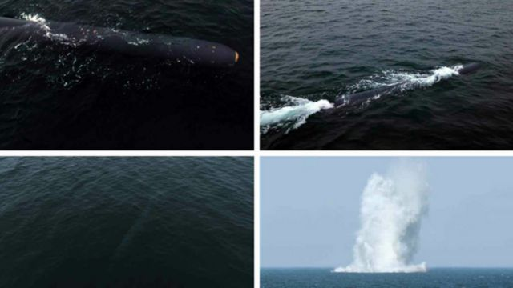

# [World] 朝鲜向其东海岸发射巡航导弹

#  朝鲜向其东海岸发射巡航导弹

  * 乔治·赖特（George Wright） 
  * BBC记者 

> 图像来源，  Getty Images
>
> 图像加注文字，首尔民众此前在电视上观看朝鲜的一次导弹发射。

**本周日（1月28日），韩国军方称，朝鲜在其东海岸附近水域发射了数枚巡航导弹。**

近几个月来，这个拥有核武器的共产主义国家多次试射导弹，加剧了地区紧张局势。

周日的发射发生在上午8点，地点在新浦港附近。目前尚不清楚导弹的数量和类型。

韩国的韩联社称，周三朝鲜试射了一枚名为“火箭-3-31”（Pulhwasal-3-31）的新型战略巡航导弹。

韩国参谋长联席会议（JCS）表示说，“我军一直在与美国密切协调，以监控朝鲜挑衅的其他迹象”。

近几个月来，朝鲜领导人金正恩在政策方向和言论上越来越咄咄逼人，终止了几项旨在维持和平的协议，并加强了军事行动。

自1月初以来，平壤已声称试射了一枚新型固体燃料导弹和据称可携带核武器的水下攻击无人机。

> 图像来源，  RODONG SHINMUN
>
> 图像加注文字，去年四月，朝鲜官方媒体发布了这些据称可携带核武器的水下攻击无人机。

在此之前的两年里，朝鲜公然违反联合国制裁，几乎每月都进行导弹发射和武器研发。

本月早些时候，金正恩宣布与韩国重新统一的基本目标已经结束，并将韩国定为“主要敌人”。

这引发了人们对朝鲜正在备战的担忧。

韩国总统尹锡悦本月对其内阁表示，如果朝鲜进行挑衅，韩国“将以数倍的力量进行报复”，并指出韩国军队拥有“压倒性的反应能力”。

> 图像加注文字，2010年，朝鲜袭击了延坪岛，造成四名韩国士兵死亡，此举激怒了韩国。分析人士认为，朝鲜可能会再次发起类似的挑衅，以试探韩国的底线。

