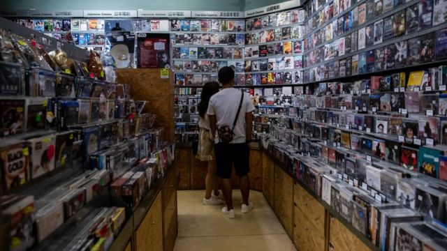
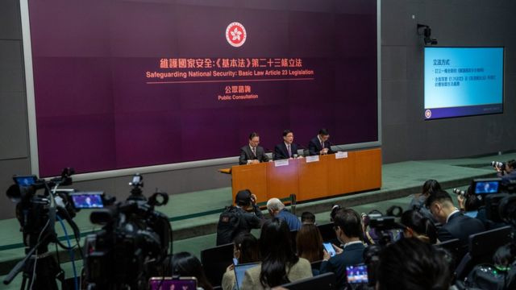

# [World] 妮可·基德曼：一文读懂美国剧集《外籍人士》无法在香港收看引发的各种讨论

#  妮可·基德曼：一文读懂美国剧集《外籍人士》无法在香港收看引发的各种讨论

  * 吕嘉鸿 
  * BBC中文 

> 图像来源，  Getty Images
>
> 图像加注文字，美国电视剧《外籍人士》参演制作人员出席在纽约现代艺术博物馆举行的首映礼（2024年1月21日）。

**由金像奖影后妮可·基德曼（Nicole Kidman，妮歌·洁曼 ）制作并主演的美国电视剧《外籍人士》（Expats），近日透过亚马逊串流媒体平台“Amazon Prime Video”独家在全球播放。但这部以香港为主题的剧集，该平台却屏蔽了香港订阅者，该剧集无法在香港“上架”收看的消息，立即引发全港议论。**

许多批评认为，剧集背景设在2014年，并重现当年香港爆发“雨伞运动”的示威场景等，因此引发亚马逊平台的“自我审查”，决定封锁该剧在香港地区使用者的权限。

面对各大媒体询问此事，亚马逊公司迄今仍无回应。香港商务及经济发展局则回应港媒称，香港《电影检查条例》现实只规管电影上映，法例不适用在串流或互联网平台，不评论个别商业机构的营运安排。

无论如何，亚马逊平台未能让香港影迷观看一套影集，意外引发全港热议。尤其是香港政府宣布启动《基本法》第23条立法公众咨询，特首李家超誓言管制“危害香港社会”的言论及行为，引发全球关注香港民主何去何从的问题。

日后外资及本地影视从业者如何与相关法律斡旋，避免“踩到红线”，还有该套影集有关经济移民或“外籍人士”是否如实被呈现，以及该剧刻画的人物形象是否陷入刻板印象等议题，也引发热烈的讨论。

BBC中文整理了这套影集在香港引发的各种争议话题，以及背后反映的复杂政治及文化因素。

##  串流平台“自我审查”？

> 图像来源，  Reuters
>
> 图像加注文字，美国电视剧《外籍人士》（Expats）是一部以香港为主题的剧集，但亚马逊串流平台却屏蔽了香港订阅者，无法在香港上架的消息，立即引发全港议论。

事实上，这套影集自开拍起，就一直在香港引发话题，延烧至今。

2021年7月，新冠疫情仍然在香港肆虐，香港政府以“专案处理”方式豁免妮可·基德曼与导演等人抵港需要隔离三周的防疫规定，并公开欢迎他们来港拍摄该影集，但此举却引发许多港人批评，认为这是提供特权给好莱坞人士。但是，港府当时捍卫有关决定，表示邀请国际红星及剧组来港，有利推动香港观光及全球能见度。

此次亚马逊影集无法在香港“上架”，亦再次引发风波。

香港电影工作者总会发言人田启文对美媒“自由亚洲电台”表示，该会已向亚马逊查询相关问题但目前仍未得到回覆。他表示，亚马逊应当是认为香港地区“没有放映作品的市场价值”，或者是出于对有关《香港国安法》的“风险考虑”。

事实上，许多报导都指，自从2020年《香港国安法》施行后，港府对于有关政治或讽刺时事的艺术创作似乎变得越来越敏感。譬如，在《香港国安法》颁布后次年，港府又再次制定了一套法律，允许相关审查人员禁止放映他们认为“违反国家安全利益”的电影。

而且，尽管港府近日已公开表示国安法律不审核串流媒体的内容，但相关的法规似乎已经间接导致串流媒体“自我审查”。

譬如，2021年11月，另一个美国串流平台“迪士尼+”（Disney Plus）正式在香港推出服务时，观众发现该平台缺少了知名美国动画《辛普森家庭》（The Simpsons）的某两集节目，这两集提到了北京天安门广场上的家庭旅游及1989年，另一集则是提到中国的“强迫劳动”争议。

之前，苹果公司旗下的音乐平台“苹果音乐”（Apple Music）在2019年被歌迷发现突然移除30年前张学友演唱的粤语歌《人间道》（即《倩女幽魂2》主题曲），也曾在当时引发热议。有报导称《人间道》歌词被指影射1989年“六四”天安门事件而遭苹果下架。

这些疑似“自我审查”的例子，让外界对于大型串连平台在香港是否还能自由制作或上映政治等敏感内容等等产生疑问。

> 图像来源，  Getty Images
>
> 图像加注文字，剧集背景设在2014年，并重现当年香港爆发“雨伞运动”的示威场景。

美国哈佛大学伯克曼网际网路与社会研究中心（Berkman Klein Center for Internet & Society）研究员毛向辉（Issac Mao）告诉BBC中文，其实这些跨国电子大平台，譬如TikTok（抖音海外版）或“网飞”（Netflix）内部都有审查中心，他们在发布内容之前就有预先的审查（Pre- Censor）。“这比内容发布后的审查更糟”，他说。

从事互联网资源共享研究多年的毛向辉向BBC中文解释，在跨国资本及政治双重力量的控制下，大众使用者及内容创造者很难与平台商有斡旋的空间。他举例说，“大型”的内容创造者，譬如在TikTok或YouTube上广受欢迎的网红们，收入多半来自大平台。因此，比起小型的内容创造者或网红，要拥有广大订阅者的网红去杯葛这些大平台的内容审查，是很困难的。

但他强调，当然，在平台商背后，自然还有政治压力或审查，持续造成寒蝉效应，让各大平台对内容的自我审核更严苛。

关注互联网正义及言论自由的民权团体“电子前线基金会”（Electronic Frontier Foundation）主席吉莉安·约克（Jillian York）女士也告诉BBC中文，就香港这套影集的审查风波来说，她认为这可能像“Meta”这样的公司（旧称为Facebook公司），被批评会根据一些政府的要求删除特定内容的原因相似。

但是，她强调“无论是由国家强制执行，还是由公司自我审查，这些审查很少会在一次实施后就停止审查。换言之，一旦这种封印被打破，更多的审查总是会一次次地到来”。

不过，毛向辉强调，以《外籍人士》为例，可以看到的是，媒体对此事的高度报导及关注，还是可以在一定程度上让用户知道并明白审查机制是如何影响创作自由及言论空间的。

他表示，目前全球许多独立电子平台与用户正在互相串连使用，创造共享的网路资源及空间，协助互联网资源去中心化（de-centralize）仍然是很重要且有效的。

##  对香港影视业的影响

> 图像来源，  Getty Images
>
> 图像加注文字，在2020年《香港国安法》实施和2021年修改电影审查条例之后，电影和其他文化领域的审查明显增加。

此套影集引发的审查风波，亦再次引发各界对于香港电影或有关香港的文化产品，如何在《香港国安法》及《基本法》“第23条”立法下生存下去的辩论。

譬如，政治纪录片《时代革命》的香港导演周冠威本周接受美国媒体采访时说，以2019年香港示威为例，他观察到，在主流电子平台上没有任何一部纪录当年示威的影片被选上放映。

他表示：“就当Netflix不一定是卖《时代革命》，但有这么多的香港‘反送中’纪录片，Netflix是一套都没有的。以我的认知与判断，这是世界大事，是值得有一套纪录片的，至少有一套。你看Netflix这么多纪录片，会不会有一出可以考虑呢？自由文明的西方公司、甚至创作人，都有这样的考量，这是可悲的。”

如何“安全地”拍摄香港的议题又不要牺牲自己的艺术主张，确实对《外籍人士》导演王子逸（Lulu Wang）提出了挑战。她在本月接受BBC电台节目采访时说，该片拍摄前后一直同法律团队合作，确定哪些内容可以拍摄或播出，哪些会有风险。最终，剧中的抗议场景都是在加州洛杉矶取景。

据报导，该剧集有邀请香港本地演员陈慧珊、柯炜林及岑乐怡出演，同时聘雇许多香港影视工作者参与制作。

王导演解释，她确实担忧该剧会对参与制作的香港同事造成安全影响，她因此需要以负责任的态度来拍摄敏感议题。但她向BBC强调，能够正确地展现香港当年（2014）的特殊时刻，是十分重要的。

电影学者、香港中文大学中国研究中心助理教授温祺德（Kristof Van Den Troost）向BBC中文解释，“令人遗憾的是，一部国际大制作，并聚焦香港的影集在香港本地无法观看“。

不过，研究香港电影史及审查制度多年的温祺德也指出，在1970年代之前，香港对电影实行相当严格的政治审查，之后审查情况逐渐变松，但直到1995年，即电影中的政治审查才从法律中被取消。

> 图像来源，  Getty Images
>
> 图像加注文字，香港特首李家超1月30日上午举行记者会，《基本法》“第23条”立法将展开为期仅一个月的公众咨询。

1970年代中期，香港影视中描绘警察腐败或滥权的场景可能成为审查人员要求删减或甚至禁止放映的原因，同样，对香港社会阴暗面的聚焦也可能遭到审查。

温祺德说，在政治审查方面，英国殖民时期的香港电影审查官主要将政治排除在电影之外，这意味着来自中国大陆，甚至台湾和美国的电影偶尔会被删减或禁止上映，“很长一段时间以来，他们对带有反殖民信息的电影也非常敏感。这些形式的审查在20世纪70年代和80年代逐渐减少”。

温祺德强调，在2020年《香港国安法》实施和2021年修改电影审查条例之后，电影和其他文化领域的审查明显增加。温教授坦言，虽然很难量化，但根据电影界者的陈述及他的研究，自我审查在香港，确实比政府实际执行的审查更为广泛。“然而，与中国大陆相比，我认为香港的电影审查仍然相对宽松”，他补充解释道。

事实上，近年来，香港名导杜琪峯和影帝周润发，都对香港电影业因为审查制度带给电影工作者的挑战表示忧虑。杜琪峯曾对香港媒体表示，“以前下架的电影，主要是因为票房唔收得，现在下架有太多因素。”

研究香港电影多年的温祺德对BBC表示，在一个全球市场上，你的竞争对手通常不必应对太多的审查限制，这是一回事。但若有一个“没有非常明确规定可行和不可行之分的审查制度，其实是最糟的，因为它产生了不可预测性，并且还培养了一种保守行事的态度，这通常妨碍了艺术家的创造力”。

##  “外籍人士”是谁？

在自我审查的质疑声浪中，有关这部剧集的故事，以及它聚焦的外籍人士，特别是女性在香港的际遇几乎要被淹没。事实上，这本书改编自在港出生长大的美籍韩裔作者李伦京（Janice Y.K. Lee）的同名小说。原著在2016年出版，后来妮可·基德曼在读过小说后，在2017年买下改编版权成为执行制作人，并邀请王子逸参与导演。

> 图像来源，  Getty Images
>
> 图像加注文字，2021年新冠疫情仍然在香港肆虐，香港政府当时以“专案处理”方式豁免妮可·基德曼与导演等人抵港需要隔离三周的防疫规定，并公开欢迎他们来港拍摄该剧集。

整套剧集因此以2014年的香港为背景，包括当年撼动全港的“雨伞运动”。故事主轴是以三位美国女性在香港的生活，各自面临的婚姻，工作与友情上的种种困难及自我追寻展开。

但有些评论认为，这些外籍人士多半在香港有着经济及种族的优势，一些评论甚至批评，这套剧集是否仍在重复一些富裕的西方人士在香港生活的“陈腔滥调”。

那么真实的外籍人士在香港的生活又是如何呢？ 研究香港经济移民多年的英国伦敦大学玛丽女王学院（Queen Mary College, University of London）社会学教授卡罗琳·诺尔斯（Caroline Knowles）向BBC中文表示，她访问的外籍人士大多很喜欢住在香港，原因是这些人“拥有在其他地方做梦也想不到的特权，因为在其他地方雇用帮佣的费用要高得多，而且他们并没有受到如此尊重的对待”。

诺尔斯告诉记者，而且，香港的特别之处在于为这些外籍人士（泛指经济移民）提供了奢华生活，包括司机、工人姐姐、工作等全方位服务等等。“香港确实提供了许多他们在老家根本无法获得或以同样方式获得的优势和特权。”

而且，“香港的独特之处在于它的异国情调——他们觉得自己生活在一个完全不同的地方，一个他们在社交和语言上都难以理解的地方，因为许多人除了几句问候之外甚至不试着学习当地语言。”

诺尔斯教授认为，对这些外籍人士来说香港赋予了帝国特权和种族政治的痕迹，是大英帝国去殖民化的最后一块地方。某种程度上，“香港是一个可以让他们恢复白人失去的特权的地方。”

正如《外籍人士》描绘的的优势生活，诺斯教授解释说，有时候他们的生活以老套的方式被性别化，譬如许多女性有时会放弃高薪工作，留在家里经营家庭，“在泳池边闲逛，去喝个下午茶”。

她指出：“这些人在港的生活往往蛮容易想像，很‘公式化’，因为作为外国人缺乏了解香港文化和语言能力，甚至无法了解当地人的生活。但与留在老‘家’的亲友相比，他们却有点自鸣得意（a bit smug），认为自己是国际化的、经常旅行的人。”

