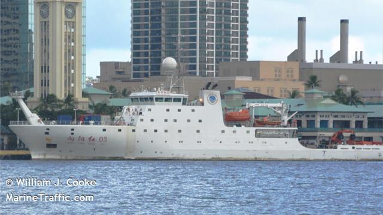
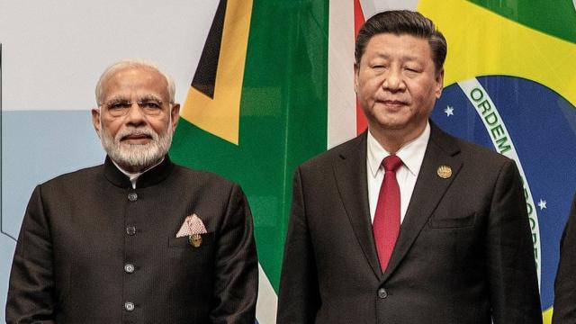
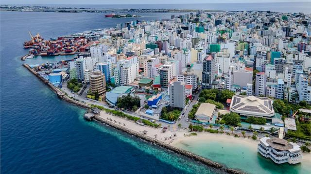
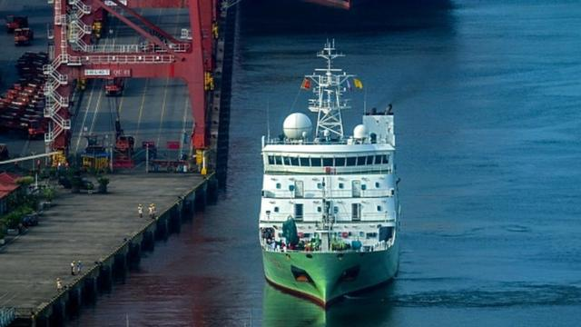

# [World] 马尔代夫：中国科考船停靠牵动印度紧张神经，前解放军大校称“印度洋并非印度的海洋”

#  马尔代夫：中国科考船停靠牵动印度紧张神经，前解放军大校称“印度洋并非印度的海洋”

  * 安巴拉桑·埃希拉扬（Anbarasan Ethirajan） 
  * BBC记者 

> 图像加注文字，中国船只“向阳红03”号泊靠在夏威夷火奴鲁鲁（檀香山）。

**一艘中国科考船预计将于本周抵达马尔代夫，这加剧了北京、德里和马累之间的紧张关系。**

官方说法是，“向阳红03”将在马尔代夫“沿途泊靠，进行人员轮换和物资补给”。简而言之，这是一次完全无害的停靠。

但在德里看来却并非如此。相反，这艘船的出现对印度来讲至少是一种外交上的冷落。在最坏情况下，一些人担心这可能是一次数据收集任务，日后可能会被中国军方用于潜艇行动。

然而，中国问题专家对他们的担忧不屑一顾。

“中国船只在印度洋开展科研工作。它在公海上的活动完全合法。”前中国解放军大校周波对BBC说。

“有时船只需要补给，比如燃料、食物和水，所以它们停泊在第三国港口是很正常的。因此，印度政府不应该对此大惊小怪。印度洋不是印度的海洋。”目前在清华大学任教的周波说。

但这并不是第一次有中国船只靠近印度水域。中国和印度在喜马拉雅边界问题上存在长期争端，两国在印度洋也展开了影响力之争。

> 图像来源，  Getty Images
>
> 图像加注文字，中国和印度在印度洋争夺影响力，并在喜马拉雅山地区拥有长期边界争端。

2014年，两艘中国海军潜艇在科伦坡港泊靠。过去两年，两艘中国科考船访问了靠近印度南端的斯里兰卡，这令印度十分不满。

在争议发酵之际，中国向科伦坡提供了数十亿美元贷款，拉进了其与斯里兰卡的距离。

事实上，科考船“向阳红03”原本计划在前往马尔代夫之前到访科伦坡进行补给。但斯里兰卡外交部副部长塔拉卡·巴拉苏里亚（Tharaka Balasuriya）称，这一计划已暂时搁置。

他告诉BBC：“在这一年中，我们希望发展我们的技术和专业知识，以便我们能够平等地参与这些研究活动。”

科伦坡阻止科考船的决定被视为是对印度强烈反对中国船只此类访问的回应。但印度的反对并没有在马尔代夫见效。

马尔代夫位于印度洋中部，由大约1200个珊瑚岛和环礁组成，长期以来一直处于印度的势力范围。但去年11月就任总统、被视为亲华派的穆罕默德·穆伊祖（Mohamed Muizzu）希望改变这种状况。

他在竞选期间喊出“印度离开”（India Out）口号，要求德里撤出驻扎在该岛的约80名军事人员。印度表示，这些部队驻扎在马尔代夫，是为了维护和操作德里几年前捐赠的三架侦察和救援飞机。

马尔代夫政府已向德里发出最后通牒，要求其在3月15日，也就是该国议会选举前两天撤军。两国已启动高级别会谈以解决这一问题。

上周在德里举行会谈后，马尔代夫外交部表示，印度已同意“替换军事人员”，首批人员将于3月10日前离开，其余人员将于5月第二周离开。

> 图像来源，  Getty Images
>
> 图像加注文字，马尔代夫长期以来一直处于印度的势力范围，但新任总统希望改变这一情况。

去年12月，穆伊祖政府还宣布，将不再与印度续签前政府签署的一项水文勘测协议，该协议旨在对马尔代夫领海的海底进行测绘。

事实上，两国关系已经严重恶化，以至于马尔代夫政府的高级领导人都没有出席印度驻马尔代夫高级专员公署最近为庆祝印度第75个共和国日而举办的活动。

与此同时，当穆伊祖上月对北京进行为期五天的国事访问时，中国为他铺上了红地毯。在那次访问后，中国高级官员访问了马尔代夫。穆伊祖还宣布了几个由中国资助的基础设施项目。

马累对中国立场的突然转变，引起了重视这个岛国战略重要性的印度政府的担忧。

正在迅速扩充海军力量的中国，很可能也想进入这样一个战略要地——这是印度希望避免的。

“当然，马尔代夫非常重要，它是印度在南大洋的侧翼。”印度前外交秘书希亚姆·萨兰（Shyam Saran）告诉BBC。

“就像我们对斯里兰卡发生的事情持严重保留态度一样，我们对马尔代夫可能发生的事情也持严重保留态度。”萨兰说。

> 图像来源，  Getty Images
>
> 图像加注文字，印度此前曾对中国科考船访问斯里兰卡提出强烈反对。

但不仅仅是德里担心与马累的关系。

反对党马尔代夫民主党（MDP）和其他党派一直在敦促穆伊祖政府改弦更张，称与印度这样的巨大邻国对抗不符合该国的利益。上周，民主党表示其甚至在考虑对穆伊祖提起弹劾程序。

作为一个小岛屿国家，马尔代夫的大部分食品、基础设施建设和技术进步都依赖于印度。许多马尔代夫人前往印度就医。

马累一名隶属于民主党的律师艾克·艾哈迈德·埃萨（Aik Ahmed Easa）在接受BBC采访时表示：“这里的大多数人认为政府对印度的敌意有点过火，完全没有必要。”

“马尔代夫是一个小国。但我们正陷入亚洲超级大国的竞争之中，这是一个危险的阶段。”

马尔代夫总统办公室和外交部长没有回应置评请求。

专家表示，中国拥有更大的战略野心，可能会派遣更多船只前往印度洋地区进行海洋研究或保护其商业利益。对印度来说，挑战将是如何对抗中国在这个被德里视为自家后院的地区日益强硬的影响力。

周波大校说，中国的航母和其他舰艇最终将驶至印度洋。他表示，如果印度在第三国（如斯里兰卡）阻止为这些船只提供补给，那么中国政府将感到愤怒。

