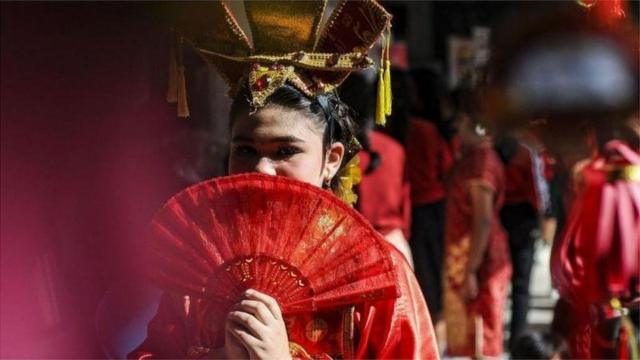
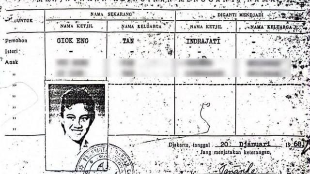
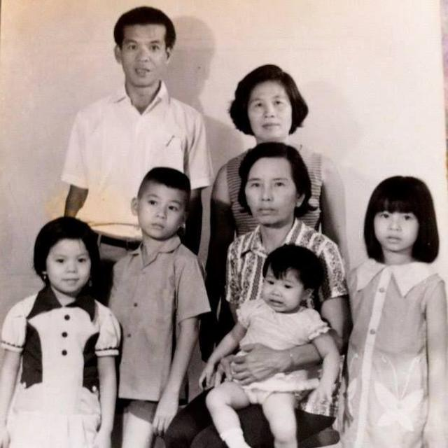
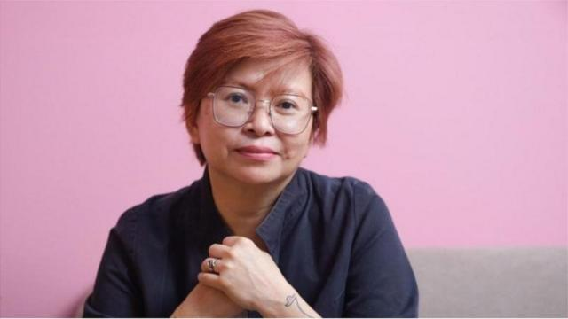
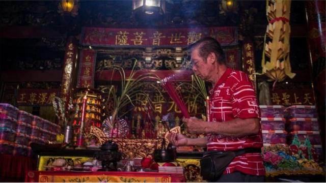
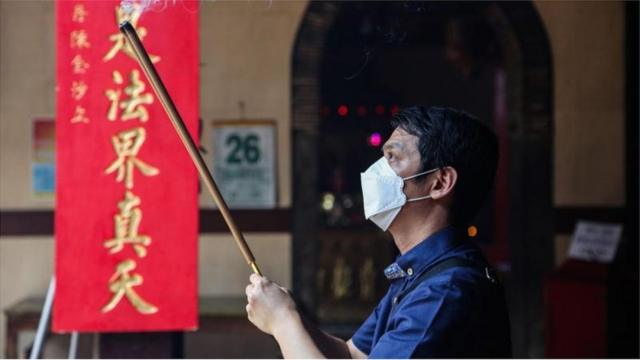
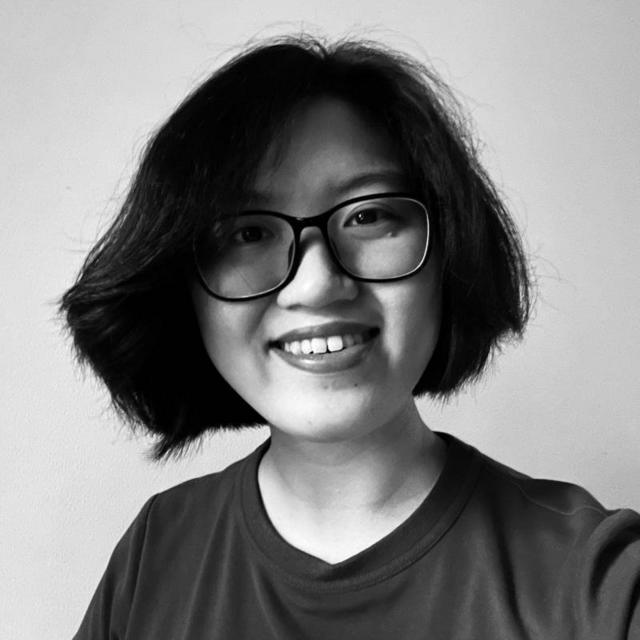
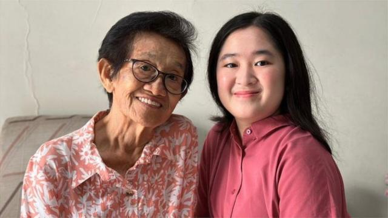

# [World] 印尼华人：重新找回中文名字的希望以及背后的身份之争

#  印尼华人：重新找回中文名字的希望以及背后的身份之争

  * 特里莎·胡萨达（Trisha Husada） 
  * BBC印尼语记者 

> 图像来源，  Getty Images
>
> 图像加注文字，身着华人传统服饰的印尼华人庆祝农历新年。

**由于印尼的历史，当地华裔的名字背后有着复杂的纠葛。在荷兰殖民时期，他们被差别对待，而在苏哈托（Suharto）的“新秩序”时代，他们又在同化政策下面临证明自己是印尼人的压力。**

苏哈托政府颁布了数十项歧视华裔的法规，从将华裔姓名改为印尼姓氏、禁止在公共场合庆贺春节，到要求华裔公民通过印尼公民证（SKBRI，也称《印度尼西亚共和国国籍证明信》）证明国籍，不一而足。

苏哈托政府倒台后，同化政策被取消，大多数印尼华裔后代有了两个名字，这象征着他们作为华人和印尼人的两种身份。不过，也有一些人没有中文名，因为其家庭在背井离乡多年后已失去了文化根基。

BBC印尼语记者特里莎·胡萨达（Trisha Husada）通过回顾自己的亲身经历、采访专家和其他不同世代的印尼华人，追溯几位印尼华人后裔的身份和文化根源。以下是他们的故事。

##  “我们生活在印尼，所以我们用印尼名字”

每当我问我的印尼华人朋友他们的中文名字是什么，他们都会很惊讶，因为很少有人问这个问题。

即便如此，他们在解释自己中文名的含义时，总是显得很自豪。

我自己出生时只有一个印尼名字，我想知道为什么我的父母没有给我起一个中文名。这激发了我对自己家庭背景的好奇心。

> 图像来源，  TAN GIOK ENG
>
> 图像加注文字，1968年，陈玉英使用一份特别为印尼华人社群准备的更名声明，将自己的名字改为因德拉贾蒂（Indrajati）。

我问母亲为什么不给我和妹妹取中文名。

“现在这个时代已经不需要中文名字了。因为我们生活在印度尼西亚，印尼名字更实用。”母亲回答道。

她的名字叫“Helen”，源自她的中文名赖爱连。

她解释说，她和我的爸爸不会用中文写字或说话，不像他们的祖父母。因此，很难给孩子起中文名。

“因为我们没有人会教（汉语），所以我们建议你们上中文课或参加课外活动。”她说。

##  “与传统隔绝的一代人”

Skip podcast promotion and continue reading

* BBC 時事一周 Newsweek (Cantonese)   **

BBC國際台粵語節目，重溫一周國際大事，兩岸四地消息，英國境況。並備有專題環節：〈記者來鴻〉、〈英國生活點滴〉和〈華人談天下〉。

分集

End of podcast promotion

雅加达希望之光大学（Pelita Harapan University）的文化专家约翰尼斯·赫里扬托（Johanes Herlijanto）告诉我，由于苏哈托时期实施的更名规定，华人家庭中使用中文姓名的情况越来越少。

约翰尼斯解释说，中文名的本地化不仅发生在印度尼西亚，也发生在其他有华人侨民或“峇峇娘惹”（peranakan；意指与当地非华人族群混血或受其文化影响的华人）的国家。例如在马来西亚、新加坡或美国。

不过，与印尼不同的是，他们通常同时会有一个中文名，并用汉字来书写。

现在印尼汉学论坛（FSI）担任负责人的约翰尼斯解释说：“在印尼，我们现已到了这样一个阶段：人们起的第一个名字就是一个非中文名。”

“出生证上写的第一个名字就是印尼语名字。长大后，他们的祖母或其他亲戚可能会建议给他们取一个中文名。”

这一特殊现象源于苏哈托当政时期。当苏哈托于1965年上台，并于次年正式成为总统时，印尼华人社区面临着证明自己是印尼人的压力。

苏哈托政权出台了几项打压印尼华人社区的政策，这一举措被称为“同化”。

在他的“新秩序”时代，苏哈托颁布了1967年第240号总统令，规定成为印尼公民的华人必须“经历一个同化过程，特别是为了防止种族独特性的发生”。

该规定建议根据1966年印尼内阁主席团第127号法令规定的华裔印尼人“华人姓名”更改程序，替换中文姓名。

在里奥·苏里亚迪纳塔（Leo Suryadinata）撰写的《印尼原住民、华裔少数民族和中国》（Pribumi Indonesiaians, The Chinese Minority and China；2023）一书中，他解释说，苏哈托之所以颁布这项政策，是因为他质疑印尼华人的政治倾向。

苏哈托政府指责中国支持的印尼共产党（PKI）是1965年那场悲剧的根源。因此，政府要求尚未获得印尼国籍的印尼华人办理归化手续。

方法之一是颁布法规，命令印尼华人将姓名改为具有印尼特色的名字。

其他歧视性政策还包括禁止在公共场合庆祝中国新年、禁止说汉语、禁止信中国传统宗教等。

因此，1965年后出生的X一代大多缺乏对中华文化（包括汉语）的了解，因为他们缺少相关的家庭教育。

“这一代人与祖先传统的根基断绝了联系。所以可能没有太多理解。也许他们也不懂汉语。”约翰内斯说。

##  华裔X世代面临的歧视

索珍玛琴（Soe Tjen Marching；音译）是强制同化政策之后出生的印尼X世代华裔之一。她是《沉默的终结：1965年印尼种族灭绝事件记录》（The End of Silence, Accounts of the 1965 genocide in Indonesia）一书的作者，也是伦敦大学亚非学院（SOAS，University of London）语言与文化讲师。

她告诉我，她于1965年悲剧后在印度尼西亚长大，生活发生了翻天覆地的变化。

索珍玛琴来自一个与爪哇人混血的华裔家庭，她的父亲曾因在泗水担任印尼共产党的行政官员而被拘留和折磨了三年。

当苏哈托政府要求中国公民将姓名改为印尼语时，索珍的父亲照做了。但他希望自己的孩子能保留中文名。

索珍玛琴承认，父辈们给她取的这个名字让她感到尴尬。因为从幼儿园到高中，她一直被同学嘲笑和欺负。

“因为我朋友的名字通常都是西方名字或爪哇名字，并不奇怪。我的名字很奇怪，让我很尴尬。”索珍玛琴告诉我。

> 图像来源，  SOE TJEN MARCHING
>
> 图像加注文字，索珍玛琴出生于一个与爪哇人混血的华裔家庭。他的父亲因担任泗水印尼共产党的行政官员而被捕。

在进一步了解了印尼华人的文化和历史后，索珍玛琴为自己的名字感到自豪，她认为这是家族的传统。

“至少我的名字没有从我父亲想要留下的传统中消失。”她说。

她的中文全名是黄失箭，意思是射向远处的箭。她的印尼语名字则加上了玛琴（Marching）的姓氏。

“过去，我父亲崇拜毛泽东，虽然我不崇拜。所以玛琴来自毛泽东的长征。”她说。

> 图像来源，  SOE TJEN MARCHING
>
> 图像加注文字，索珍玛琴

索珍玛琴解释说，对华裔的歧视性规定实际上并非始于苏哈托时期，而是自荷兰殖民时代就已存在。当时，华人和当地人被迫分开居住。

当时，中国人必须持有特殊的身份证，并居住在中国公民的特殊定居点，也就是现在的唐人街。

“他们直接隔离了中国人，建立了唐人街。这样，中国人就不会与当地人混居，然后成家立业。”她说。

然后，这项规定在苏加诺（Soekarno）和苏哈托统治时被继续执行。

“苏哈托时代更糟，因为我们不仅被迫改名，还被禁止使用汉字，春节庆祝活动也被禁止。”

> 图像来源，  Getty Images
>
> 图像加注文字，1965年10月，一名华裔学生在印尼公共大学（Res Publica University）遭到印尼青年攻击时保护自己。

虽然索珍玛琴的父亲能说一口流利的汉语，母亲也是一名汉语教师，但索珍说，她和她的兄弟姐妹们从未在家里学习或使用过中文。

“他们不教孩子中文是因为他们害怕，非常害怕。因为我父亲也曾是政治犯，所以你必须小心。所以我不会说汉语。”

“我失去了（学习语言）的机会，非常（不幸）。现在回想起来，我仍然很恼火。”索珍玛琴说。

她说，当时的政府正试图通过更名规定、语言禁令以及中国庆祝活动和传统禁令来推行同化进程，从而抹杀中国人的身份。

“如果他们在没有任何胁迫的情况下想改名，对我来说这并不重要。这是别人的权利。问题在于是否存在胁迫。新秩序时期就存在胁迫。”

##  被要求提供公民证的历史

与索珍玛琴不同，记者兼木塔图里计划（Project Multatuli）项目执行主任埃维·马里亚尼（Evi Mariani）从小就有一个印尼名字。埃维说，她的父亲给她起了一个中文名字，他在台湾学过汉语。

“爸爸姓朱，所以我叫朱爱惠。他说这意味着一缕爱。然后他决定给他的孙子和我的儿子也取中文名。”埃维说道。

埃维的父母出生时都有中文名。然而，他们被迫改成印尼名，以获得印尼公民证。

“我亲眼看到了那些文件，其中有一个文件叫做《姓名变更声明》。在印尼，没有任何一个民族有这样的文件，这是专门为华人准备的。所以我的父亲、母亲和祖父也改了名字，以证明他们是印尼人。”

> 图像来源，  EVI MARIANI
>
> 图像加注文字，埃维

埃维的名字意为“爱的光芒”，是在台湾学习过汉语的父亲给她起的。

埃维于1994年开始上学，当她想在校园里办理学生证时遇到了困难。当时的行政官员要求她提供公民证。但实际上，埃维并不需要持有该文件。

1996年，政府取消了华裔公民出示公民证的义务。

“因为我是印尼人，在印尼出生，所以我天生就是印尼人。你不需要实际的公民身份证明。但管理者想要钱，后来我才明白。”埃维说。

她分享说，她的许多华裔印尼朋友在出国旅行时，总是会在移民局遇到麻烦。他们必须提供各种各样的文件来证明自己的印尼国籍。

埃维认为，印尼华人的民族认同一直受到质疑。尽管她这一代人大多在印尼出生和长大，但他们总是被要求证明自己的民族认同。

在苏哈托时代，同化和融合运动曾造成印尼华人舆论的分裂。

同化群体由同意将自己的中文名改为印尼语名字的华人组成。他们希望同化过程是基于自我意识。

> 图像来源，  BETWEEN PHOTOS/MOHAMMAD AYUDHA
>
> 图像加注文字，1990年代末，印尼松绑允许使用汉字和庆祝春节。2000年，印尼承认儒教为官方宗教之一。

支持同化的人认为，如果印尼华人不放弃区别于其他印尼人的文化和习俗，他们就永远无法真正成为印尼人。

另一方面，融合支持者认为，华人应被视为一个民族实体，与组成印尼的其他部族一样，被承认为印尼的一部分。

在苏哈托时代，同化团体得到了国家的大力支持。而融合团体则被认定为亲中国或与共产主义有关联。因此，国家颁布了禁止在公共场所使用中国语言和文化的规定。

事实上，融合的特点之一就是解放一个种族或部落，使其能够在公共场所使用自己的文化和语言。

尽管现在已没有禁止使用中文名的规定，但埃维承认，现在的父母还是更喜欢给孩子起带有西方或印尼特色的名字。就像她小时候一样。

“在我那个年代，第一个在自己的印尼名字中使用中国姓氏的人是我的朋友，当时使用他的姓氏是相当勇敢的。”

“用西化的名和中国的姓氏是一件了不起的事情。这在当时真的很勇敢、很酷。”埃维说。

##  不同的公民权原则

为了寻找华人的身份和文化根源，我采访了《雅加达华人宗族名录》（List of Chinese Clans in Jakarta）一书的作者艾迪·萨德利（Eddy Sadeli）。

“一般来说，现在华裔公民在为子女办理出生证明时都使用印尼语姓名，以便于与当地民众相处。”他说道。

艾迪解释说，印尼坚持出生地主义（属地主义），即根据出生地确定一个人的国籍。

与此同时，台湾和中国大陆坚持血统原则（属人主义），即根据个人血统决定公民身份。

艾迪说：“在华裔申请签证时，中华人民共和国和台湾会要求他们提供中文姓名，因为两地都坚持血统主义。”

> 图像来源，  BETWEEN PHOTOS/MEANING OF ZAEZAR
>
> 图像加注文字，1月26日，华裔居民在中爪哇三宝垄大觉寺举行岁末祷告活动。

在1945年印尼独立之前，由于中国和荷兰殖民政府适用的公民权原则不同，许多印尼华人被划分为两个民族。

因此，1958年苏加诺政府上台后，印尼与中国达成协议，要求在印尼出生的华人选择一个国籍，即成为印尼公民或中国公民。

1978年3月，苏哈托政府颁布了一项法规，要求“所有需要证明其公民身份的公民”都申请印尼公民证。

选择印尼国籍的印尼华人随后被要求改名并获得公民证，以继续留在印尼。

艾迪在书中指出，印尼大约有167个华人姓氏。

据印华百家姓协会副秘书长阿尔迪·苏珊托·奥伊（Ardy Susanto Oey）介绍，拥有一个中国姓氏可以帮助印尼华人社区与国外其他华人华侨建立联系。

“（中文）名字对我来说仍然很重要，所以我的朋友们知道也许几百上千年前他们就是兄弟，这样就能最大限度地减少人与人之间的误解。有一种化学反应能缓解紧张气氛。”艾迪说。

> 图像来源，  ARDY SUSANTO OEY
>
> 图像加注文字，阿尔迪·苏珊托·奥伊（Ardy Susanto Oey）认为，拥有一个中国姓氏可以帮助印尼华人社区与国外其他华人华侨建立联系。

出生于1980年的阿尔迪觉得自己这一代人“迷失了方向”，因为二十多年来，由于同化规定，中国文化和语言已经流失。他本人在出生时也没有中文名。

尽管如此，他认为，在他之后的年轻一代越来越积极和自豪地了解他们的印尼华人身份。

“今天，我们不能说父母对（中华文化）了解更多。现在的年轻人更了解中华文化，我的儿子就比我更了解中华文化。不同的是，我们是迷失的一代。”身兼印尼华裔青年协会主席的阿尔迪说。

##  复活身份的Z世代

阿尔迪的解释有一定道理。至少，当我遇到和我同龄的华裔印尼跨性别女性马西娅·明（Mathea Ming；音译）时，我有了类似的印象。

马西娅·明说，她之所以选择将自己的中文名融入印尼名字中，是因为从小她就经常被人用中文名称呼。

“其实我很喜欢我的中文名——明。听起来也很可爱。当人们叫我明明时，我会更开心。”当我在万丹省当格朗市阿拉姆苏泰拉（Alam Sutera）的一家家具店见到马西娅时，她这样说道。

她解释说，她的中文名吴业明意为辉煌的事业。她的父母特意为她取了这个名字，希望她的未来是美好的。

> 图像加注文字，吴业明更喜欢使用自己的中文名，因为她觉得这是她华裔印尼人身份的一部分。

马西娅现在在一家知名公司担任游戏开发员，这是她从初中开始就梦想的工作。

“这不仅是因为运气，也是因为我的努力。”她说。

她说，在她的朋友圈子里，很多人都有中文名，其中一些人还经常用中文名字作为昵称。

“我在Discord群组里问我的朋友们：你们的中文名是什么？让我们把自己的昵称改成汉字来迷惑别人吧。”马西娅笑着说。

“很多人都这么做了。”

峇峇娘惹之声（Suara Peranakan）是一个通过社交媒体介绍华裔印尼人文化和身份的群体组织，该组织的夏琳·凯拉·罗斯利（Charlenne Kayla Roeslie）与马西娅有同样的感受。

她在自己的Instagram账户上，也将汉字名李滋羿放入昵称之中。

夏琳说，在她开始接受自己印尼华人身份后，才决定用这两个名字来表明自己的身份。

> 图像来源，  Charlenne Kayla Roeslie
>
> 图像加注文字，夏琳·凯拉·罗斯利在进一步了解自己的文化后，接受了自己的印尼华人身份。

“（以前）有一种身份之争，我是华人还是印尼人？在印尼的日子里，尽管我在这里出生并从小到大在这里生活，但我从未有过真正的家的感觉，因为我总是被拿来与别人比较。”

“我尝试接受两种身份的方法之一，就是把我的中文名字放在显眼的地方。我不想再抹去我的华人身份。”

夏琳的中文名是李滋羿，取自一个关于月饼的中国传统童话故事。

她说：“‘滋’是生长的意思，‘羿’来自中国的一个传说，如果你知道关于月饼的传说的话。‘羿’与后羿射日的‘羿’完全相同。”

##  保持华人身份的愿望

文化研究教授约翰尼斯·赫里扬托说，随着文化的发展和社会的变化，一个人表达自己身份的方式不能只从单一类别来看。

约翰尼斯认为，随着文化和部族的融合，印尼华人不再有“纯种”或“混血”之分。每个人都可以认定自己是华裔，因为这就是他们的身份。

他继续说，因为身份是不断变化的，每个人都有权以自己的方式表达自己的身份。

“现在，雅加达的华人不再使用中文名，也不再说汉语，但仍在遵循一些中国传统。他们到底是不是华人？”

“即使没有中文名，他们也有权称自己为华人。”约翰尼斯说。

> 图像来源，  CHARLENNE KAYLA ROESLIE
>
> 图像加注文字，夏琳家客厅的沙发上总是摆放着一些春节图案的抱枕。

虽然禁止使用华人姓氏的禁令与同化政策一起走进历史，但印尼华裔记者埃维·马里亚尼认为，从插入华人姓氏的印尼姓氏中，仍然可以看出保持华人身份的愿望。

“过去还有更多的隐蔽手段，因为他们更害怕。但保留身份和文化、维护家族传承的愿望依然存在。”埃维说。

与约翰尼斯的观点一致，埃维说，印尼华人的文化已经被有机地同化，与该国各个部族、语言甚至食物混合在一起。因此，形成了非常丰富的文化交融。

“每次过春节，从小到大，我家人都没吃过中国菜。我们总是吃巽他菜。”

“因为家庭聚会的地方在我母亲的姐妹家，而她的丈夫开了一家很有名的巽他餐厅，所以就这么简单。”埃维说。

在与不同年代的印尼华人交流了他们对华人身份和名字的看法后，我找到外祖母陈玉英，请她给我起一个汉字名。

外祖母家的客厅里，一个十字架插在一个有蓝色花纹的中式花瓶里。冰箱里还有一张红底兔子贴纸。去年春节庆祝活动的装饰品依然残存。

> 图像加注文字，尽管在日常生活中已不再说华语，BBC印尼语记者特里莎·胡萨达（Trisha Husada；右）和外祖母陈玉英（Tan Giok Eng；左）仍然庆祝中国新年。

我坐在外祖母旁，她在家里被称为“阿嬷英”（Omah Eng）或“陈玉英”（Tan Giok Eng）。不过，她的证件上的名字是因德拉贾蒂（Indrajati）。

起初，她很犹豫是否要给我取个中文名，因为她觉得印尼名字比中文名字更容易生活。

“（你）已经（有）印尼名字了，这好多了。这更简单。”她轻声说道。

但我又试着问她觉得哪个中文名字适合我。

> 图像加注文字，陈玉英写下了陈金丽三个字，意为美丽的黄金。

“Chen Jin Li。”外祖母脱口而出，像是给人一种她准备了很久的感觉。

“意思是美丽的金子。和‘好看’不同。因为‘丽’是美丽的意思。”

然后，她在杂志扉页上用汉字写下了这个名字，并把它交给了我：陈金丽。

