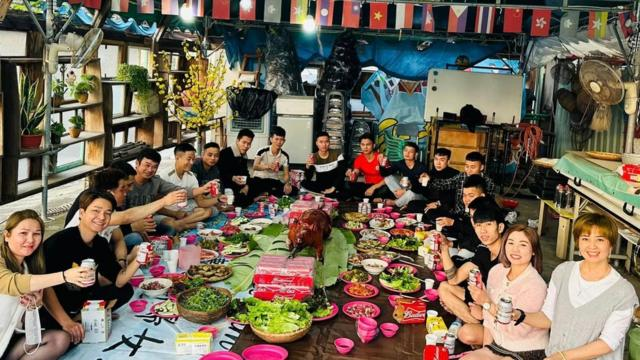
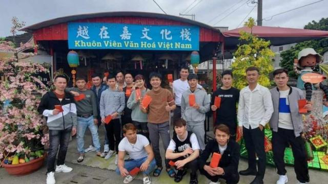
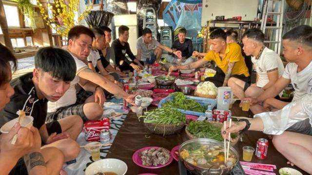
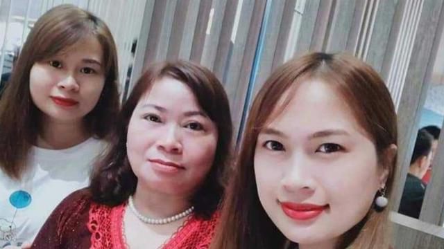

# [World] 越南移工台湾过年：“越在嘉”里的思乡情，高雄买房的妈妈终和女儿团圆

#  越南移工台湾过年：“越在嘉”里的思乡情，高雄买房的妈妈终和女儿团圆

  * 吕嘉鸿 
  * BBC中文 

> 图像来源，  Tsai Tsun-lung
>
> 图像加注文字，20多万名在台湾工作的越南移工大多留在当地庆祝新年。很多人会举办聚会，一解乡愁。

**2024年农历新年除夕，全球有数亿人在庆祝龙年的到来。在台湾，家家户户忙着张罗饮食，欢庆新年团圆，也有人选择飞往外地旅行。**

同样过农历新年的越南人在台湾，也选择在这个难得的假期中，与朋友相约聚会，祈愿来年一切顺利。台湾有多达20多万名越南移工，他们如何庆祝农历新年，一解乡愁呢？

##  嘉义“越在嘉”里的聚会

来自越南的阮金红与同样是纪录片导演的台湾先生蔡崇隆，2017年在台湾南部嘉义县民雄乡开设了“越在嘉”文化中心。之后，这个中心慢慢成为许多越南移工及移民社交或与当地人交流的空间。

阮女士之前接受台湾杂志采访时说，“越在嘉”是她自小便期望打造的一个属于自己的空间，一开始的计划是单纯的想要有一个地方能跟越南姐妹聚会，或跟社区居民交流，“让多一点台湾人更了解我们的文化，他们才会真正尊重我们。”

今年31岁的“越在嘉”新年派对常客、越南移工阿尊（Tuan），有同样的看法。

阿尊向BBC中文说，他在木材厂工作，今年是第六个在异乡度过的春节。他十分感激有“越在嘉”这样的一个空间，让他与朋友们一起欢庆新年，一解思乡之情。

> 图像来源，  Tsai Tsun-lung
>
> 图像加注文字，2023新年派对（资料图）

依据台湾法令，一般情况下移工一年内仅能离境一次。去年阿尊已经回家探望家人一次了，春节就待在台湾过。

来自广治省的阿尊表示，每次春节假期，大家汇到“越在嘉”聚会，在一块煮自己的家乡食物，特别是猪肉馅饼。大快朵颐之外，还会布置会场，展示越南文化。同时还会举办一些活动，向台湾人士介绍越南文化跟移工的工作处境等等：“活动不仅帮助我们减少思乡之情和在异国他乡庆祝农历新年的感觉，也向国际友人宣传了一些越南独特的文化特色。”他感谢两位导演提供了这个空间。

他也告诉记者，在台湾辛勤工作，总是还有语言隔阂，最大的困难是薪资少而工时长，他期待台湾政府能协助他们在台湾的工作有合理的回报。

另一位阿尊的好友，今年26岁的阿玉（Ngoc Le）也是“越在嘉”的常客。在南台湾农业大县嘉义一家工厂工作已经六年了。来自广平省的阿玉告诉BBC说，在台湾打工确实很辛苦，“工作时间好长好累，但收到的薪资却很微薄。”

根据台湾法令，营造、制造、机构看护及海洋渔捞等移工，其月薪不得低于劳动基准法所定的基本工资，即新台币2万7470元 （约860元美金）。但他们要偿还从越南及台湾两地人力资源公司预借的中介费，因此许多人来台工作的前几年，薪资都是拿去还债。

阿玉说大家每一年新年愿望都是期盼着加工资，谈到过年则有满满的乡愁：“我很开心有这样一个地方可以跟朋友们欢庆新年。但是，其实每到新年也会感到难过，因为会想家。我想念越南的家人。”

阿玉告诉BBC，台湾过春节，还是没有在越南那么热闹。但他说不大出来原因，不过他同意，或许是在过大节的时候更想家，好想念远方的家人跟好友吧。

> 图像来源，  Tuan
>
> 图像加注文字，“越在嘉”慢慢成为许多越南移工及移民社交的空间。

##  团圆在高雄

阿玉想念家人的心情与住在高雄的阿娥一样。

今年50岁左右的阿娥（Nga Nguyên）从越南乡下来到台湾已有20多年，因为先生早逝，她独自一人来到高雄，希望赚取家用，让家乡的双亲以及年纪还小的两位女儿有安稳的生活。阿娥先在电子工厂工作，之后到医院担任24小时病人看护，省吃俭用20年，终于在高雄一家大医院附近，买了一个小套房，给自己安居。

> 图像来源，  Nga Nguyen
>
> 图像加注文字，阿娥（中）将两位女儿拉拔长大，可以一起在台湾过新年了。

说到农历新年，阿娥向BBC称，因为过年机票特别贵，自己很少在这个时候回家探亲，母亲也只来过台湾一次。后来妈妈身体不好到病逝，就更没有机会来台湾一起过节。现在新年的时候有时候要在看护工作中过年，若有休假机会，就会跟越南姐妹及台湾好友，聚在一起做越南菜，去理发店弄个新发型，到附近旅游景点走一走，吃吃喝喝放松自己，祈祷新的一年日子会更好。

阿娥表示，这几年来，最令她开心的是，两位女儿在越南学习多年中文后，也申请到台湾读大学了。女儿们因此也会选择南下到高雄陪妈妈过节。母女三人除了自己做越南菜之外，也会一起去餐厅吃年夜饭，她的心愿是女儿们可以在台湾找到工作，稳定下来，三人可以打造一个在台湾的新家。

