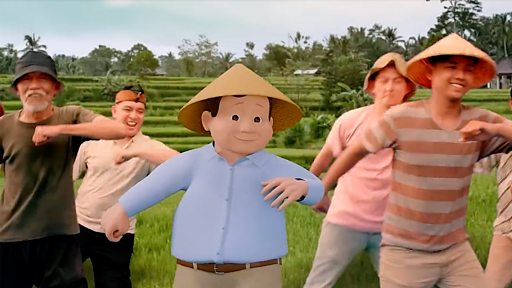

# [World] 印尼大选：从铁腕将军到“跳舞老爷爷”，普拉博沃料一轮获胜当选总统

#  印尼大选：从铁腕将军到“跳舞老爷爷”，普拉博沃料一轮获胜当选总统

**印尼大选：从铁腕将军到“跳舞老爷爷”，普拉博沃料一轮获胜当选总统**

印尼总统大选初步点票结果显示，该国现任国防部长普拉博沃（Prabowo Subianto）预计赢得过半选票，料将成为下一任印尼总统。

投票日星期三当天晚上，大多民调机构已完成至少九成的抽样计票。民调机构对全国投票站进行抽样计票，虽然不是正式结果，但具备一定可信度。

普拉博沃星期三晚上与支持者见面时，宣布胜选。

根据印尼选举法，总统候选人须获得过半选票，同时在全国一半的省份获得20％的选票，才能在第一轮投票胜出当选。否则，得票率最高的两组候选人须在6月进行对决。目前各家民调机构的抽样结果，显示普拉博沃几乎笃定一轮胜出。官方计票结果将在投票后的35天内公布。

现年72岁的普拉博沃曾是令人望而生畏的铁腕将军，在苏哈托时代饱受侵犯人权的指控。短暂流亡海外后，他重返印尼政坛，三度参选总统。

他在此次大选中改头换面，在社交媒体上对年轻人展开攻势，用跳舞打造自己的“可爱老爷爷”人设。

