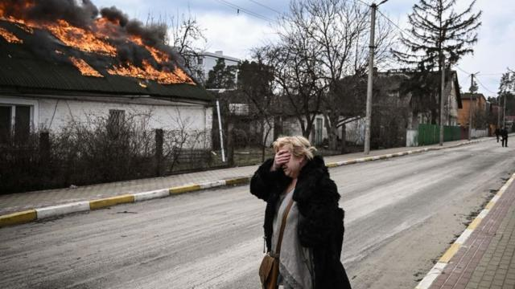
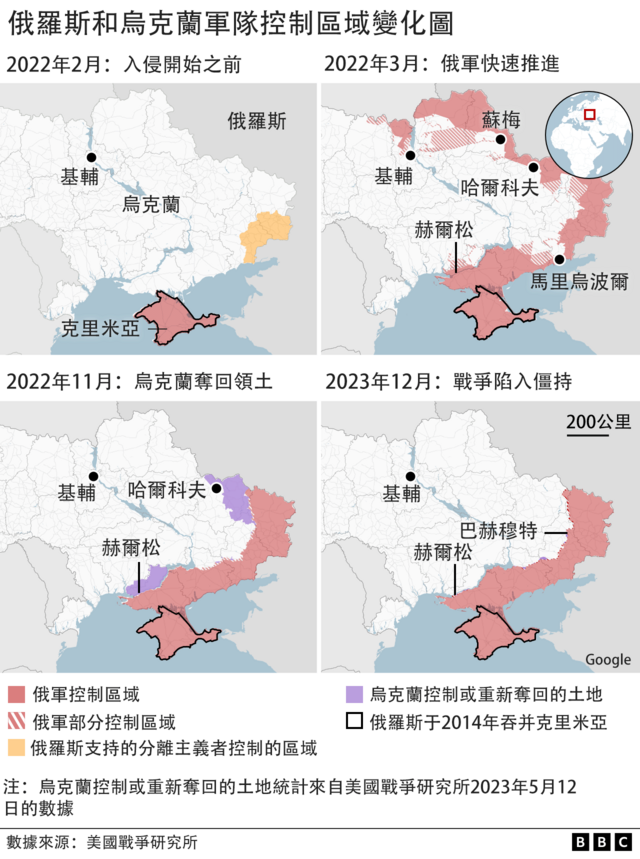
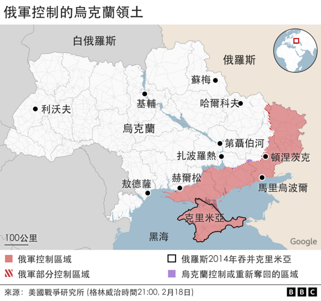
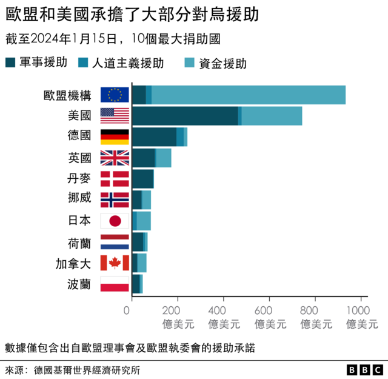
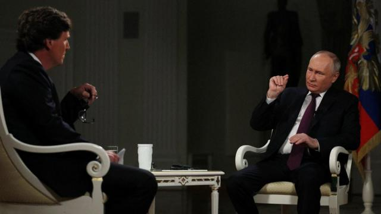
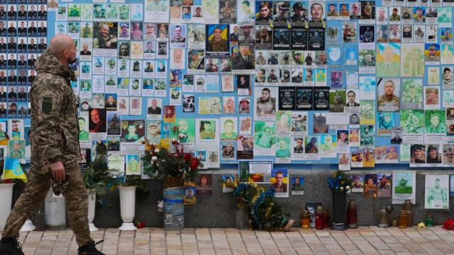

# [World] 乌克兰战争两周年：战争何时结束等五个关键问题的答案

#  乌克兰战争两周年：战争何时结束等五个关键问题的答案

  * 维多利亚·普莱斯兹卡（Victoria Prysedska），卡特琳娜·欣库洛娃（Kateryna Khinkulova） 
  * BBC记者 

> 图像来源，  Getty Images
>
> 图像加注文字，俄乌战争正进入第三个年头。

****乌克兰战争已持续两年，但没有理由相信战火会很快停止。** **

无论是乌克兰还是俄罗斯，还是双方的主要盟友，都不认为有任何和平解决的理由。

基辅坚称必须恢复国际公认的边界，将俄罗斯军队赶出国土，而莫斯科的立场仍是：乌克兰不是一个真正的国家，俄罗斯军队将继续推进，直到实现他们的目标。

我们来看看现在发生了什么，以及这场冲突未来可能的走向。

##  谁是赢家？

双方都付出了惨重的代价。

战线绵延了1000公里长，而自2022年秋季以来，其形状几乎没有变化。

两年前，在俄罗斯发动全面入侵的几个月内，乌克兰就将俄罗斯军队从北部地区和首都基辅周围击退。同年晚些时候，乌军重新夺回了东部和南部的大片领土。

但现在，俄罗斯军队正掘壕固守，乌克兰人说他们的弹药也已所剩无几。

许多人都认为军事僵局已经出现，包括最近被解职的乌军总司令扎卢日内（Valerii Zaluzhnyi）和几位亲克里姆林宫的俄罗斯军事博客作者。

二月中旬，乌克兰军队从东部拉锯已久的阿夫迪伊夫卡镇（Avdiivka) 撤出。

俄罗斯军队称赞这是一次重大胜利——因为阿夫迪伊夫卡具有战略意义，有可能为进一步入侵开辟通道。

基辅说，撤军的目的是保护士兵的生命。该国没有掩盖其部队人数和武器均处于劣势的事实。

这是俄罗斯自去年5月占领巴赫穆特 (Bakhmut）以来取得的最大战果。阿夫迪伊夫卡位于2014年以来一直被俄罗斯占领的顿涅茨克西北仅20公里。

如此微小的推进与俄罗斯在2022年2月的最初目标相距甚远，当时俄罗斯军事观察人士和官方媒体都雄心勃勃地宣称可以在三天内攻下基辅。

目前，约18%的乌克兰领土仍在俄罗斯占领之下，包括2014年3月就被俄罗斯吞并的克里米亚半岛，以及俄军随后占领的顿涅茨克和卢甘斯克地区的乌东大片土地。

##  国际社会对乌克兰的支持正在减弱吗?

根据基尔世界经济研究所（Kiel Institute for the World Economy）的数据，在过去两年里，乌克兰的盟友向其提供了巨额军事、金融和人道主义援助——截至2024年1月，欧盟机构提供了近920亿美元，美国提供了730亿美元。

西方提供的坦克、防空系统和远程火炮对乌克兰帮助很大。

但最近几个月，在有关北约能切实支持乌克兰多久的争论中，对乌克兰的援助有所减少。

在美国，一项价值600亿美元的新援助计划因两党的政治分歧，而在国会受阻。

乌克兰的支持者担心，如果特朗普（Donald Trump）在11月的总统大选后再次入主白宫，美国对乌克兰的支援将会枯竭。

在欧盟，经过多次讨论和讨价还价，一项价值540亿美元的援助计划于2月份获得批准。该计划此前受到匈牙利的阻挠，该国总理欧尔班（Victor Orban）是普京的盟友，公开反对支援乌克兰。

此外，欧盟原计划在2024年3月底前向基辅提供一百万枚炮弹，但目前只完成了一半左右。

俄罗斯的支持者包括邻国白俄罗斯，俄军曾利用白俄罗斯的领土和领空进入乌克兰。

美国和欧盟称，伊朗一直在向俄罗斯供应“见证者”（Shahed）无人机，尽管伊朗只承认在战前向俄罗斯提供了少量无人机。

事实证明，无人机能有效打击乌克兰境内的目标——在这场战争中，俄乌双方都需要无人机，因为它们能躲避防空系统。

制裁并没有像西方国家所希望的那样奏效，俄罗斯仍在设法出售石油，并为其军事工业采购零部件。

分析认为，中国没有向任何一方提供武器。在这场战争中，中国总体上采取了谨慎的外交路线，没有谴责俄罗斯的入侵，但也没有在军事上支持莫斯科。不过，中国和印度正继续从俄罗斯购买石油。

俄罗斯和乌克兰也在争取发展中国家方面付出了很多努力，它们都对非洲和拉丁美洲进行了多次外交访问。

##  俄罗斯的目标改变了吗？

人们普遍认为，俄罗斯总统普京仍然希望得到整个乌克兰。

在最近接受美国脱口秀主持人塔克·卡尔森（Tucker Carlson）采访时，普京在未受质疑的情况下，再次阐述了他对俄乌历史和冲突的扭曲看法。

长期以来，他一直认为乌克兰（尤其是东部顿巴斯地区）的平民需要俄罗斯的保护，但却没有提供有力的证据。

> 图像来源，  Sputnik / Reuters
>
> 图像加注文字，普京接受卡尔森采访时表达了对北约东扩的不满。

战前，他写了一篇长文，否认乌克兰作为一个主权国家的存在，称俄罗斯人和乌克兰人是“一个民族”。

2023年12月，他说他对俄罗斯所谓的“特别军事行动”的目标没有改变，包括“去纳粹化”——这是基于对乌克兰极右翼影响的没有根据的说法。

普京还说，他希望乌克兰“非军事化”和“中立”，并继续谴责北约东扩。

作为一个独立国家，乌克兰从未加入任何军事联盟。乌克兰的政治目标包括加入欧盟，并曾与北约谈判，以建立更紧密的联盟关系——与战争开始时相比，这两个目标现在似乎都更有希望实现。

这些目标旨在加强乌克兰的国家地位，并保护其不会成为任何以某种形式恢复苏联的地缘政治的目标。

##  战争将如何结束？

鉴于双方似乎都不可能投降，普京似乎也将继续掌权，分析人士的预测倾向于认为战争会持续很长时间。

全球安全智库“全球安全”（Globsec）综合了数十位专家的意见，评估了出现不同结果的可能性。

他们认为最有可能的情景是，一场消耗战将持续到2025年以后，双方都将遭受重大伤亡，乌克兰将继续依赖盟友的武器供应。

第二种最有可能的情景是世界其它地区的冲突升级，如中东、中国-台湾和巴尔干地区——俄罗斯试图煽动紧张局势。

> 图像来源，  EPA
>
> 图像加注文字，专家认为俄乌战争有可能成为长时间的消耗战，会带来更多伤亡。

另外两种被认为同样可能发生的情况是：乌克兰取得了一些军事进展，但没有达成结束战争的协议；或者乌克兰的盟友支持减弱，迫使乌克兰通过谈判达成和解。

然而，不确定性来自美国总统大选的潜在影响，以及其它战争（尤其是以哈冲突）将如何分别影响乌克兰和俄罗斯支持者的优先事项和忠诚度。

##  冲突会进一步外溢吗?

二月中旬，乌克兰总统泽连斯基（Volodymyr Zelensky）警告说，让乌克兰处于“人为的”武器赤字状态将利好于俄罗斯。

他在慕尼黑举行的国际安全会议上表示，如果西方世界不站出来对抗普京，普京将在未来几年给更多国家带来“灾难”。

英国智库皇家联合研究所（RUSI）称，俄罗斯已成功地将其经济和国防工业转型为规模化的军工生产，并正在为长期战争做好准备。该智库称，欧洲没有跟上步伐。波兰外长也提出了同样的担忧。

包括德国外长和爱沙尼亚情报部门发出的警告在内，欧洲国家最近都表达了对俄罗斯可能在未来十年内袭击北约国家的担忧。

这促使北约和欧盟加强军事能力以及整个社会对生活在一个截然不同的世界所准备的程度等未来规划。

