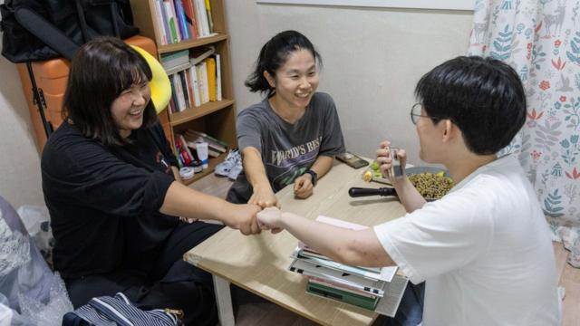
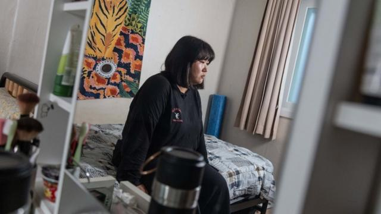
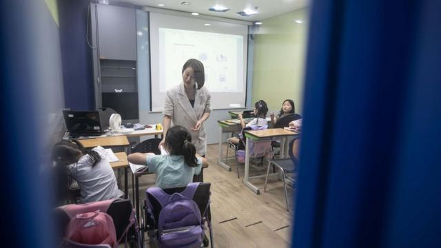
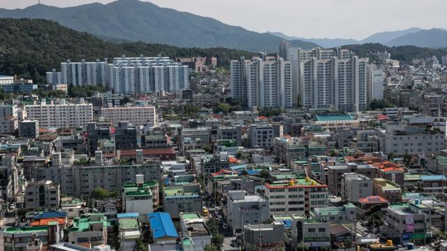
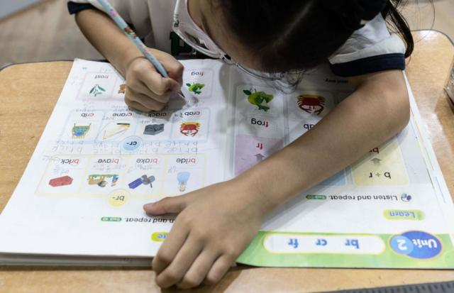
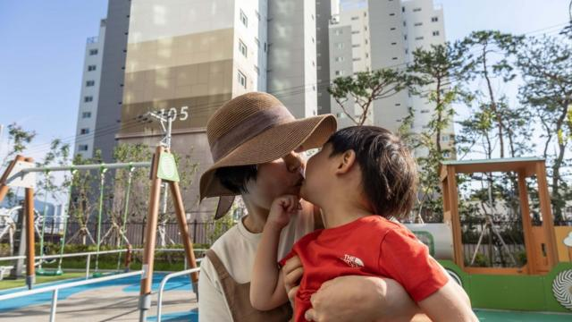
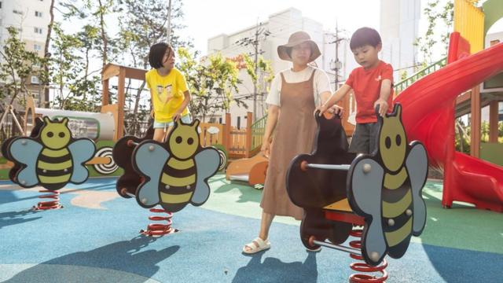
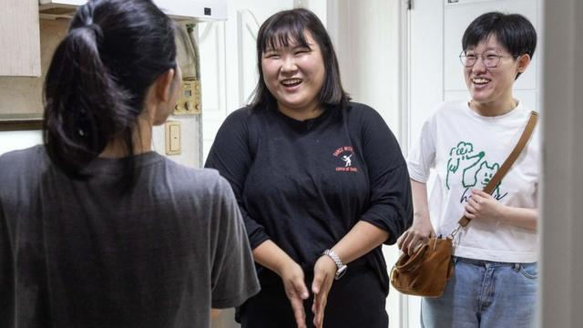

# [World] 韩国生育率全球最低 为什么这里的女性不愿生孩子

#  韩国生育率全球最低 为什么这里的女性不愿生孩子

  * 吉恩·麦肯锡（Jean Mackenzie） 
  * BBC驻首尔记者 

> 图像来源，  Jean Chung
>
> 图像加注文字，韩国生育率全球最低，且逐年下降。

**在一个下雨的周二下午，艺珍（Yejin）在自己的公寓里为朋友们做午饭。她一个人住在首尔郊区，过着愉快的单身生活。**

吃饭时，她的一位朋友在手机刷到了一个老套的卡通恐龙表情包。“小心点，”恐龙说，“别让自己像我们一样灭绝。”

几名女子都笑了。

“这很有趣，但也很可怕，因为我们知道我们可能正在导致自己的灭绝。”30岁的电视制片人艺珍说。

艺珍和她的朋友们都不打算要孩子，而她们是韩国越来越多选择不生育的女性群体的缩影。

韩国是世界上人口生育率（编者注：指平均每位女性在一生中所生育的孩子数）最低的国家，该国生育率还在持续下降，年复一年地打破惊人的最低纪录。

周三（2月28日）发布的数据显示，2023年韩国的生育率再下降8%，降至0.72。若要保持人口稳定，这一数字应为2.1。

如果该趋势持续，预计到2100年，韩国人口将减少一半。

##  “国家紧急情况”

在全球范围内，发达国家的生育率都在下滑，但没有一个国家像韩国这样极端。

韩国的数据显示形势严峻。

在未来50年，劳动适龄人口将减少一半，符合资格强制服兵役的人口将减少 58%，近一半的人口将超过65岁。

这对该国的经济、养老金储备和安全都是非常不利的征兆，以至于政治家们宣布这构成“国家紧急情况”。

近20年来，历届政府都在这个问题上投入了大量资金——确切地说，达到了379.8万亿韩元（2860亿美元）。

有孩子的夫妇会得到大量现金，从每月发放的补助金到住房补贴和免费出租车。住院费甚至是试管婴儿都可以报销，不过只适用于已婚人士。

这些经济方面的诱因并未奏效，导致政客们提出了更多“创造性”的解决方案，比如从东南亚雇佣保姆，并支付低于最低工资的报酬，以及如果男性在30岁之前有三个孩子，就可以免服兵役。

不出所料，决策者们被指责没有倾听年轻人，尤其是女性的需求。因此，在过去的一年里，我们走访了韩国各地与女性交谈，了解她们决定不生育的原因。

> 图像来源，  Jean Chung
>
> 图像加注文字，艺珍说自己永远处于工作之中。

当艺珍在25岁左右决定独自生活时，她违背了社会规范——在韩国，单身生活在很大程度上被认为只是人生的一个暂时阶段。

五年前，她决定不结婚，也不要孩子。

“在韩国，很难找到一个可以约会的男人——一个可以平等分担家务和照顾孩子的男人。”她告诉我，“而且，独自生孩子的女性也不会受到善意评价。”

2022年，韩国只有2%的新生儿来自非婚生育。

##  “无休止的连轴转”

艺珍选择专注于她的电视事业。她认为，这使她没有足够的时间抚养孩子。韩国人的工作时间长是出了名的。

艺珍的工作是传统的“朝九晚六”，但她说自己通常要到晚上八点才离开办公室，除此之外还有加班。回到家后，她在睡前只有打扫房间或锻炼身体的时间。

“我热爱我的工作，它给我带来了很多成就感。”她说，“但在韩国工作很辛苦，你会陷入无休止的连轴转中。”

艺珍说，为了在工作中取得更好的成绩，她也面临着在业余时间学习的压力：“韩国人有这样一种心态：如果你不能不断地自我提升，你就会落后，成为一个失败者。这种恐惧让我们加倍努力。”

“有时在周末，我会去打点滴（补充营养），只是为了获得足够的能量，以便周一回去工作。”她漫不经心地补充道，好像这是一项相当正常的周末活动。

她也与我交谈过的每一位女性一样有着同样的顾虑——如果要请假生孩子，可能就不能回去工作了。

“公司有一种隐性压力，要求我们有了孩子就必须离职。”她说。她亲眼目睹了这种情况发生在她的姐姐和最喜欢的两位新闻主播身上。

##  “我太了解了”

一位28岁从事人力资源工作的女性说，她曾见过一些人在休完产假后被迫离职，或不被允许晋升，这足以说服她永远不要生孩子。

在孩子出生后的头八年里，男女都有权享受一年的育儿假。但在2022年，只有7%的新晋奶爸使用了部分假期，而妈妈休假的比例为70%。

> 图像来源，  Jean Chung
>
> 图像加注文字，斯特拉说她的生活方式使她无法生育。

在经合组织（OECD）国家中，韩国女性受教育程度最高，但韩国的男女薪酬差距却最为严重，女性平均失业率高于男性。

研究人员说，这证明她们需要权衡——要事业还是要家庭。越来越多的女性选择了事业。

我是在一个课外班见到斯特拉·申（Stella Shin）的，她在那里教五岁的孩子英语。

“看看这些孩子，他们太可爱了。”她低声道。但39岁的斯特拉没有自己的孩子。她说，这并不是一个主动作出的决定。

已结婚六年的她和丈夫都想要一个孩子，但因忙于工作和享受生活，时间就这样溜走了。现在，她已经接受了自己的生活方式使她“不可能”生育的事实。

“在孩子出生的头两年，母亲需要辞去工作全职照顾孩子，这会让我非常沮丧。”她说，“我热爱我的职业，也喜欢自己照顾自己。”

在闲暇时间，斯特拉和一群更年长的女性一起参加Kpop舞蹈班。

在韩国，妇女生孩子后要休息两到三年的观念很普遍。当我问斯特拉能否与丈夫共同分担育儿责任时，她用眼神拒绝了我。

“就像我让他洗碗，他总是漏洗一点，我不能依赖他。”她说。

她补充说，即使她想放弃工作或兼顾家庭和事业，她也无力负担育儿成本，因为住房花销太高了。

> 图像来源，  Jean Chung
>
> 图像加注文字，住房成本使许多人无法生孩子。

韩国半数以上的人口都居住在首都首尔或京畿地区，那里提供着绝大部分工作机会，公寓和各种资源面临巨大压力。斯特拉和丈夫逐渐被挤到离首都越来越远的邻近地区，但仍然买不起房。

首尔的生育率已降至0.59，为韩国最低。

除了住房，还有私人教育的费用。

从四岁起，孩子们就被送去上各种昂贵的课外班——从数学、英语到音乐、跆拳道。

这种做法非常普遍，以至于选择不上课外班就会被视为让孩子失败，在竞争激烈的韩国简直不可思议。这也使得韩国成为世界上抚育孩子最昂贵的国家。

2022年的一项研究发现，只有2%的家长不支付私人学费，而94%的家长表示这是一种经济负担。

作为一所补习学校的老师，斯特拉对这种负担深有体会。她看着家长们每个月在每名孩子身上花费高达700英镑（890美元），这是许多人无法承担的。

“但如果不上这些课，孩子们就会落后。”她说，“当我和孩子们在一起时，我也想要个孩子，但我太了解了。”

对一些人来说，这种过度的私人补习制度比成本问题更为严重。

> 图像来源，  Jean Chung
>
> 图像加注文字，韩国的儿童从四岁起就被送到一系列课外班。

敏智（化名；Minji）想匿名分享她的经历。她还没有准备好让父母知道她不会生育。“他们会非常震惊和失望。”她和丈夫住在海滨城市釜山。

敏智坦言，她的童年和20多岁的时光都很不快乐。

“我的一生都在学习。”她说，首先是为了考上一所好大学，然后是考公务员，最后是在28岁时找到第一份工作。

在她的记忆中，童年都是在教室里度过的，直到深夜都在恶补数学，但她并不喜欢也不擅长数学，她的梦想是成为一名艺术家。

“我不得不无休止地竞争，不是为了实现梦想，只是为了过平庸的生活。”她说，“这太让人心力交瘁了。”

直到现在，32岁的敏智才感到自由，能够享受生活。她喜欢旅行，正在学习潜水。

但她考虑最多的是，她不想让孩子经历和她一样的竞争痛苦。

“韩国不是一个能让孩子快乐生活的地方。”她总结道。她的丈夫想要一个孩子，他们过去经常为此争吵，但现在丈夫已经接受了她的愿望。她承认，她的决心偶尔也会动摇，但很快就会想起为什么不能要孩子。

##  令人沮丧的社会现象

在大田市，全正妍（Jungyeon Chun）正处于一种她所称的“单亲婚姻”之中。接完放学的七岁女儿和四岁儿子后，她就会前往附近的操场消磨时间，直到丈夫下班回来。他很少能在睡觉时间前赶回家。

“我当时并没有觉得生孩子是一个重大决定，以为我很快就能重返工作岗位。”她说。

但很快，社会和经济压力开始显现。令她惊讶的是，她发现自己竟然是一个人在养育孩子。她的丈夫是一名工会成员，不帮忙照顾孩子或做家务。

“我感到非常愤怒，”她说，“我曾受过良好的教育，并被教导男女是平等的，所以我无法接受这种情况。”

> 图像来源，  Jean Chung
>
> 图像加注文字，正妍表示，令她感到难过的是，由于女性所处的“悲惨处境”，她们被剥夺了身为人母的乐趣。

这正是问题的核心所在。

在过去的50年里，韩国经济以惊人的速度发展，推动女性接受高等教育和进入职场，并扩展她们的抱负，但妻子和母亲的角色却没有同步演变。

沮丧之余，正妍开始观察其他母亲。“我当时想，‘哦，我的朋友在养育孩子时也很抑郁，我的邻居朋友也很抑郁’，我就想，‘哦，这是一种社会现象’。”

> 图像来源，  Jean Chung
>
> 图像加注文字，正妍说自己处于“单亲婚姻”之中。

她开始用涂鸦展现自己的经历，并将它们发布到网上。“我的故事源源不断。”她说。她的网络绘画获得了巨大成功，全国各地的女性都对她的作品感兴趣，现在正妍已经出版了三本漫画书。

现在，她说自己已经过了愤怒和后悔的阶段。“我只是希望自己能更多地了解养育孩子的现实，以及母亲们要做的事情有多少。”她说，“女性现在不生孩子的原因是因为她们有勇气谈论这个问题。”

但正妍很难过，她说，女性被剥夺了身为人母的乐趣，因为“她们将被迫陷入悲惨的境地”。

但敏智说，她很庆幸自己拥有自主权。“我们是第一代有选择权的人。此前我们必须要生孩子。而现在我们选择不这么做，因为我们可以。”

##  “如果可以，我愿意生10个孩子”

回到艺珍的公寓，在午饭后，她的朋友们正就她的书和其它物品讨价还价。

对韩国生活感到厌倦的艺珍决定前往新西兰。一天早上，她突然意识到，没有人强迫她住在这里。

她研究了哪些国家在性别平等方面排名靠前，新西兰名列前茅。“这是一个男女薪酬平等的地方。”她几乎难以相信地说，“所以我要离开了。”​​

我问艺珍和她的朋友，是否有什么能促使她们回心转意？

敏盛（Minsung）的回答让我大吃一惊。“我很想有孩子。如果可以，我愿意生 10 个。”我问那是什么阻止了她，27岁的她告诉我，她是双性恋，有一个同性伴侣。

> 图像来源，  Jean Chung
>
> 图像加注文字，敏盛（右）有同性伴侣，很想生孩子，但无法借助捐献者精子怀孕。

同性婚姻在韩国是非法的，未婚女性一般不允许使用捐赠者的精子受孕。

“希望有一天这种情况会改变，我可以和我爱的人结婚生子。”她说。

她指出，鉴于韩国岌岌可危的人口状况，一些想成为母亲的人却不被允许，这是讽刺的。

不过，政治家们似乎正在慢慢接受这一危机的深度和复杂性。

本月，韩国总统尹锡悦承认，通过花钱解决问题的尝试“没有奏效”，韩国在“过度且不必要地竞争”。

他说，韩国政府现在将把低出生率作为一个结构性问题来处理，但如何将其转化为政策还有待观察。

本月早些时候，我在新西兰见到了已经在那里生活了三个月的艺珍。

她饶有兴致地谈论起自己的新生活和朋友，以及在一家酒吧厨房里的工作。她说：“我的工作和生活平衡多了。”她可以安排在工作日与朋友见面。

“在工作中，我感觉自己更受尊重了，人们也不那么品头论足了。”她补充说。

“这让我不想回家。”

**（** **文中人名均为音译** **）**

