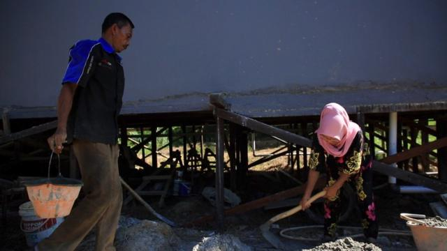
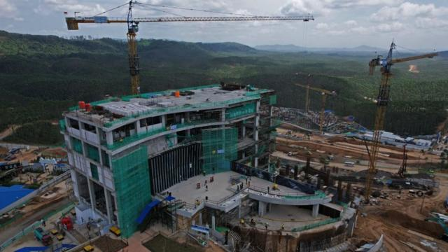
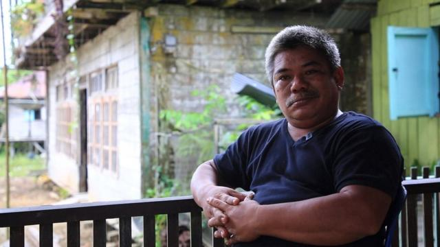
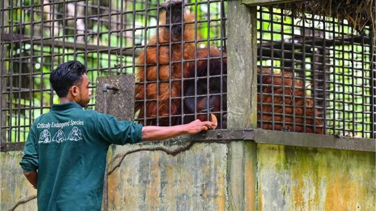
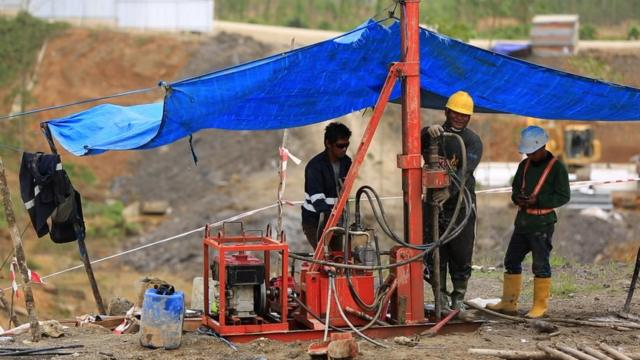
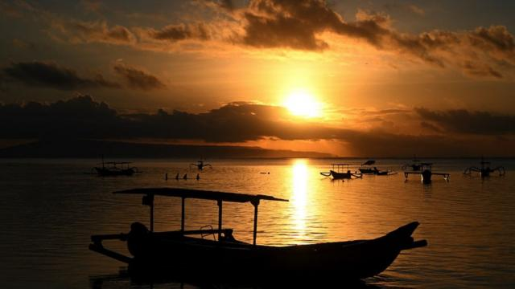

# [World] 印尼：全球最大穆斯林国家如何向第五大经济体目标迈进

#  印尼：全球最大穆斯林国家如何向第五大经济体目标迈进

  * 哈纳·萨摩斯尔 （Hanna Samosir）& 尼奇·维达迪欧（Nicky Widadio） 
  * BBC News 

> 图像来源，  Oki Budhi
>
> 图像加注文字，穆斯木亚蒂和莫尼斯夫妇两人来到新首都，妻子从事水泥工，而丈夫则是铺设瓷砖。

**在印尼，如果有足够的财力的话，大多数中年夫妇准备退休，但穆斯木亚蒂（Musmulyadi）（55岁）和他的妻子莫尼斯（Nurmis）（50岁）却没有随大流。**

他们刚刚移民到印尼的新首都努山塔拉（Nusantara），该城市是从有猩猩生存的树林中开垦的。

穆斯木亚蒂告诉BBC印尼语组说：“在他们还在为新首都建设基础设施之际，应该更容易在这里找到工作。”他们现在的家，婆罗洲岛上的努山塔拉，爪哇语中就是群岛的意思。来到新首都，妻子从事水泥工，而丈夫则是铺设瓷砖。

事实是，他们的梦想是印尼的梦想——穆斯木亚蒂期望能找到一份稳定的工作，成为新首都大基建型项目的分包商。

自总统佐科·维多多（Joko Widodo）两年前宣布建设新首都以来，相关行业开始蓬勃发展。政府预计到2029年，新首都将有两百万人口。

但几十公里外，51岁的旁迪（Pandi）和妻子席亚姆斯亚（Syamsiah）担心他们将被驱逐。他们来自一个有二万人口的原住民社区，没有合法土地所有权，但家族世世代代都生活在这里。

旁迪先生说，有一天一早醒来，看到他的土地被划定出来，没有任何事先通知。

政府希望将他的土地清理后用作防洪。但在今年2月份，旁迪成功在法庭上阻止了政府的驱逐令。他告诉BBC印尼语说：“这是我为了孩子和孙子们的未来而做的事情。若我什么都不做，我的孩子和孙子们对政府来说只会变成垃圾。这就是我们对抗不公正的方式。”

这可能只是一个暂时的缓兵之计，因为其他村庄的原住民社区已经被搬迁，政府对他们的土地进行了赔偿，尽管赔偿金额非常低。

上述两个家庭的故事展示了在印尼，维多多策划的建设项目通常是一把双刃剑：有争议，但也能创造机会。

> 图像来源，  Oki Budhi
>
> 图像加注文字，自总统维多多两年前宣布建设新首都以来，相关行业开始蓬勃发展。政府预计到2029年，新首都将有两百万人口。

根据国际货币基金组织（IMF）的数据，2014年维多多首次上任时，印尼在购买力平价（PPP）下是世界第十大经济体。

十年后，印尼已经上升至第七位，仅次于中国、美国、印度、日本、德国和俄罗斯。根据预测，到2027年，这个世界上最大的穆斯林国家将在经济上超过俄罗斯。

这个东南亚国家于2月14日举行了总统选举，非官方数据显示国防部长普拉博沃（Prabowo Subianto）在单轮投票中胜出，他也已承诺将继续执行现任总统维多多的经济政策，后者之子吉布兰·拉卡布明·拉卡（Gibran Rakabuming Raka）则是他的副手搭档。

印尼顶尖10家银行之一Permata Bank的首席经济学家帕蒂蒂（Josua Pardede）表示：“在纸面上，维多多的计划是好的，并且可能使印尼更接近IMF的预测。”

但是，印尼有更大的野心——到2045年，即独立百年之际，成为全球前五高收入国家。

印尼财政部长斯里·穆利亚尼表示，为了实现这一目标，印尼经济必须每年增长6-7%。

目前印尼的增长率为5%。

> 图像来源，  Oki Budhi
>
> 图像加注文字，51岁的旁迪（Pandi）和妻子担心他们将被驱逐。他们来自一个有二万人口的原住民社区，没有合法土地所有权，但家族世世代代都生活在那里。

##  “镍热潮”

印尼以度假岛峇里岛（Bali）而闻名。它也拥有世界上最大的镍（Nickel）储量。镍是制造电动车电池的关键材料。当总统维多多首次宣布在2019年禁止原始镍原料的出口时，欧盟在世贸组织（WTO）对印尼提告。

这位总统表示，他希望在印尼发展镍精炼加工，即所谓的下游产业。位于印尼的独立研究智库“经济金融发展研究所”（Indef）发表的一份报告表示，维多多的镍政策创造了就业机会并促进了经济增长。

但是，印尼在建设镍精炼厂方面仍然极为依赖中国的投资，这对该产业的未来也带来了不确定性，特别是考虑到中国今年经济增长预测从5.2%下降至4.6%。

维多多因对中国投资打开绿灯受到一些人是批评。批评称，在与中国的投资合作中，他忽视了与这些镍矿开发相关的土地纠纷、劳工健康问题和环境破坏。

譬如，非政府组织矿业倡导网络（Jatam）的协调人纳哈尔（Melky Nahar）就告诉记者说：“镍热潮使政府失去理智。”

> 图像来源，  Getty Images

##  岛国债务危机？

交通连通性对印尼发展至关重要，因为印尼由17,000个岛屿组成，分布在三个不同的时区，而目前的首都雅加达正在沉降。

因此，当世界在竭力从新冠肺炎恢复时，维多多2022年签署了一项迁都法律。

包括中国在内的一些国家对投资新首都表现出兴趣，但目前还没有具体的进展。

印尼独立智库经济与法律研究中心（CELIOS）的胡达（Nailul Huda）向BBC说明：“到目前为止，很难吸引全球大型投资者投资于新首都。”

这位现任总统尝试了各种方法，包括通过支持投资者的新劳工法，但民间社会团体表示这违反了工人权益。维多多将于10月交出权力，根据报导，他将新首都的建设视为自己永存的政绩遗产。

> 图像来源，  Oki Budhi
>
> 图像加注文字，印尼经济需要以每年 7% 的速度增长才能实现其雄心勃勃的经济目标

但智库政府国家创新研究机构（BRIN）的研究员努尔（Firman Noor）却认为，这是一个黯然失色的遗产。他告诉BBC称：“在许多方面，维多多的开发项目反映了过去10年来印尼发展和政治实践中民主价值的退化。”印度尼西亚经济需要以每年 7% 的速度增长才能实现其雄心勃勃的经济目标

与此同时，即将上任的总统苏比安托试图通过承诺提供免费牛奶和午餐给母亲和儿童来赢得民心。

专家警告说，这些项目可能给预算带来负担，而即将卸任的维多多擘画的新首都超级项目已经给预算带来了压力。

胡达则向BBC强调：“免费午餐和其他一些政策将耗尽国家预算，引发国债问题。”

“若下一届政府的政策继续像现在这样鲁莽，我认为印尼的债务在2029年可能会翻上一倍，尽管我们有追求成为全球最大经济体的梦想。”胡达说。

> 图像来源，  Getty Images
>
> 图像加注文字，印尼以度假岛峇里岛而闻名

