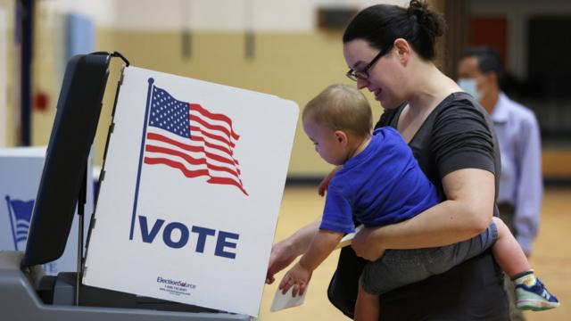
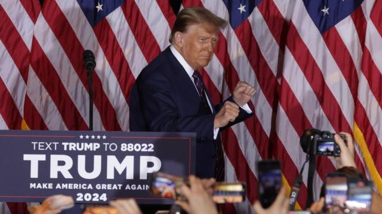
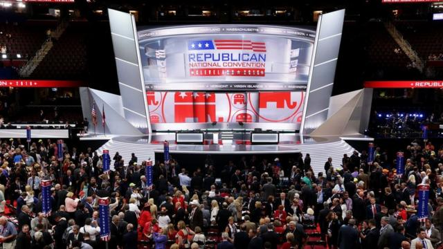
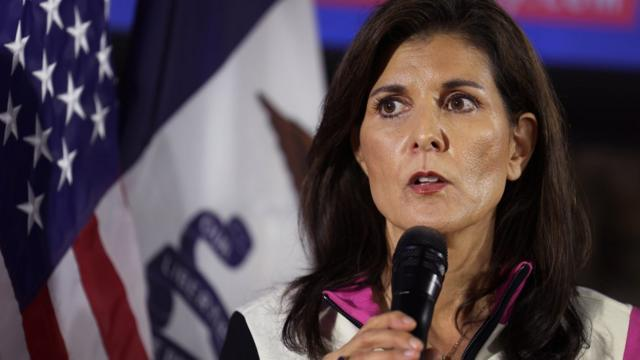

# [World] 美国大选2024：什么是“超级星期二”和共和党初选

#  美国大选2024：什么是“超级星期二”和共和党初选

> 图像来源，  Getty Images
>
> 图像加注文字，一名带着孩子的妇女在弗吉尼亚州的美国初选中投票。

**美国2024总统大选预定于11月5日举行，而3月5日是被称为“超级星期二”（Super Tuesday）的关键初选日，届时将有15个州及一个海外领地举行共和党初选投票。**

唐纳德·特朗普（Donal Trump，又译川普）再次竞选美国总统，所谓“超级星期二”的一系列投票将决定特朗普能否击败对手尼基·黑利（Nikki Haley），成为共和党总统候选人，并挑战竞逐连任的现任总统乔·拜登（Joe Biden）。

##  美国有哪两大政党？

目前拜登所属的民主党执政，共和党在野。

民主党较自由派（liberal），认为应增加公共开支。

共和党人则较保守派（conservative），倾向要求缩减公共开支和精简政府架构。

##  共和党总统候选人提名初选需时多久？

候选人在11月选举前一年多就开始提名。

> 图像来源，  Getty Images
>
> 图像加注文字，特朗普有望再次成为共和党总统候选人。

特朗普自2016年首次赢得总统大位以来，一直是共和党的领军人物，但他在2020年大选中败给民主党人拜登。

共和党人将通过初选程序选出2024年大选的候选人。参选人如果累计取得1215张党代表票就可获得共和党提名。

民主党方面，预计拜登在党内提名中不会遇到任何强劲对手。

##  什么是初选？

初选是一系列各州的选举，以及随后召开的全国会议。

每个州都会举行选举，选出一名政党提名人。各州完成初选后，共和党将于2024年7月举行全国代表大会，正式确认党内的总统候选人。

> 图像来源，  Getty Images
>
> 图像加注文字，共和党将于7月举行全国代表大会，正式提名共和党候选人。

##  初选如何进行？

初选的形式有两种，包括初选选举（primary election）和党团会议（caucus）。

几乎所有州都通过无记名投票进行初选，就像大选一样。少数州设有党团会议，由清点人数或举手表决来决定。

各州对于谁可以投票有不同的规则——通常只有共和党成员可以投票。

每位候选人会根据所得票数，获得一定数量的代表票，以代表他们参加7月的全国代表大会。

##  投票什么时候开始？

投票从一月份的爱荷华州（Iowa）党团会议开始。紧随其后的是新罕布什尔州（New Hampshire）初选。

除了“超级星期二”之外，3月份的投票还包括南卡罗来纳州（South Carolina）初选、密歇根州（Michigan）初选、内华达州（Nevada）和维尔京群岛（Virgin Islands）的党团会议。

##  什么是“超级星期二”？

根据美国选举传统，多数州的初选投票日会落在某个星期二，最多州同时举行初选的日子被称为“超级星期二”。

今年的“超级星期二”落在3月5日，是最重要的投票日。

共和党初选在15个州举行，包括人口最多的加利福尼亚州和德克萨斯州，以及美国领土美属萨摩亚（American Samoa）。

本届选举，共和党有2429名代表。在今年的“超级星期二”竞选当天，将有874名共和党代表参与角逐胜出。

特朗普目前已经遥遥领先，他获得247名党代表票，而妮基·黑利只有24名代表票。

> 图像来源，  Getty Images
>
> 图像加注文字，“超级星期二“是妮基·黑利赢特朗普的最后机会。

黑利实际上不大有机会阻止特朗普获得提名。即使如此，若她选择继续竞选，初选投票将持续到2024年6月。

##  谁最有希望赢得共和党初选？

特朗普仍是可能的获胜者，他此前在六场初选中都获胜。

他在新罕布什尔州的领先优势，并没有达到民调预测的20个百分点。

但他每一次胜利，都让美国离这位前总统和现任总拜登之间的再次对决更近了一步。

特朗普未来数月将忙于总统竞选，同时还面临多项刑事指控，包括试图推翻2020年大选结果。

他否认有不法行为，并称起诉是有带有政治目的。即使被定罪或入狱，他仍可继续竞选总统。

##  特朗普的对手怎么了？

前美国驻联合国大使、前南卡罗来纳州州长妮基·黑利是特朗普仅存的对手。

佛罗里达州州长罗恩·德桑蒂斯（Ron DeSantis）退出竞选，转而支援特朗普。

其他总统候选人，包括印度裔美国富商拉马斯瓦米（Vivek Ramaswamy）和纽泽西州前州长克里斯·克里斯蒂（Chris Christie）也相继退出竞选。

此前，妮基·黑利在包括其家乡南卡罗来纳州的每场初选中，都败给了特朗普。

但她表示将继续参选，因为选民“有权做出真正的选择，而不是只有一名候选人的苏联式选举”。

