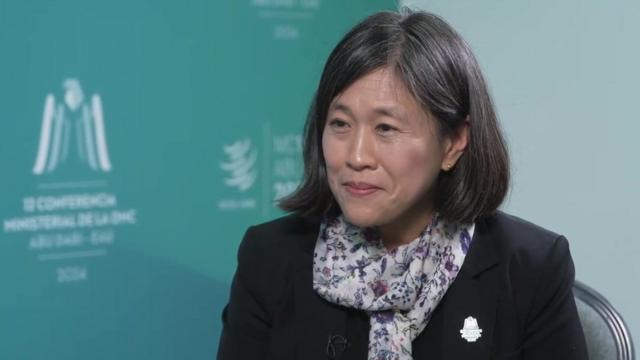
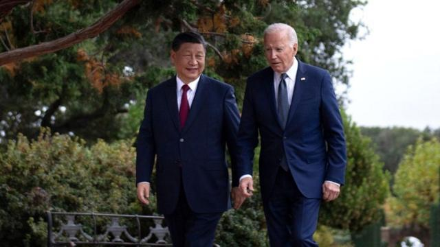
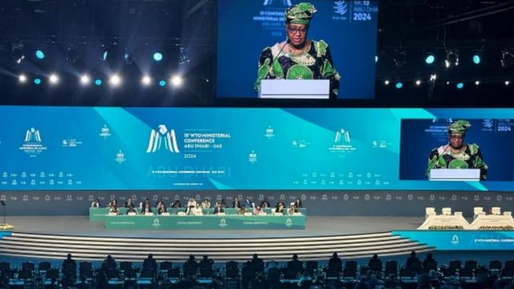

# [World] 美国称，与中国贸易的下降也许是个积极信号

#  美国称与中国贸易的下降也许是个积极信号

> 图像加注文字，美国贸易代表戴琪

**美国贸易代表戴琪向BBC说，美国与中国的贸易急剧下滑可能是一个正面的发展。换言之，她说，这并不一定是不利的，反而可能是反映美中双方贸易发展多元化的积极信号。**

在全球经济的发展日益分歧的背景下，全球最大的两个经济体2023年相互销售的商品数量下降了17%。

事实上，分歧背后包含美国宣布对中国制造的汽车进行调查，称这些货品带来潜在的国家安全风险。因为美国担心高科技汽车可能收集个人数据或能被远程控制。

中国汽车公司一直在全球其他地区扩大发展，但在美国几乎没有他们的存在。因为中国汽车要卖到美国会面临25%的进口关税。白宫将针对中国汽车采取的行动描述为“史无前例”且公平的，以应对北京限制外国汽车公司的政策。

去年，美国从中国购买的商品金额下降了20%，至4270亿美元，而相反中国对美采购的商品金额才下降了4%，仅为1480亿美元。

近年来，消费电子产品、机械和服装一直是美中两国贸易最畅销的产品。

> 图像来源，  Getty Images
>
> 图像加注文字，白宫将针对中国汽车采取的行动描述“为史无前例”

两国之间的贸易在2022年达到历史新高。之后，许多美国大公司将生产转移到中国以外的地方，并受到关税的影响，双边贸易额已经下降。

在双方关系日益紧张的背景下，智库战略与国际研究中心（CSIS）的贸易专家威廉·雷恩斯（William Reinsch）向BBC分析称：“去年美中贸易的下降似乎表明两个经济体正在相互疏远；但如果你看看东南亚对美国的进口增加，似乎其中很大一部分是来自中国公司，这表示这些公司要么已经将生产转移，要么仅仅是通过第三国将产品，以出口美国规避关税或其他限制。”

戴琪则告诉BBC说：“中国的经济发展正在全球范围内产生很多竞争压力”

她在阿布扎比（Abu Dhabi 阿布达比）的世界贸易组织（WTO）重要会议上发表讲话，称该机构“显得有些老态”，需要进行改革，以便更好地应对这些压力。

> 图像来源，  AFP
>
> 图像加注文字，中国国家主席习近平和美国总统拜登

世贸组织部长级会议已进入第五天，他们正试图达成协议，更新全球贸易规则。然而，达成任何协议都是复杂的，因为它需要得到所有166个成员的共识。譬如，渔业补贴、延长对电子商务关税的禁令以及世贸组织本身的改革是讨论的议题之一。

近年来，美国一直在呼吁世贸组织进行改革。

在特朗普担任总统期间，美国通过阻止任命该组织新法官的方式，使机构瘫痪因此不能去处理争端事件，特朗普政府并称世贸组织的及其裁决偏袒中国，损害了美国利益。

尽管现任总统拜登的团队很少透露出希望WTO改变的讯息，但这种封锁WTO机制和改革呼声在拜登担任总统期间仍然持续存在。

戴琪称：“WTO的存在是为了服务所有成员，不论（国家）大小。”

在拜登政府的领导下，世界上两个最大的经济体之间的贸易关系恶化，美中两国都对贸易实施了新的壁垒，包括对电脑晶片出口的限制，这些限制最近导致供应短缺问题。

中国驻华盛顿大使馆发言人刘鹏宇则告诉BBC说：“维护中美经贸关系的健康稳定增长，符合两国和两国人民的根本利益，有利于全球经济增长。”

> 图像来源，  Reuters
>
> 图像加注文字，世贸组织总干事奥康乔·伊维阿拉向BBC强调，该组织正试图帮助美国和中国解决一些分歧。

他说：“双方应共同应对全球挑战，相向而行。”

在阿布扎比的会议前，世贸组织总干事奥康乔·伊维阿拉（Ngozi Okonjo-Iweala）向BBC强调，该组织正试图帮助美国和中国解决一些分歧。

两国都在试图在非洲和亚洲某些地区扩大其经济影响力，以确保对自然资源的获取并在供应链中建立韧性。

这引发了人们对世界分裂成两个贸易集团的日益关注。奥康乔·伊维阿拉警告说：“我们该非常谨慎，因为如果这种情况持续，可能会对世界经济造成实际损害。”

一项世贸组织的研究发现，这种分裂可能会使世界经济损失5%的GDP。在利率上升和通货膨胀影响经济增长的时刻，奥康乔·伊维阿拉强调这会是一个巨大的损失。

