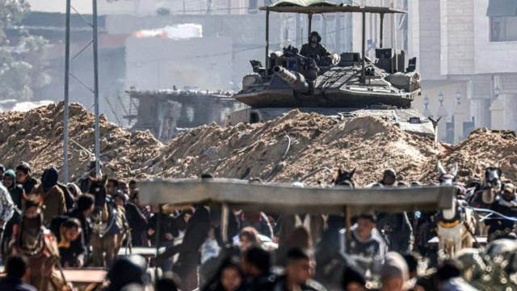
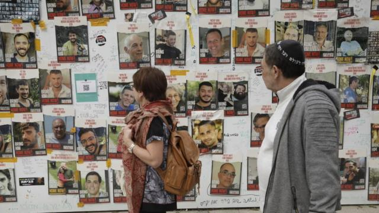
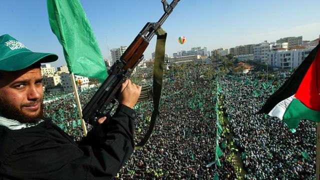
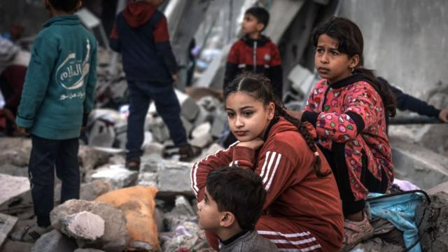

# [World] 以色列有可能“消滅”哈马斯吗？

#  以色列有可能“消灭”哈马斯吗？

> 图像来源，  Getty Images
>
> 图像加注文字，联合国称，四分之三的加沙人因战争而流离失所。

**以色列总理内塔尼亚胡（Benjamin Netanyahu）多次表示要消灭哈马斯，指该国在加沙的目标是“摧毁哈马斯的执政和军事能力”。**

战事已持续五个月，加沙卫生部门估计有近三万名巴勒斯坦人丧生，以色列方面表示已取得重大进展，必须继续争取“全面胜利”。

但哈马斯不仅是拥有军事能力的组织，它还是一个政治、意识形态和社会运动。那么，以色列彻底消灭哈马斯的目标是否现实，甚至是否可能？

##  战场上发生什么？

以色列表示已经摧毁加沙24个哈马斯营中的18个，并“完成了对哈马斯在加沙地带北部军事框架的拆除”。

以色列国防军 (IDF) 表示，去年10月7日哈马斯对以色列发动袭击时，造成约 1,200人死亡，劫持约250名人质。该组织当时约有3万名武装分子。

> 图像来源，  Getty Images
>
> 图像加注文字，以色列称 ，10 月 7 日有 253 名以色列人和外国人被哈马斯绑架，其中 130 人仍下落不明。

以色列称已杀死13,000名武装分子，内塔尼亚胡2月初表示，以军“杀死、打伤或抓获了20,000多名恐怖分子，占哈马斯战斗力量超过一半”。

BBC无法核实上述数字，以色列国防军也没有回应有关数字如何计算。而以色列和加沙的数字有明显矛盾，加沙卫生部门数据显示，加沙死亡人数中只有约9,000人是包括平民在内的成年男性。

哈马斯政治办公室对BBC表示，拒绝接受以色列的说法，又指其军事部门继续在加沙“所有地区”进行“武力”行动。 与此同时，以色列《国土报》一篇报道称，哈马斯已开始恢复一些营队。

《简氏防务周刊》中东编辑杰里米·宾尼（Jeremy Binnie）表示，哈马斯可以“非常轻松地招募新战士，因此这可能不是我们要考虑的最重要指标”。

以色列雷克曼大学国际反恐研究所的以色列退役上校米里.艾辛（Miri Eisin）指出，以军已经“击毙指挥官”，发现 “武器储藏处”，并正在“有计划地炸毁地下恐怖系统”——这指的是哈马斯的地道网络。

但《简氏防务周刊》的宾尼说，地道系统 “比以前估计的要大得多”，以色列人要摧毁它“还有很长的路要走”，而且人质还有机会被劫持在那里。

他续指，在加沙北部，以色列给人的印象是，其行动似乎是“一个持续镇压的开放式进程，而不一定是彻底消除”。

以色列被指违反国际法，国际法庭也在考虑种族灭绝的指控。以色列称这些指控“严重歪曲”，内塔尼亚胡也坚持以色列必须继续解决剩余的哈马斯部队。

##  意识形态能灭绝吗？

许多西方国家视哈马斯为恐怖组织，指哈马斯领袖仍在呼吁摧毁以色列，但在阿拉伯世界部分地区，哈马斯则被视为抵抗运动。

> 图像来源，  Getty Images

Skip podcast promotion and continue reading

* BBC 時事一周 Newsweek (Cantonese)   **

BBC國際台粵語節目，重溫一周國際大事，兩岸四地消息，英國境況。並備有專題環節：〈記者來鴻〉、〈英國生活點滴〉和〈華人談天下〉。

分集

End of podcast promotion

哈马斯在2006年赢得选举，并暴力驱逐竞争对手法塔赫，2007年起开始统治加沙地带。

此后，以色列一直封锁加沙地带，埃及也实施一定程度的封锁，两国都表示是为了安全。

过去二十年，巴勒斯坦组织从加沙向以色列发射了数千枚火箭弹——有时是为了回应以色列军队在被占领的约旦河西岸或东耶路撒冷发生的暴力和冲突。

欧洲外交关系委员会高级研究员、中东问题专家休·洛瓦特（Hugh Lovatt）表示，这“不仅是一场军事运动，也不仅是一场政治运动，而是一种意识形态”。

“这种意识形态是无法根除的，当然也无法通过以色列的武力而根除，”他说。

“在当前形势下，巴勒斯坦人确实感到不再有实现自决权的政治前景，”他说， 该组织对武装抵抗以色列的支持“现在尤其能引起共鸣”。

位於约旦河西岸的阿拉伯美国大学国际关系讲师阿姆贾德·阿布·埃兹(AmjadAbuElEzz)博士表示，许多巴勒斯坦人支持哈马斯，因为“他们看不到未来”。

几乎从政以来，内塔尼亚胡总理就反对建立巴勒斯坦国，对外的理由是安全问题，以及指哈马斯不承认以色列。但他所属的利库德集团及其政府中的极右派人士，认定约旦河西岸和加沙地带属于以色列。

据以色列活动组织立刻和平（Peace Now）称，去年以色列政府批准在约旦河西岸的以色列定居点建屋数量，创了历史新高。

2023年，至少有507名巴勒斯坦人在西岸被以军和以色列定居者杀害，其中包括至少81名儿童，这是自联合国人道主义事务协调厅（OCHA）自2005年开始记录以来，巴勒斯坦人死亡人数最多的一年。

联合国记录也显示，36名以色列人在约旦河西岸因为巴勒斯坦人袭击致死。

此外，人们对由法塔赫主导并管理西岸部分地区的巴勒斯坦权力机构（Palestinian Authority，PA）深感失望。许多巴勒斯坦人认为，面对以色列的占领，该机构腐败且软弱。

阿姆贾德·阿布·埃兹博士表示，10月7日之前，生活在封锁下的加沙巴勒斯坦人觉得自己“在一座大监狱里”。他补充指，约旦河西岸的巴勒斯坦人对犹太定居者的袭击、土地被吞并以及缺乏就业机会感到愤怒。

他指出，巴勒斯坦社会中年轻人比例很高，在没有和平进程的情况下，其他各方“没有什么可以吸引巴勒斯坦年轻人。”

“只要有占领，只要有暴行，只要有杀戮，很多人都会听从哈马斯的说法——因为他们在寻找希望，”他说。

##  哈马斯支持率如何？

加沙的巴勒斯坦人在10月7日事件后付出了巨大代价，但2023年底一项民调显示，巴勒斯坦人对哈马斯的支持率有所上升。

> 图像来源，  Getty Images
>
> 图像加注文字，以色列因战争对平民的影响而面临严厉批评

根据对西岸750名巴人和加沙481名巴人的调查，哈马斯在西岸的支持率从9月的12%，上升到12月的42%。

民调来自位于约旦河西岸的巴勒斯坦政策与调查研究中心，负责人哈利勒-希卡基（Khalil Shikaki）博士说，哈马斯的支持率一般会在战事期间飙升，但这次增长是“戏剧性的”。

他指出，在11月哈马斯和以色列休战期间进行民调时，以色列监狱里的巴勒斯坦妇女和儿童获释。这让一些人认为哈马斯使用暴力在实现巴勒斯坦目标方面“非常有效”。

希卡基博士指，定居者的袭击和对巴权力机构应对战争的不满，也有利对哈马斯的支持度。

然而，加沙情况有所不同，民众对哈马斯的支持度仅从38%略升到42%，落在民调的误差范围内。

而被问到哈马斯发动10月7日的袭击是否正确时，加沙受访者有57%的人支持，反观西岸受访者有82%支持。

希卡基博士说：“很明显，那些因哈马斯在这场战争中的决定而受苦的人，对哈马斯的批评要多得多。”

2月初之前一直在加沙采访的BBC记者注意到，近月当地人对哈马斯的不满有增无减。

一些加沙人表示，亲人死亡、家园被以军摧毁以及饥饿，令他们对哈马斯感到愤怒。

他们还说，很多人对公开批评哈马斯感到担忧。

##  新一代战士？

阿布·艾兹博士认为，加沙许多年轻人现在“对以色列和占领充满仇恨”。

“我认为下一代人将加入这些军事团体以复仇，因为他们失去了家庭，他们失去了孩子、母亲和儿子……他们的兄弟姐妹，”他说。

但艾辛上校表示，不应该因为担心哈马斯获得更多支持，而影响军事目标。

她形容10月7日发生的袭击事件“极端、恐怖、残暴”，“他们本来已经如此激进了”。

“这个意义上说，我们的首先要尝试消除他们的能力。这不会让意识形态变得比现在更糟糕，”她说。

然而，希卡基博士说：“一场大战不一定会使年轻人拿起武器——如果战争之后是和平。”

##  战后会发生什么？

内塔尼亚胡概述了战后计划，以色列将无限期掌管“非军事化”加沙安全，而与以色列敌对组织没关联的巴勒斯坦人将管理该领土。

艾辛上校表示，哈马斯“总是会有所表现”，但相信以色列将能够消除“他们的大部分——他们的威胁”。

洛瓦特表示：“如果真想边缘化和削弱哈马斯，唯一办法就是建立可行的政治轨道。”

但两国方案的前景仍然黯淡。

内塔尼亚胡最近在X（推特）上表示，他“不会在以色列对约旦以西整个地区的全面安全控制上妥协——这与巴勒斯坦国方案是背道而驰的”。

这与以色列的主要盟友美国公然相悖，美国表示，以巴冲突的长远解决方式，“只能通过包括建立巴勒斯坦国在内的区域性方法来实现”。

拜登政府强调，以色列不应无限期占领加沙。如果不改变现状，未来暴力升级的风险确实存在。

“我只是看不到以色列人胜利的一天，"中东问题专家宾尼说。 “他们可以大规模削弱哈马斯，但关键是如何防止哈马斯战后再次崛起？”

