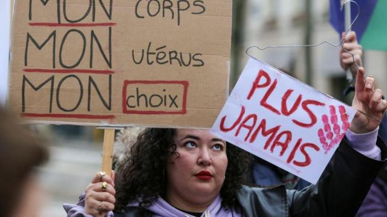
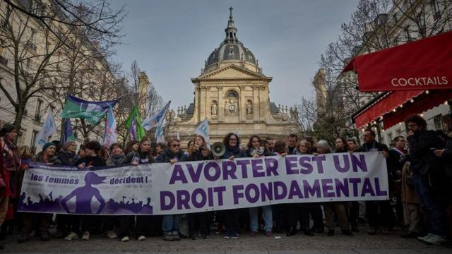
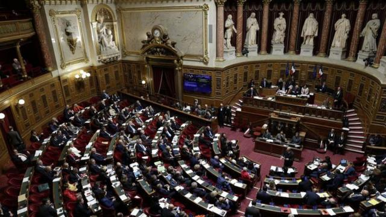
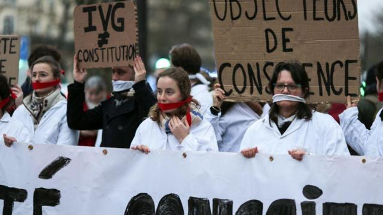

# [World] 法国成为全球首个堕胎权入宪的国家，背后的象征意义和法律争议

#  法国成为全球首个堕胎权入宪的国家，背后的象征意义和法律争议

> 图像来源，  Getty Images
>
> 图像加注文字，一名抗议者在支持修宪的静默集会上举着写有“我的身体、我的子宫、我的选择”等标语。

**法国成为世界上首个把堕胎权写入宪法的国家，女权人士认为具有象征意义，但此举也引起法学争议。**

法国国会周一（3月4日）在凡尔赛宫召开国会两院特别会议，以780票赞成、72票反对的压倒性票数通过修宪案。

这是法国自2008年以来的第一项宪法修正案，将修改1958年的宪法，把“法律决定妇女在何种条件下享有堕胎自由”纳入宪法第34条。

法国总统马克龙（Emmanuel Macron；马克宏）在社交媒体“X”（前推特）庆贺法案通过，形容是“法国的骄傲”。大批民众在艾菲尔铁塔前的人权广场庆祝，铁塔亮出“我的身体，我的选择”（Moncorps mon choix）标语。

民调显示，约85%法国民众支持这项改革。议会中右翼分子的阻力没有出现。

##  “罗诉韦德案”的影响

自1974年以来，法国妇女就享有堕胎的合法权利。

但2022年美国联邦最高法院推翻近半个世纪前有关女性堕胎合宪权的“罗诉韦德案”（Roe v Wade），这促使活动人士推动法国把堕胎权写入宪法，马克龙也做出相关承诺。

法国妇女基金会（Fondation des Femmes）的劳拉·斯利玛尼（Laura Slimani）说：“这权利（堕胎权）在美国已经消退。因此，我们没理由认为法国可以免于这种风险。”

##  马克龙的政治考量

根据法国民调机构IFOP在2022年11月进行的调查，高达86%法国人支持将堕胎权写入宪法。

> 图像来源，  Getty Images
>
> 图像加注文字，民意调查显示约85%的法国公众支持改革。

在政治上，马克龙总统在法国国会没有绝对多数，同时他在1月改组内阁，使其向右倾斜。

继去年有关养老金改革和移民的争议性法律后，马克龙领导的复兴党中的左翼成员开始感到不安——对他们来说，现在的堕胎权改革是一次值得欢迎的重新洗牌。

一名不愿具名的党内左翼人士说：“能够在一个全党都能达成一致的问题上，再次展现团结，我感到非常欣慰。复兴党内部关系一直很紧张，但现在我们可以提醒自己，我们拥有共同的价值观。”

但马克龙所做的不仅为了巩固左翼的支持，也是因为6月欧洲大选临近，他希望堕胎权宪法修订案能在他的政党，与其主要对手玛丽·勒庞的极右翼政党之间，打开明显的分野。

据法新社报道，左翼和中间派政治人物欢迎修正案，右翼参议员则私下表示，他们感到有压力要为法案开绿灯。

一名国会议员说，如果她反对法案，她的女儿将“不会再来过圣诞节”。

##  滥用修宪？

但这次修改宪法，也引起法律学者的隐忧。

> 图像来源，  Getty Images
>
> 图像加注文字，一月份，法国议会下院以压倒性多数通过，将堕胎列为宪法中"受保障的自由"，参议院也予以效仿。

巴黎索邦大学法学教授安妮·莱瓦德 (AnneLevade) 说：“除了成为一个象征之外，这次修订绝对不会改变任何事情。”

事实上，法国自1975年起就把堕胎权写入法律，而非像美国由最高法院的裁决来决定。

从那时起，法国的法律已更新九次，每次都是为了扩大堕胎的权利范围。

法国宪法委员会负责决定法律是否符合宪法，该机构从未提出过质疑。这让许多法学家认为，堕胎已经是一项宪法权利。

法律教授莱瓦德和和其他专家认为，宪法的目的是制定一套不可改变的规则，如果它成为各种“权利”的宣示，就有可能被破坏。

如果将来掌权者相信生孩子也是一项权利怎么办？代孕妈妈会被写入宪法吗？或者同性婚姻呢？还是碳减排目标的实现？

莱瓦德说：“法国的特殊性导致政客们每次想要表明对某个议题的重视时，都会以一种近乎巴甫洛夫式（条件反射）的方式，寻求宪法修改。”

##  法国堕胎法的历史

1971年，法国堕胎合法化运动愈演愈烈，全国343名妇女联署请愿。

她们承认自己曾非法终止妊娠，而当时每年堕胎的妇女估计有70万至80万，该请愿书被称为“343人的宣言"。

世界妇女协会（Femmes Monde）负责人克劳迪娅·蒙泰尔（Claudine Monteil）当年是宣言最年轻的联署者，她对法新社说：“美国最高法院的行为帮了全世界女性一个大忙，因为它唤醒了我们。”

> 图像来源，  Getty Images
>
> 图像加注文字，堕胎反对者在宪法改革运动中基本上被边缘化。

支持这次改革的法国人认为，必须防范欧洲新一波“反动”社会变革，因为这可能会让那些想限制堕胎权的人上台。

他们指出，马耳他、匈牙利和波兰等国已对堕胎权实施限制，或成为了争议话题。

女权律师雷切尔-弗洛尔·帕尔多（Rachel-Flore Pardo）谈到宪法修正案时说：“在女性权利方面，象征意义是很重要的。它们将成为我们的堡垒。等到堕胎真正受到威胁时再修改，就等得太久了。”

生殖权利中心（Center for Reproductive Rights）的利亚·霍克托（Leah Hoctor）表示，法国不仅在欧洲，而且在全球范围内提供“第一个明确、广泛的宪法条款"。

智利在2022年的新宪法草案中纳入了选择性堕胎权，但遭选民在全民公决中否决。

部分国家提到了这项权利，例如古巴宪法保障女性的“生殖权和性权利”。

一些巴尔干国家则继承前南斯拉夫1974年宪法的版本，其中规定“决定孩子的出生”是人权。

还有部分国家在宪法中明确提及堕胎，但只允许在特定情况下进行。

