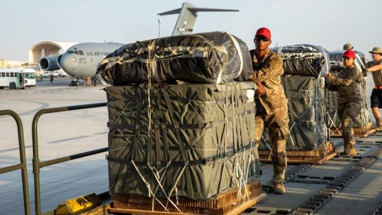
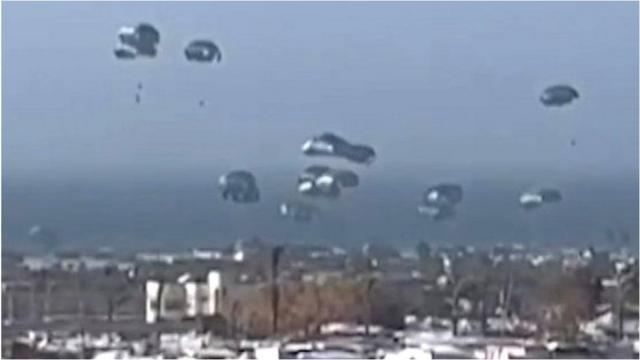
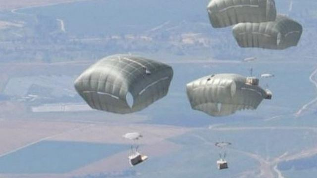

# [World] 加沙战争：空投粮食为何备受争议

#  加沙战争：空投粮食为何备受争议

  * 路易斯·巴鲁乔（Luis Barrucho）和BBC阿拉伯语组 
  * BBC国际部记者 

> 图像来源，  US Central Command
>
> 图像加注文字，美国军方表示，周二与约旦的联合空投是“向加沙提供更多援助的持续努力的一部分”。

**美国军方表示，美国周三（3月5日）在与约旦的联合行动中，向加沙北部空投超过3.6万份粮食。这是美国数天内第二次空投行动。**

一天前，世界卫生组织称加沙北部地区有30万巴勒斯坦人缺乏粮食或干净食水，儿童因为饥饿而死亡。

人道主义援助组织认为，空投物资无法满足急剧增长的需求。这也象征着当地援助工作的失败。

在以色列与哈马斯交战期间，援助卡车一直通过埃及控制的拉法口岸，和以色列控制的凯雷姆沙格姆口岸进入加沙南部。

但作为以色列地面攻势第一阶段重点的北部地区，近几个月来基本上已经切断了援助。

世界粮食计划署（WFP）在2月20日表示，将暂停向加沙北部运送粮食，因为其急救车队在三周内经历了“社会秩序崩溃而导致的彻底混乱和暴力”，包括暴力抢劫。

上周四在加沙城以西，以色列军队护送由私人承包商运营的援助车队进入加沙时，大批群众涌前抢夺物资，造成100多名巴勒斯坦人死亡。

巴勒斯坦卫生官员表示，以色列军队开火导致数十人死亡。以色列军方指，大多数人死于被救援卡车践踏或碾压，又指援助车队附近的士兵向靠近他们并被他们视为威胁的人开枪。

哈马斯去年10月7日突袭以色列，造成约1200人死亡，253人被扣为人质，此后以色列军方在加沙发动空中和地面攻势。哈马斯辖下的加沙卫生部称，自那时起加沙已有超过3万人丧生。

##  物资不足

过去几周，在以色列军方的协调下，法国、阿联酋和埃及与美国和约旦一起向加沙空投20多批援助物资。

> 图像来源，  Reuters
>
> 图像加注文字，绝望的巴勒斯坦人包围了向加沙北部运送粮食援助的卡车车队。

加沙居民伊斯梅尔·莫克贝尔（Ismail Mokbel）对BBC阿拉伯语的“加沙生命线”电台（Gaza Lifeline radio）表示，周五空投的援助物资包括一些豆类和妇女生理必需品。

另一名男子阿布·优素福（Abu Youssef）说，他没拿到在加沙城希法医院附近空投的援助物资。

“突然，当我们抬头仰望天空时，我们看到了援助降落伞。于是我们留在原地，直到物资降落在离我们约500米的地方。当时人很多，但物资很少，所以我们什么也拿不到。”

加沙人莫克贝尔表示，空投物资不足以满足该地区大量民众的基本需求。

他说：“成千上万的民众看到物资降落......而当成百上千的人在这些地方等待时，只有大约10到20人拿到东西，其他人空手而归。不幸的是，空投并不是向加沙北部运送物资的最合适方法。”

“加沙需要陆路和水路来运送援助物资，而不是以这种方式，这无法满足所有人的需求。”

##  昂贵且杂乱无章

空投最初在二战期间用于向地面部队提供补给，现已发展成为提供人道主义援助的重要工具，联合国于 1973年首次使用空投。

然而，正如世界粮食计划署在2021年的一份报告中提到，空投被认为是“最后的手段”，只有在“更有效的选择失败时”才会使用。该署上一次进行空投是在南苏丹。

挪威难民理事会秘书长、前联合国解决冲突特使扬·埃格兰（Jan Egeland）最近结束了对加沙为期三天的访问，他回来后对BBC说：“空投费用高昂、杂乱无章，通常会导致错误的人得到援助。”

> 图像加注文字，世界粮食计划署表示，由于飞机、燃料和人员等相关成本，空投援助的费用是地面援助的七倍。

世界粮食计划署表示，由于飞机、燃料和人员等相关成本，空投援助的费用是地面援助的七倍。此外，与卡车车队相比，空投每次只能运送相对较少的物资，而且在运送区域内还需要大量地面协调工作。

红十字国际委员会也强调要监督配送，以防人们因食用不适当或不安全的物品而危害健康。

该会曾在2016年发布有关叙利亚内战期间空投物资的情况，警告指：“突然且无人监督下，向营养不良甚至饥饿的人提供食物，可能会对生命造成严重风险。需要权衡这些风险，不要空运任何物品，否则地面配送可能会造成延误。”

世界粮食计划署指，空投一般从不同高度进行，在冲突地区大约从300米到5600米不等，因此必须确保包装坚固，能够承受地面冲击,且空投区应该不小于一个足球场的宽阔空地，这就是援助物资往往被投到加沙海岸线的原因。

但据当地人说，这有时会导致援助物资掉进海里或被风吹进以色列。

##  美国应向以色列施压

加沙居民萨米尔·阿博·萨卜哈 (SamirAboSabha) 告诉BBC阿拉伯语加沙生命线电台，他认为美国应做更多，向其盟友以色列施压要求停火。

“作为加沙公民，这些东西没有用，”他说。“我们希望美国向以色列施压，迫使其停火并停止向以色列提供武器和导弹。”

一些援助人员也有同感。

上周，美国乐施会的斯科特·保罗（Scott Paul）在社交媒体“X”（前推特）上写道：“美国不应该在加沙肆意空投，而应该减少向以色列提供用于肆意袭击的武器，推动立即停火并释放人质 ，并坚持要求以色列履行其提供人道主义援助、开放通道和其他基本服务的责任。"

巴勒斯坦人医疗援助组织的梅兰妮·沃德（Melanie Ward）表示，美国、英国和其他国家应“确保以色列立即开放所有进入加沙的过境点，让援助人员和物资进入，为有需要的人提供帮助”。

但随着危机加深，其他人认为必须用尽办法运送粮食。

> 图像来源，  Jordan Armed Forces
>
> 图像加注文字，约旦武装部队分发的照片显示援助物资被空投到加沙。

世界中央厨房（World Central Kitchen）一直向加沙运送食物，厨师兼创始人何塞·安德烈斯（José Andrés）告诉美国广播公司（ABC News）：“我们要尽一切努力将粮食运入加沙。我们应该海运食物进去。”

“我觉得我们不必批评约旦和美国进行空投。相反，我们应该赞扬任何向加沙运送食物的举措。”

美国总统拜登誓言，美国将“加倍努力开辟海上走廊，并扩大陆路运输"，但这些努力尚未转化为现实。

以色列国防军发言人、海军少将丹尼尔·哈加里（Daniel Hagari）周日表示，他们正为援助车队和空投到加沙北部提供便利，“因为我们希望人道援助能够送达有需要的加沙平民”。

他说：“我们将继续扩大对加沙平民的人道主义援助，同时实现从哈马斯手中解救人质，以及将加沙从哈马斯手中解救出来的目标。”

联合国大会近日讨论美国上月否决安理会加沙决议的问题，主席丹尼斯·弗朗西斯（Dennis Francis）表示安理会肩负着拯救后代免遭战祸的首要责任，呼吁国际社会立即行动起来结束加沙危机。

中国常驻联合国副代表耿爽3月5日表示，加沙冲突爆发近5个月来，安理会要求停火的行动被美国四次强行阻挠，中方对此深表失望。

他说：“安理会的表决结果清楚表明，在加沙停火问题上，绝大多数安理会成员意见一致，而美国却独家滥用否决权，扼杀了安理会的共识。这引起国际社会的普遍不满。”

耿爽呼吁立即在加沙实现停火，并敦促以色列落实“两国方案”。

