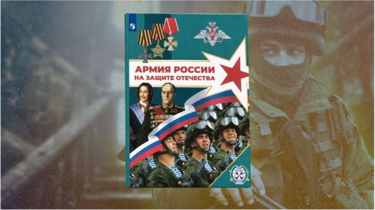
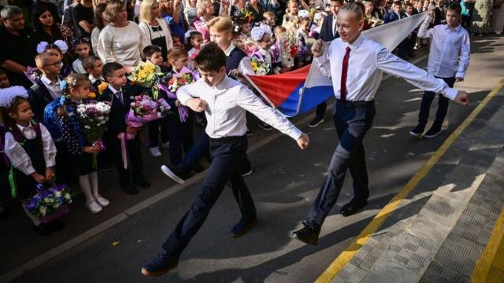
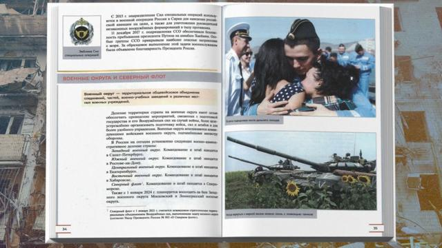
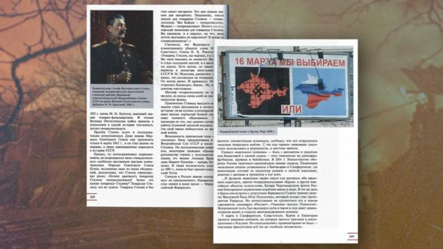
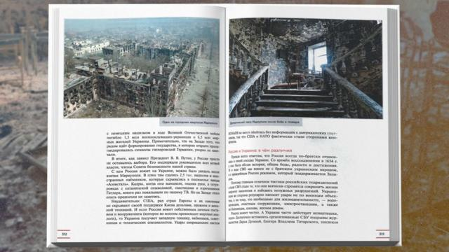
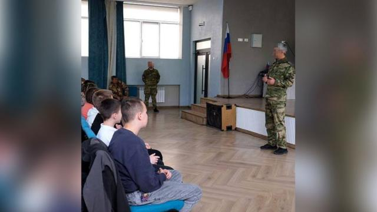

# [World] 乌克兰战争：俄罗斯新中学教科书鼓励青少年加入对乌克兰作战

#  乌克兰战争：俄罗斯新中学教科书鼓励青少年加入对乌克兰作战

  * 玛丽亚·科雷纽克（Maria Korenyuk） 
  * BBC全球虚假信息核查小组 

> 图像来源，  Getty Images/BBC
>
> 图像加注文字，俄罗斯中学课本封面“保卫祖国的军队”

**俄罗斯正在该国以及乌克兰被占领土的学校开设一门新的军事课程。从2024年9月1日起，这门名为"祖国安全防卫基础"的课程将成为15至18岁高中生的必修课。**

BBC获得了该书，并对其368页内容进行了分析。其中包含克里姆林宫对乌克兰战争的虚假叙述，以及呼吁学生参军的内容。

“祖国安全防卫基础”课程将于每周开设一次，取代俄罗斯和乌克兰五个俄占区所有学校长期以来的“安全生活基础”课程。

退役士兵有望成为新课程的教师。从乌克兰战场归来的拥有教育学学位的俄罗斯人可以免费参加再培训课程，成为学校教师。

俄罗斯启蒙部部长谢尔盖·克拉夫佐夫（Sergei Kravtsov）说：“我们将加强初始的军事训练模块，使其更具吸引力和现代性。”

> 图像来源，  Getty Images
>
> 图像加注文字，从2024年9月1日起，这门名为“祖国安全防卫基础”的课程将成为15至18岁高中生的必修课。

新课程的第一本教科书《保卫祖国的俄罗斯军队》由俄罗斯著名教育出版社“启蒙”出版。该公司于1月为教师们组织了一次在线介绍会，BBC观看了这次介绍会。

“亲爱的同事们，我们都明白从我们国家（俄罗斯）的角度向学生介绍信息的重要性。”出版社代表奥尔加·普莱乔娃（Olga Plechova）说。

“我们不能向学生传达其他观点。因此，这本教科书将帮助你们解决孩子们的问题，并提供对某些事件的准确报道。”

> 图像来源，  Getty Images/BBC
>
> 图像加注文字，书中一张配图是在乌克兰的俄罗斯坦克，文字说明是，和平有时只能借助坦克才能重新实现。

为了“准确报道”某些事件，出版社向国防部代表拉斐尔·季莫舍夫（Rafael Timoshev）中将和克里姆林宫《俄罗斯报》副主编伊戈尔·切尔尼亚克（Igor Chernyak）寻求帮助，他们是教科书的共同作者。

##  “纳粹火箭袭击”成为入侵借口

BBC获得了一本《保卫祖国的俄罗斯军队》。书中充满了描述“俄罗斯士兵英雄业绩”的故事，时间跨度从13世纪至今。

该出版物的作者赞扬了苏联独裁者约瑟夫·斯大林（Joseph Stalin），颂扬了苏联人民在“伟大的卫国战争”（俄国对二战的称呼）中取得的胜利，并赞扬了俄军在“克里米亚与俄罗斯统一”（克里姆林宫对吞并乌克兰克里米亚的说法）中发挥的作用。

> 图像来源，  Getty Images/BBC
>
> 图像加注文字，这本教科书颂扬了苏联独裁者斯大林和占领乌克兰克里米亚的俄军。

在一个单独的章节中，教科书讲述了所谓的“在乌克兰的特别军事行动”，这是克里姆林宫对全面入侵乌克兰的用词。

“2014年基辅发生政变后，新政府开始镇压一切俄罗斯事物。俄文书籍被焚毁、纪念碑被摧毁、俄文歌曲和俄语本身被禁止。”作者不实地写道，“餐馆里还供应‘俄族人鲜血’鸡尾酒。”

还有更多不实的描述：“卢甘斯克和顿涅茨克地区的城市遭到纳粹炮弹和火箭弹的轰炸，因为那里存在着对这些政策的异议。”

“是乌克兰和北约策划了这场战争。”教科书称，“2022年2月19日，在慕尼黑会议上，乌克兰总统弗拉基米尔·泽连斯基威胁俄罗斯，称乌克兰计划获得核武器。基辅计划重新控制顿巴斯并夺取克里米亚，之后北约部队将驻扎在那里。”文章继续写道：“大量乌克兰军队和装甲车集中在边境。”

乌克兰政治分析家弗拉基米尔·费申科（Volodymyr Fesenko）将这些内容斥之为“全部是错误信息和谎言”。他回忆起参加泽连斯基在慕尼黑的演讲时，这名乌克兰总统提到了《布达佩斯备忘录》。这份1994年签署的协议要求乌克兰交出核武器，以换取俄罗斯和其他国家的安全保证，但2014年俄罗斯占领克里米亚时，这些保证遭到了破坏。

费申科表示，与教科书的说法相反，泽连斯基总统之所以强调这一违约行为，是因为自2021年底以来，人们对俄罗斯在乌克兰边境附近的军事部署感到日益担忧。慕尼黑会议后不久，俄罗斯联邦就对乌克兰发动了全面进攻。

> 图像来源，  Getty Images/BBC
>
> 图像加注文字，书中称，遭到俄军轰炸的乌克兰马里乌波尔，实际是在与"纳粹"和"外国雇佣军"的战斗中被摧毁的。

教科书随后谎称，遭到俄军轰炸的乌克兰马里乌波尔，实际是在与“纳粹”和“外国雇佣军”的战斗中被摧毁的。

接受BBC采访的专家强调，该书声称俄罗斯优先考虑了乌克兰平民的安全并将破坏程度降到最低。课文称，“乌克兰经常以民用基础设施为目标”而“俄罗斯正直地作战”。

“我们都记得发生在基辅布查的悲剧，那里有数十名乌克兰平民被俄罗斯人杀害，据报还有妇女被强奸。”费申科说。

“这样的案例还有很多很多。我20年前工作过的哈尔科夫国立大学的教学楼在俄罗斯攻城的第一天就被摧毁了。我女儿就读的学校也被炸毁。这些都是被俄罗斯野蛮摧毁的民用建筑。”

##  从课堂到战场

《保卫祖国的俄罗斯军队》的另一部分首先深入介绍了俄罗斯武装部队的结构。随着内容的延展，它越来越多地呼吁18岁以上的人报名参军。

教科书概述了报名流程，包括所需文件、照片尺寸、报名表链接以及附近的报名地址。它宣传的福利包括免费医疗和保险、诱人的薪水和一日三餐。

教科书还列出了如果被征召，却未到征兵办公室应征将面临的各种限制措施，包括拒绝贷款、禁止驾驶汽车或登记财产等。

> 图像来源，  Telegram channel New Melitopol
>
> 图像加注文字，俄军士兵在被占的马里乌波尔的学校和学生交流。

克里米亚人权组织负责人奥尔哈·斯克里普尼克（Olha Skrypnyk）警告说，来自克里米亚和顿巴斯等乌克兰被占领土的年轻人可能会受到这些经济奖金的诱惑。

“除了过去十年来针对乌克兰被占领地区儿童的声势浩大的宣传外，那里没有赚钱的机会。他们还能在哪里领取这么高的薪水呢？”斯克里普尼克说。

她说，新教材将推动在俄罗斯和俄占区动员后备力量。“所以这些孩子去打仗，然后死去。”

在两年的战争中，俄罗斯至少损失了1240名20岁以下（含20岁）的士兵。该数字仅为BBC俄罗斯分社根据公开资料确认的死亡人数。

