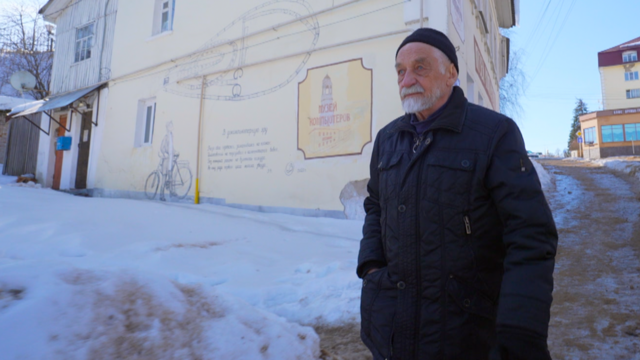
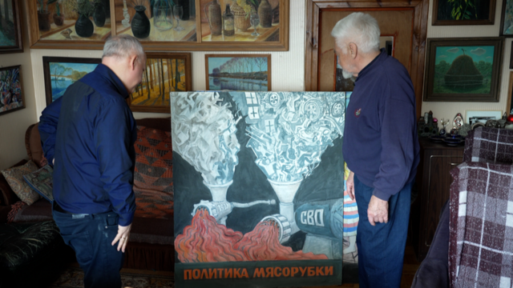
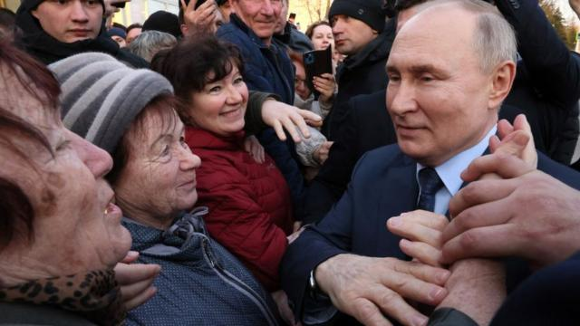
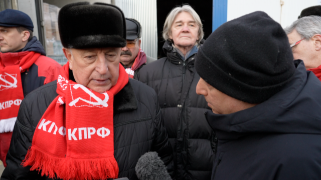
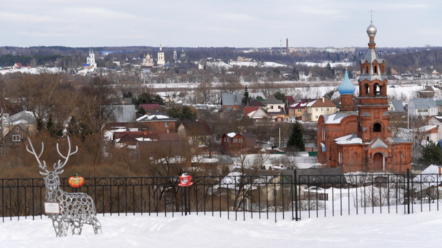
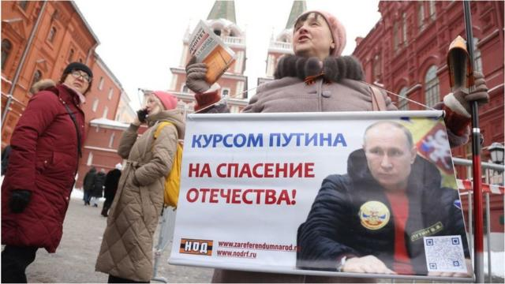

# [World] 俄罗斯大选：精心控制的投票将让普京获得第五任期

#  俄罗斯大选：精心控制的投票将让普京获得第五任期

  * 史蒂夫·罗森伯格（Steve Rosenberg） 
  * BBC俄罗斯事务编辑 发自博罗夫斯克 

> 图像加注文字，弗拉基米尔·奥夫钦尼科夫的街头艺术装饰着博罗夫斯克的墙壁。他的大部分画作都没有争议，除了描绘当今俄罗斯的作品。

**当我走在距莫斯科60英里（100公里）的小镇博罗夫斯克（Borovsk）的街头时，有两件事让我印象深刻。**

首先，这里几乎看不到本周末即将举行总统选举的迹象。

我几乎没有看到任何选举横幅或广告牌，也没有人在散发政治传单。

这并不奇怪。看不到选举筹备工作反映出这次选举结果将在精心安排的投票中尘埃落定，不会有任何戏剧性场面。弗拉基米尔·普京（Vladimir Putin）将第五次入主克里姆林宫。

在博罗夫斯克，你不得不注意到的另一件事是街头艺术。它们无处不在。

其中大部分是街头艺术家弗拉基米尔·奥夫钦尼科夫（Vladimir Ovchinnikov）创作的。他的作品遍布全城的墙壁和建筑物。

他的大部分画作都没有争议。比如讲述小镇历史的巨型地球仪，或是著名足球运动员的形象。

然而，当弗拉基米尔描绘当今俄罗斯时，他的画作却越来越阴暗。

“我把这幅画叫做《雄心的顶峰》。”这位86岁的艺术家告诉我。他在家里给我看的这幅画上，一名穿着武术服的人在人头骨堆上走钢丝。

“这就是位高权重者的野心所能导致的结果。”

更引人注目的是他画的两台绞肉机在绞杀人的画面——一个上面写有1937年（斯大林展开大清洗），另一个则写有“特别军事行动”（俄罗斯在乌克兰的战争）。

“我们没有吸取任何教训。”奥夫钦尼科夫总结道。

> 图像加注文字，弗拉基米尔·奥夫钦尼科夫在展示他的艺术作品。

此前，他在墙上涂鸦了类似的绞肉机图案后，被以“抹黑”俄罗斯军队的名义遭到罚款。他还在另一幅作品中描绘了导弹落在一名穿着乌克兰蓝黄相间衣服的女孩身上，而这给他带来了相同的后果。

奥夫钦尼科夫不仅用他的艺术来评论当下，也用其揭示俄罗斯黑暗的过去——斯大林时代的镇压。他批评乌克兰战争的涂鸦并没有得到当局的青睐，很快就被涂掉了。

“我的画让人们思考：在这场冲突中，我们是对还是错？”奥夫钦尼科夫告诉我。“我认为这是侵犯邻国领土完整的罪行。如果我保持沉默，就是在纵容这种行为。”

“很多人确实保持了沉默，因为他们害怕受到打压，害怕失去工作，害怕被别人批评。”

俄罗斯反对派领袖纳瓦尔尼（Alexei Navalny）死于狱中后，奥夫钦尼科夫将纳瓦尔尼的肖像画在了当地一座纪念政治镇压受害者的纪念碑上。

“就在当天，有人把它擦掉了。”奥夫钦尼科夫告诉我。“但在家里，我在硬纸板上画了一个草稿。所以后来我把它放在纪念碑旁。”

奥夫钦尼科夫如何看待俄罗斯的未来？

“有人预测会有更多的镇压。”他说。“我们正在走向极权主义和全面独裁。”

##  总统的照片

> 图像来源，  Getty Images
>
> 图像加注文字，普京将在这次选举中赢得第五个任期（图为普京在斯塔夫罗波尔向支持者致意）。

奥夫钦尼科夫告诉我，他从不看电视。

一旦打开电视，他就会在官方媒体上看到一幅截然不同的俄罗斯的画面。

那是普京版的俄罗斯。

没有堆积如山的人头骨，没有绞肉机，没有提到纳瓦尔尼。

这不是一个对外扩张、对内镇压的俄罗斯，而是一个有着辉煌过去和同样辉煌未来的俄罗斯。这个国家英雄辈出，爱国者团结在国旗下保卫祖国不受外来侵略。

这是一个热爱现任领导人的俄罗斯。

几天前，俄罗斯《第一频道》（Channel 1）的晚间新闻播报显示，普京的粉丝们似乎像追星一样向总统问好。

“保重身体。”一位女士在亲吻总统之前喊道。

“健康长寿！”一名男子喊道。

如果你仅依靠《第一频道》获取新闻，你可能会得出这样的结论：普京大有希望在总统大选中大获全胜。

但是，就像绘画一样，背景很重要。这里的背景至关重要。

克里姆林宫不仅控制着俄罗斯的电视，还控制着包括选举在内的整个政治体系。

普京总统在寻求第五个任期时没有面临严峻挑战。他最尖锐的批评者要么流亡国外，要么在国内锒铛入狱。他最激烈的对手纳瓦尔尼已经身亡。

但是，克里姆林宫喜欢标榜俄罗斯拥有世界上“最好的民主”。因此，除了普京之外，还有三位官方批准的挑战者，他们来自亲克里姆林宫的俄罗斯议会。

我最近采访了其中一位。这是一次奇怪的经历。

“你为什么认为你会成为比普京更好的总统？”我问俄罗斯共产党候选人尼古拉·哈里托诺夫（Nikolai Kharitonov）。

“这不是我该说的。”哈里托诺夫回答说。“那是不对的。”

> 图像加注文字，俄罗斯总统候选人尼古拉·哈利托诺夫（左）认为，他不应该说自己是否会成为比普京更好的总统。

“但你认为你的政纲比普京的更好吗？”我继续问道。

“这要由选民来决定。”

“但你怎么看？”

“我怎么看并不重要，这取决于选民。”

哈里托诺夫没有自我吹捧，反而赞扬了现任总统。

“如今，普京正在努力解决1990年代的许多问题，当时叶利钦将俄罗斯拖入了疯狂的资本主义。”哈里托诺夫说。“他正试图在所有领域巩固国家的胜利，这一定会实现。”

直觉告诉我，哈里托诺夫的心并不在这场竞选上。

俄罗斯反战政治家鲍里斯·纳杰日丁（Boris Nadezhdin）曾试图参加选举，但最终失败。

“要说我们的总统选举是公平和自由的，这是绝对不可能的。”纳杰日丁告诉我。他声称，他之所以被禁止参选，是因为他的反战主张日益深入人心。

“民调显示，俄罗斯约有30%至35%的人希望投票给像我这样谈论和平的候选人。对我们的政府来说，这绝对是不可能的结果。”

##  街头的照片

> 图像加注文字，俄罗斯希望其国民和世界相信，一切都是完美的。

回到博罗夫斯克后，我在普罗特瓦河（Protva River）的桥上欣赏风景。

从这里看，小镇本身就像一幅画：就像一幅挂在冬宫的俄罗斯画卷。山上矗立着一座美丽的教堂，教堂下面是白雪覆盖的古朴房屋。人们穿着暖和的大衣，小心翼翼地走在结冰的小路上。

走在进城的路上，我也小心地打量着周围的气氛。在博罗夫斯克的街道上，人们对战争、选举和他们的总统有何看法？

“不管你怎么投票，一切都已经提前决定好了。”一位名叫斯韦特兰娜（Svetlana）的女子对我说。“我觉得参加投票没有任何意义。”

但这里的许多人，尤其是年长的俄罗斯人告诉我，他们将参加投票。当我和人们交谈时，明显感到在电视上看到的俄罗斯有很多支持者。

“我希望普京能够赢得选举，从而结束战争。”柳德米拉（Lyudmila）告诉我。“很多年轻人被杀害了。当和平到来时，许多国家最终会明白俄罗斯是不可战胜的。”

“你为什么希望普京获胜？”我问道。“毕竟是他发起了特别军事行动。”

“众说纷纭。”柳德米拉承认。“有人说这场战争根本就不该打。有人说他是对的。我现在不会评判他，我们不知道所有的政治内幕。”

> 图像来源，  Getty Images
>
> 图像加注文字，2024年大选前夕，一名妇女在红场举着海报，表达她对普京的支持。

“普京已经执政近四分之一个世纪了。”我说道。“在一个拥有1.45亿人口的国家里，难道没有其他人能胜任他的工作吗？”

“不，我们有很多有才能的领导人，他们在紧急情况下可以管理国家。”柳德米拉回答说。

尼古拉（Nikolai）也将投票给现任总统，他显然对普京执政25年毫不介意。

“那又怎样？我们的沙皇也统治了很长时间。”尼古拉说。“领导人有好有坏，我们有斯大林和勃列日涅夫。你可以换领导人，但这对我们的生活没什么影响。”

