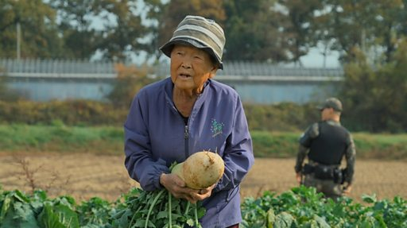

# [World] 朝韩非军事区：走访仍生活在隐秘缓冲区内的韩国“自由村”居民

#  朝韩非军事区：走访仍生活在隐秘缓冲区内的韩国自由村居民

**朝韩非军事区：走访仍生活在隐秘缓冲区内的韩国自由村居民**

朝韩非军事区（DMZ）为韩国和朝鲜交界处的缓冲地带，于1953年韩战结束后建立。它是世界上最高度军事化的地区之一，双方仅被允许各留下一个村：韩国的自由村和朝鲜的和平村。

BBC驻首尔记者吉恩·麦肯锡（Jean Mackenzie）取得进入非军事区的机会，在联合国军司令部指挥官陪同下拜访韩国位于区内的自由村。

自由村里仍然居住着138位居民，很多已经年过60。

“有一天我在捡橡树果子的时候，就看到了朝鲜人，我开始大叫。”一位居民描述自己的生活经历，这里和朝鲜只有一步之遥，非军事区也是朝鲜脱北者逃离的主要通道。

但对于朝韩关系是好是坏，这位身处前线的居民反而说自己“不会关注”，因为“我们背对对方生活”。

这里的居民要在全副武装的士兵陪同下收割稻谷，在这个非军事区内，至今还埋有约200万颗地雷。自由村仍在实施宵禁，居民晚上七点后离家需要获得许可。

**更多关于朝韩关系及非军事区的报道：**

