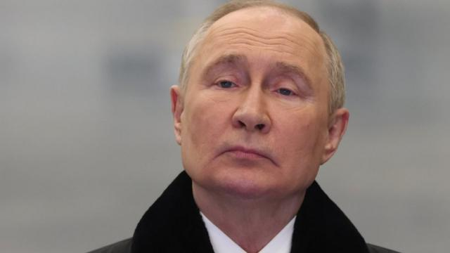
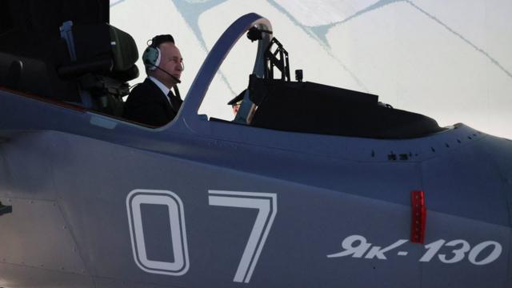
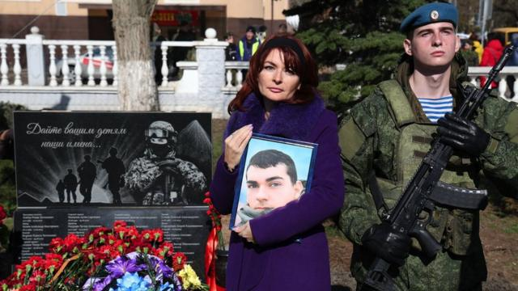
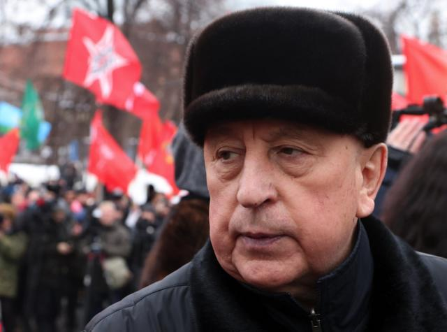
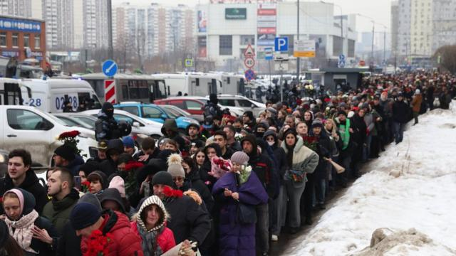

# [World] 俄罗斯总统大选：普京为何大费周章举行这次选举

#  俄罗斯总统大选：普京为何大费周章举行这次选举

  * 谢尔盖·戈里亚什科（Sergei Goryashko） 
  * BBC国际部记者 

> 图像来源，  Getty Images
>
> 图像加注文字，俄罗斯在3月15日至17日举行为期三天的总统选举，外界认为普京第五次当选总统已成定局。

**71岁的普京（Vladimir Putin）已经掌权超过20年。他最初被前总统叶利钦任命为看守总统，并于2000年3月赢得首次大选。**

2008年至2012年间，他换了角色成为总理，但仍完全掌控政权。当时俄罗斯宪法规定总统只能连任两届，转为总理让他得以再次参选。

2020年修改宪法後，外界普遍预期普京将继续执政到2036年。

届时，他将成为俄罗斯执政时间最长的统治者，超越共产党领导人斯大林和18世纪的凯瑟琳大帝（Empress Catherine the Great），两人都执政超过30年。

##  动员人民投票

> 图像来源，  AFP

俄罗斯选举很少是令人紧张的事件，但选举对于执政者的合法性和表明民意非常重要。

这次对普京来说尤为重要，他不仅要获胜，还要看到高投票率和支持率，因为俄罗斯正卷入一场全面战争，这场战争将对俄罗斯和整个世界产生持续影响。

对于政府官员而言，这次选举将考验他们是否有能力调集行政资源，为总统带来压倒性胜利。

俄罗斯独立新闻网站《美杜莎》（Meduza）报道，克里姆林宫希望投票率至少达到70%，其中约80%选票投给普京。这将超过他在2018年76.7%的得票率。

BBC研究发现，为了取得这样的结果，当局的目标是动员国有部门雇员，即中央和地方当局以及国有企业工作的人，大力鼓励他们投票并支持现任总统。

俄罗斯约有1.123亿合资格选民。

这个数字包括生活在乌克兰被占领土的俄罗斯公民，范围包括2014年被俄罗斯非法接管的克里米亚和顿巴斯地区部分区域，以及自2022年2月以来被占领的乌克兰东部和南部其他地区。

另有190万居住在国外的俄罗斯公民有资格投票，其中1.2万人居住在邻国哈萨克斯坦，俄罗斯在当地租用了拜科努尔航天发射基地。

##  战争与选举

> 图像来源，  AFP
>
> 图像加注文字，普京在总统选举前夕的2024年世界青年节闭幕式上发表讲话。

普京在竞选期间出席多场活动，主要是与俄罗斯不同地区的学生和工人会面。

虽然他避而不谈“特别军事行动”，即莫斯科对入侵乌克兰的称呼，但战争在俄罗斯人的生活中无处不在：国际制裁、旅行选择受限、外国商品减少，以及与欧洲和北美的隔绝感。

战争还夺去了数万甚至数十万俄罗斯士兵的生命。

> 图像来源，  AFP
>
> 图像加注文字，高投票率和对总统的高支持率，将增加其后续决策的合法性，当中很多决策将直接关乎入侵乌克兰。

在过去24个月，数十万俄罗斯人离开国土，他们大多是受过教育、家境富裕的年轻人，要么是因为不同意战争，要么是不想被征召入伍。

即使不参与竞选活动，战争也是媒体的重要主题，俄罗斯人无法回避它。

高投票率和对总统的高支持率，将增加其后续决策的合法性，当中很多决策将直接关乎入侵乌克兰。

##  候选人有哪些？

> 图像来源，  Getty Images
>
> 图像加注文字，除了普京，还有另外三名登记在册的候选人： 民族主义保守派候选人斯卢茨基、共产党候选人哈里托诺夫和新人党的达万科夫。三人都表示支持普京及俄罗斯在乌克兰的战争，他们都没有构成真正的威胁。

除了普京，还有另外三名登记在册的候选人： 民族主义保守派候选人斯卢茨基（Leonid Slutsky）丶共产党候选人哈里托诺夫（Nikolai Kharitonov）和新人党的达万科夫（Vladislav Davankov）。新人党新成立，在俄罗斯杜马下议院拥有少量代表。

三人都表示支持普京及俄罗斯在乌克兰的战争，他们都没有构成真正的威胁。

普京真正的挑战者要么已入狱，要么已被消灭，要么已逃离俄罗斯。普京最激烈的反对者纳瓦尔尼今年2月在戒备森严的监狱去世。

BBC记者罗森伯格（Steve Rosenberg）询问候选人哈里托诺夫是否认为自己会成为比普京更好的总统，他回答说这不是他能说的，选民将“决定一切”。他自2022年以来就一直受到西方制裁。

俄罗斯自由民主党（LDPR）议员斯卢茨基（Leonid Slutsky）曾多次被指控性骚扰。他组织了对被占领的克里米亚的国事访问，自2014年以来一直受到国际制裁。

新人党的达万科夫（Vladislav Davankov）在媒体上的曝光率最低。他是一家化妆品公司的共同创始人，2023年在莫斯科市长选举中仅获5%多一点的选票。在与乌克兰的战争中主张“和平与谈判”的同时，达万科夫投票支持吞并乌克兰领土，这也导致他受到国际制裁。

至于反战参选人纳杰日丁（Boris Nadezhdin）获数万名俄罗斯人排队签名支持，但最终未能登记为候选人。

##  投票为期三天

> 图像来源，  Getty Images
>
> 图像加注文字，大规模公开表达对俄反对派的支持并不常见，但3月1日，数千人聚集在一起参加被监禁的普京批评者纳瓦尔尼的葬礼。

俄罗斯选民将在3月15至17日三天内投票，这在该国总统选举史上尚属首次。

三天投票的形式首次出现在2020年宪法修正案投票，以及在新冠疫情期间就保障公共健康进行的投票。有独立观察员曾提出批评，认为这难以确保投票过程的透明度，但此次选举再次采用这种形式。

此外，这次总统选举将首次采用远程在线投票系统，主要是在以抗议投票闻名或当局难以确保投票率的地区。

俄罗斯还因将乌克兰被占领土纳入此次选举而备受批评，有报道称当地居民受到压力。

欧洲安全与合作组织（OSCE）议会大会自1993年以来向俄罗斯大选派遣观察员，但在过去三年已经停止。

##  有什么可能改变？

俄罗斯没有独立民意调查，大多数俄罗斯人从国有媒体获取新闻，而国有媒体严重偏袒普京及其政策。

专家认为，对政府持怀疑态度的俄罗斯人比表面上看来要多，但支持反对派的轻微举动都有可能遭到严惩，因此异议民众不敢公开表态。

纳瓦尔尼遗孀尤利娅呼吁同胞抵制投票，并要求外国政府不承认这次选举的结果。

后者不太可能成真，但前者有可能发生。俄罗斯独立媒体《美杜莎》引述一名接近普京的消息人士指，当局确实担心投票率低。“如果人们不怀疑现任总统会获胜，为什么还要去投呢？”

这次选举最有可能的结果，是普京取得令人信服的胜利，至少在纸面上是如此。

但低投票率将意味着对总统的支持减弱，这反过来又可能带来更严格的国家控制，使俄罗斯进一步陷入恐惧和压迫的氛围。

