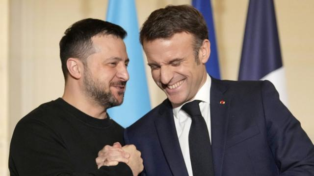
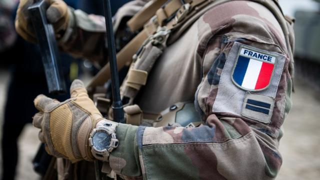

# [World] 法国总统马克龙在乌克兰问题上正从鸽派转向鹰派——观点

#  法国总统马克龙在乌克兰问题上正从鸽派转向鹰派——观点

  * 休·斯科菲尔德（Hugh Schofield） 
  * BBC记者 发自巴黎 

> 图像来源，  EPA

**法国总统马克龙 （Emmanuel Macron，马克宏）最近在俄罗斯和乌克兰问题上的立场转变了，他何以从安抚者转变为对俄主战派？这是欧洲各国政府正在问的问题。**

马克龙逐渐成为欧洲对抗普京的领导者，这让欧洲各国政府感到些困惑。

一些国家，如波罗的海国家和波兰，对马克龙近日表现出的对莫斯科威胁的“现实主义”姿态表示欢迎。然而，其他国家尤其肖尔茨领导下的德国，对马克龙表现出的“好战精神”感到惊讶。

许多人对马克龙新立场的真实性感到困惑，他最近令人意外地拒绝排除法国向乌克兰派遣部队这个选项，这是否只是马克龙追求国际外交表现的举措？这一新立场在多大程度上纯粹是政治手段呢？

欧洲各国选举即将到来，极右派的玛琳·勒庞（Marine Le Pen）和乔丹·巴德拉（Jordan Bardella）看起来将击败马克龙阵营。因此，马克龙是否利用乌克兰在自己和反对派之间制造了一条分界线，将自己清晰的鹰派立场与勒庞过去与莫斯科的暧昧合作形成对比？

> 图像来源，  Getty Images
>
> 图像加注文字，法国指责德国在对乌克兰提供援助上拖延，并盲目信奉美国安全保护伞的永久性；而柏林则指责巴黎鲁莽好战且虚伪。

在周四晚间的法国电视直播访谈中，马克龙间接承认了这些重要问题正在被提出。

然而，马克龙以他一贯的风格，没有想要安抚外界的疑问，而是试图维护自己主张。他不但没有减少那些危言耸听的说法，反而还进行了解释。

对于他从鸽派转变为鹰派这一点，法国总统并不感到尴尬，他认为有人必然要先行。他主张，只有在所有与对手接触的努力耗尽之后，才能断定该对手已经超出了可接受的范围。

> 图像来源，  Getty Images
>
> 图像加注文字，马克龙在外交上又开拓了新战场。

他自我辩护的第二部分是，他认为俄罗斯人现在将对乌克兰的侵略推向了一个全新的层次。他表示，克里姆林宫在最近几个月内“变得明显更强硬”——将俄罗斯经济置于永久的战争状态，还加大对内部反对派的压制并升级对法国和其他国家的网路攻击。

他又表示，随着乌克兰局势日益艰难，而美国不再作为可靠盟友，欧洲正在进入一个新世界：“一个我们认为不可想像的世界实际上正在眼前。”

这就是为什么根据新的马克龙主义，法国和欧洲需要准备一个“跃升”——心理上要从“垂死时代”确定性的舒适区跳出来，进入新时代的严酷现实之中。

他用刻意模仿英国前首相邱吉尔的语调表示，为了维护和平，欧洲需要为战争做好准备。

> 图像来源，  EPA
>
> 图像加注文字，马克龙暗示法国可能需要向乌克兰派出地面部队。

这正是马克龙总统一贯的风格，他的逻辑是那么无可挑剔，他的论点又是如此坚不可摧。然而，这也就像一直以来的马克龙主义一样，总是存在一个问题：他能否使人信服呢？

因为这位法国领导人的持久困难明显不是智力不足，而是将那种才华转化为另一种才能的能力：领导力，也就是让他人愿意跟随他的能力。

在这个问题上，其他人是否会听从他的指挥还很不明朗。最明显的迹象是，法国领导人与他在欧洲被认为是最亲近盟友的德国领袖肖尔茨之间的分歧。按照传统的“法德风格”，双方正在公开修补并展示必要的共同立场。这就是为什么马克龙于上周高调访问柏林之原因。

然而，再多的拥抱也无法掩盖两国立场根本的不一致：法国指责德国在对乌克兰提供援助上拖延，并盲目信奉美国安全保护伞的永久性；而柏林则指责巴黎鲁莽好战且虚伪（事实上，法国的武器交付远远落后于德国），以及马克龙的炫耀作风。

> 图像来源，  Reuters
>
> 图像加注文字，德国总理肖尔茨对马克龙最近表现出的好战精神感到惊讶。

法国人对马克龙在乌克兰问题上的支持并不如他自己想的那样坚定。法国民意调查显示，多数法国人（约68%）反对他派遣军队到乌克兰的立场。更普遍地说，尽管大多数人明显反对俄罗斯，但法国民意研究机构Ifop的报告显示了对乌克兰支持的“渐进性衰退”。

换句话说，若马克龙对莫斯科采取新的强硬立场，并用以揭露选举中极右派对莫斯科的暧昧，那么这种策略似乎并不奏效，因为民意调查显示，这反而会让勒庞的国民联盟（National Rally ）的支持度增强。

在成为欧洲反绥靖派领导者的同时，马克龙在外交上又开拓了新战场。他正想要带领并推动欧洲人深思自己的安全问题，以及可能很快需要作出的牺牲。毫无疑问，这一切举措都受到欢迎。

但马克龙的困难在于太多人对他表示反感，批评者对他的自信感到不满，觉得他总是很容易地混淆对欧洲、对世界和对他本人有利的做法。

