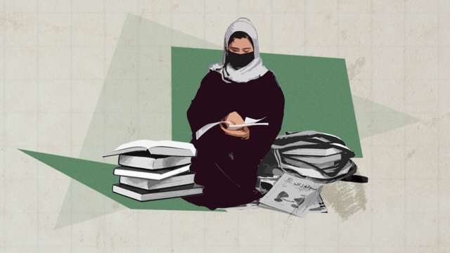
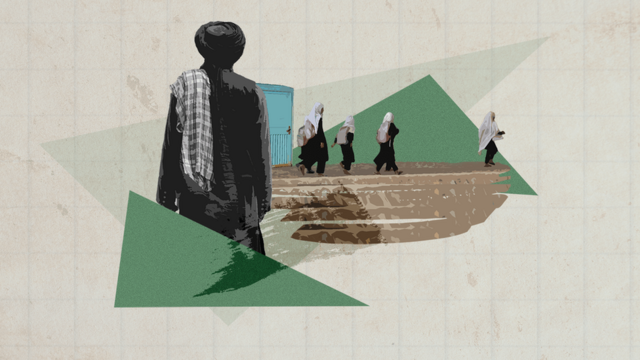
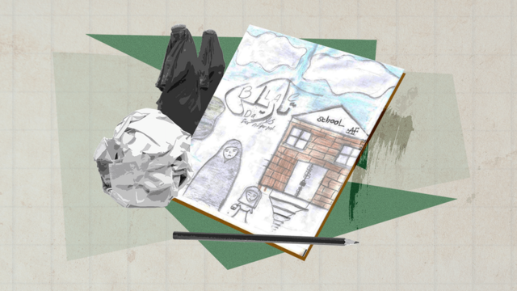

# [World] 联合国：塔利班禁令再让33万名阿富汗女孩失学

#  联合国：塔利班禁令再让33万名阿富汗女孩失学

> 图像来源，  Raess Hussain/BBC

**联合国儿童基金会（UNICEF）对BBC说，今年阿富汗将再有超过33万名女孩无法进入中学学习。2021年，塔利班政府表示，女孩在六年级（约13岁）之后将不再接受教育。**

13岁的扎伊娜卜（Zainab）是本月无法参加新学年课程的女孩之一。

在过去的几个月里，扎伊娜卜一直讨厌煎蛋卷。煎蛋和牛奶的味道会让她想起去年她还在上学的时候。那是不到六个月前的事，那时她很快乐——她会在晨祷声中醒来，然后和妹妹、哥哥一起走去上学。而如今，妹妹和哥哥将开始新学期生活，煎蛋卷提醒着她失去的一切。

扎伊娜卜早就知道六年级以后女孩就不被允许上学，但她一直希望能有所改变。她热爱学习，各门功课都很出色，文科和理科都很擅长。

扎伊娜卜的父亲自豪地说：“她是班里的佼佼者。”她羞涩地笑了。她本可以从事任何她想从事的职业。但就在去年12月她参加了小学毕业考试后，校长走进考场，告诉扎伊娜卜和同年级的女孩们，她们将无法在三月份的新学年重返校园。

“她当时非常难过。”扎伊娜卜的父亲沙希尔（Shaheer）说，他眼睁睁看着沮丧的女儿回到家里。

“看到她这样我很难受，我无法为女儿做任何事，作为父亲我感到内疚。”他一直试图带家人离开阿富汗，但没有成功。

“我感觉自己把梦想埋在了一个黑洞里。”扎伊娜卜在经过加密的视频通话中轻声说道，然后沉默了几秒钟。她的父亲问我们，她是否可以休息片刻，整理一下思绪。谈论这件事对整个家庭来说都是沉重的。

对于像扎伊娜卜这样的女孩来说，唯一的选择就是继续在政府控制的宗教学校（亦称伊斯兰教学校）里上课。但联合国秘书长阿富汗问题特别代表奥通巴耶娃（Roza Otunbayeva）去年12月告诉安理会，她无法确定女子宗教学校是否教授数学和英语等学术科目。

扎伊娜卜的父亲说，宗教学校无法为女儿提供全面教育。

"这不是学校的替代方案，他们只会教她宗教课程。我不认为有必要送她去宗教学校。"他说。

> 图像来源，  Raess Hussain/ BBC
>
> 图像加注文字，根据塔利班的政策，女孩在六年级之后就不能再上学。

塔利班自2021年8月15日控制首都喀布尔以来，一直统治着阿富汗。以美国为首的北约军队不久后撤出。塔利班官员在首次新闻发布会上宣布，他们不会像1996年至2001年首次统治阿富汗的塔利班强硬派那样。

“我们将允许女性在我们的框架内学习和工作。女性将在我们的社会中非常活跃。”他们承诺。

但该国女性权益的倒退很快接踵而至。几个月内，女孩被剥夺了就读七年级或中学的机会。

随后，大学和许多工作场所也被规定只允许男性进入。

如今，没有男性陪伴，妇女不得离开家门，也不得去公园。

这是一幅暗淡的图景。联合国儿童基金会告诉BBC，自2021年以来，受学校禁令影响的女孩总数超过140万。其中，33万名女孩在2023年完成六年级课程，今年起将无法继续学业。

然而，并非所有人都在遵循塔利班的命令。

扎伊娜卜的家人说，他们所在的社区正在开展由社区主导的私人活动，扎伊娜卜目前正在上英语课。没人知道这种情况会持续多久，但现在，她可以在这里见到朋友。

她尽力为朋友们打气，告诉他们要振作起来。“我鼓励他们找到自己的爱好。”她告诉BBC，“我鼓励他们创作艺术。”

> 图像来源，  Raess Hussain/ BBC
>
> 图像加注文字，扎伊娜卜给BBC记者发送了她的一幅画，画的是一名女孩站在一所上锁的学校门前。

扎伊娜卜喜欢画画。在校长说她再也回不去学校的那天，她回家后便拿起了画笔。

她给BBC记者发送了她的一幅画，画的是一名女孩站在一所上锁的学校门前。她把这幅画取名为“阿富汗女孩的黑暗日子”。

“在被禁止上学后，我画的第一幅画是一个女孩盯着学校紧锁的大门。”她说。

但在过去的几个月里，她强迫自己保持乐观。现在，她画的都是美好的事物——天空、高楼、花朵、太阳，或是她想象中梦想成真的未来。她向世界传达的信息是，像她这样的阿富汗女孩绝不能被遗忘。

“帮助阿富汗女孩重新获得她们的权利。”她说，“阿富汗儿童非常有天赋。我们需要的只是机会。”

BBC向塔利班寻求评论，但尚未收到答复。

**（** **出于安全原因，本篇报道中的姓名为化名。** **）**

