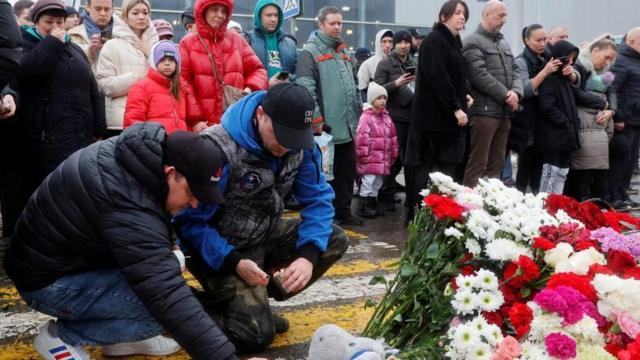
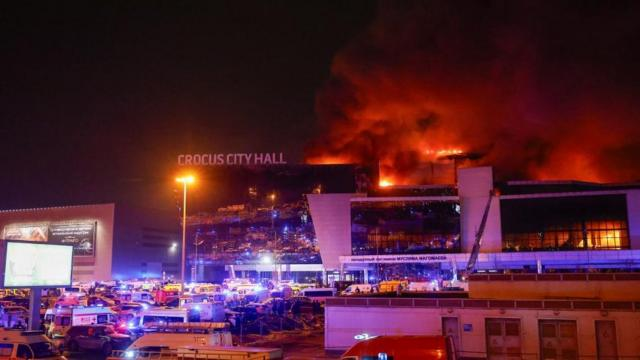
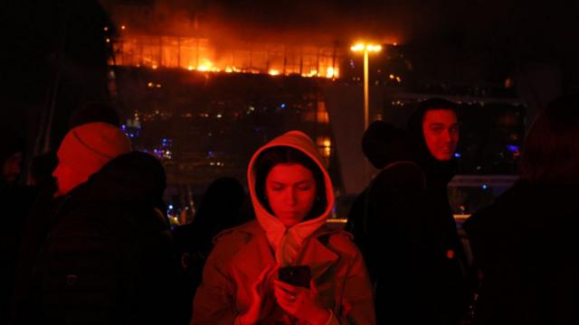
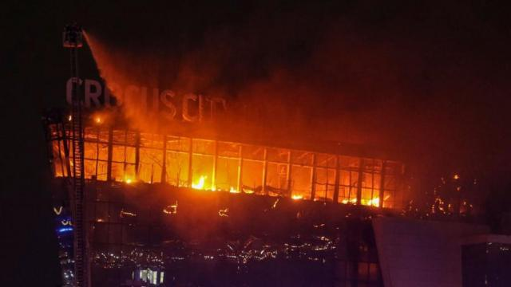
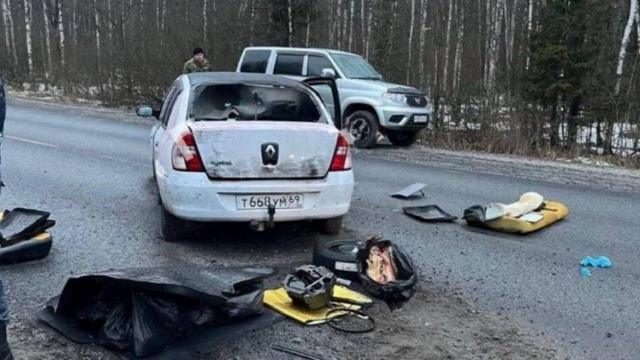

# [World] 莫斯科袭击案：枪击与恐慌下的音乐厅大屠杀

#  莫斯科袭击案：枪击与恐慌下的音乐厅大屠杀

> 图像来源，  Reuters
>
> 图像加注文字，周六，人们在受到袭击的音乐厅外献上鲜花以表达纪念。

**降半旗、取消公众活动、电视台更新节目表……俄罗斯为当地时间周五傍晚莫斯科袭击案中丧生的133名死者举行哀悼日。**

稍早前，俄罗斯总统弗拉基米尔·普京（Vladimir Putin）表示，在莫斯科近郊一家音乐厅发动致命袭击的四名枪手已全部被捕。俄罗斯当局称，共有11人被拘留，四名枪手在前往乌克兰途中被抓获。伊斯兰国（IS）组织自称为此次袭击的幕后主使。

袭击者冲进建筑物，无差别射击并点燃了建筑物，造成至少 133 人死亡，140 多人受伤。

周六，伊斯兰国（IS）组织在自己Telegram频道张贴了四名蒙面男子的照片，他们声称参与了袭击。俄罗斯没有对其说法发表评论。

该组织随后公布了非常清楚的袭击过程视频。BBC已核实这段视频的真实性，画面中一名枪手向多人开火。BBC将不会播放这段视频。

普京在电视讲话中谴责了这起俄罗斯近20年来最严重的屠杀事件，称其为“野蛮的恐怖主义行为”，并重申了俄罗斯安全部门早些时候提出的袭击者曾试图逃往乌克兰的说法。

基辅方面驳斥了关于乌克兰在某种程度上参与了此次袭击的说法，称其“荒谬”。

乌克兰军事情报局发言人安德烈·尤索夫（Andriy Yusov）对BBC说：“如果说嫌疑人正前往乌克兰，那就意味着他们是愚蠢的或有自杀倾向的。”

乌克兰总统泽连斯基指责普京试图将此次袭击“归咎于”乌克兰。他在夜间讲话中说：“这个一无是处的普京，不与俄罗斯公民打交道，不向他们讲话，而是沉默了一天——想着如何把这一切归咎于乌克兰。”

美国国家安全委员会表示，本月早些时候该机构曾警告可能会有针对莫斯科的 “大型集会”（包括音乐会）的潜在袭击。克里姆林宫当时斥之为“宣传”和华盛顿干涉俄罗斯近期选举的企图。

周六，白宫谴责这次“令人发指”的袭击，并将伊斯兰国描述为“必须在各地被击败的共同恐怖敌人”。

> 图像来源，  Reuters
>
> 图像加注文字，克罗库斯（Crocus）市政厅的礼堂外火光冲天。

**BBC记者保罗·柯尔比（Paul Kirby）还原** **了** **这次袭击的细节。** **请注意，本文中的一些细节和画面可能让人不安。**

八点不到，克罗库斯（Crocus）市政厅的礼堂里就坐满了人，因为周五晚上老牌摇滚乐队“野餐”（Picnic）要在这里举行一场摇滚音乐会。

摄影师戴夫·普里莫夫（Dave Primov）说：“一些穿着棕色衣服的人，我不知道他们是谁——恐怖分子、军人还是其他什么人——闯入礼堂，开始用突击步枪向人们射击。”

枪手刚刚走过剧院外的大厅，就开始随意开枪，打死打伤正在走进剧院的公众。

音乐会售出了约6200张门票，但入口外的安保人员很快就消失了。四名警卫中的一名说，他的同事躲在一块广告板后面：“那些袭击者从离我们10米远的地方经过——他们开始向一楼的人随意乱射。”

没有人知道有多少袭击者。但从楼上拍摄的画面显示，四名男子在米色大理石瓷砖地板上分开行走，他们之间的距离只有几米。

领头的袭击者近距离瞄准了挤在窗户边的人们。他们成为这场俄罗斯多年以来针对平民发动的最致命袭击的首批受害者。

许多死伤者来自克拉斯诺戈尔斯克（Krasnogorsk）、希姆基（Khimki）和莫斯科西北边缘附近的其它城镇。

第二名袭击者随后加入，第三名袭击者背着一个背包平静地跟在后面。第四个人把武器递给他，然后他们穿过无人看守的金属探测器，走向礼堂。

一名妇女当时正带着11岁的女儿在入口附近的一家咖啡馆买冰淇淋，他们听到响声，有人大喊“趴下”。

她告诉BBC俄语记者：“我们冲到孩子身边，躺下，开始用桌椅搭起障碍，几个受伤的人向我们跑来。”

剧院内，音乐会几分钟后就要开始，一些人认为噪音可能是演出的一部分。

索菲科·克维里卡什维利（Sofiko Kvirikashvili）最初以为是“某种无休止的爆竹声——我在大厅里转了一圈，又转了一圈。第三次，我发现大厅里的每个人都开始四散奔逃”。

摄影师戴夫·普里莫夫（Dave Primov）说，现场一片拥挤和恐慌。剧院里的一些人试图趴在座位之间，但随着有几名枪手在座位里开火，这几乎起不到什么保护作用。

那些能走向舞台的观众都往舞台去了。其他人试图寻找更高处的出口，却发现有些门是锁着的。目击者说，现场有老人和儿童，他们都遭到无差别射击。

一名妇女当时在一个较高的地方，她跑向舞台，看到一名男子在台下开枪： “我们跑到幕布后面，一名穿着制服的克罗库斯礼堂的员工告诉我们快跑，我们就跑到停车场，没有穿任何冬装。”

玛格丽塔·布诺娃（Margarita Bunova）刚拿到观剧镜准备看演出，就听到了她以为是鞭炮声的声音，随后变成了急促的爆裂声，她和丈夫辨认出那是枪声。

“有人说快跑下楼，然后一片漆黑......我们出来的时候还能听到身后传来阵阵枪声。”

> 图像来源，  AFP
>
> 图像加注文字，幸存者讲述了人们试图逃生时楼内的恐慌情况。

贵宾包厢里的一名男子讲述了他和其他人如何在包厢里架起障碍物，却发现剧院里浓烟滚滚。

另一名男子维塔利（Vitaly）从阳台上看到了袭击的发生： “他们扔了一些汽油弹，所有东西都燃烧起来。”

无论枪手扔出的是汽油弹还是其它燃烧装置，火势都在迅速蔓延。

由于袭击者在开枪，消防员无法靠近大楼。火势很快蔓延到屋顶，整个克拉斯诺戈尔斯克（Krasnogorsk）的天际线都能看到火光。部分屋顶坍塌，火势蔓延到大楼前部，顶部两层被烧毁。

> 图像来源，  VASILY PRUDNIKOV/EPA-EFE/REX/Shutterstock

礼堂里的许多人从门厅逃出。一段画面感很强的视频显示，人们冲下扶梯，经过两具被沙发支撑着的尸体。

另一段视频显示，人们在逃离时，周围回荡着噼噼啪啪的枪声。他们逃到了相对安全的大楼后面，有些人蜷缩着坐在那里，有些人则相互搀扶着穿过走廊。

监控视频显示舞台前方一片混乱。大楼内没有任何俄罗斯警察或特种部队的踪迹。

幸存者们爬过楼梯，逃到克洛库斯市政厅的后门。有人看到，一名男子正在干呕，其他人则打电话给亲人，然后那名男子走开了。

伊娃是一名舞蹈团助理，当袭击者冲进礼堂时，她正在后台。“我们当时在化妆间，一群人从我们身边冲过。我们听到走廊里有嘈杂声，还有人在跑；我们拿起外套，跟着人群跑了。”

最初，“野餐”（Picnic）乐队的所有成员都被宣布安然无恙，但后来有未经证实的报道称其中一名乐手下落不明。

随着死亡人数超过100，受伤人数超过200 ，大屠杀的规模和滥杀无辜的性质在礼堂内外变得越来越清晰。第一份官方伤亡名单显示，年龄最大的受害者70多岁，死伤者中还有儿童。

> 图像来源，  Ostorozhno Novosti via Reuters
>
> 图像加注文字，俄罗斯当局称，袭击者乘坐这辆车逃离了克拉斯诺戈尔斯克袭击现场。

与俄罗斯安全机构有关的社交媒体上出现了一张白色雷诺汽车的照片，车上有两名乘客。

伊斯兰圣战组织“伊斯兰国”在一份简短声明中称自己是这次袭击的幕后指挥，但没有具体说明是哪个附属分支。这与美国情报部门的说法不谋而合，情报显示伊斯兰国想要袭击俄罗斯。两周前，美国曾警告说可能有针对莫斯科“大型集会”的袭击，但俄罗斯官员抱怨情报缺乏具体细节。

乌克兰很快否认参与其中，坚称自己的攻击仅限于战场。

但俄罗斯联邦安全局（FSB ）声称，凶手试图穿越俄罗斯进入乌克兰，并在那里有“相关联系人”。俄联邦安全局表示，已有多人被拘留，其中包括四名涉嫌袭击者。

玛格丽塔·布诺娃（Margarita Bunova）和丈夫帕维尔（Pavel）说，他们回到家做的第一件事就是拥抱自己的孩子。

直到当地时间周六下午，总统普京才向俄罗斯公众发表讲话，谈到了整个民族的悲痛。

他将凶手与二战时期的纳粹相提并论，并表示任何人都不能破坏俄罗斯的团结。他补充说，周日将是全国哀悼日。

