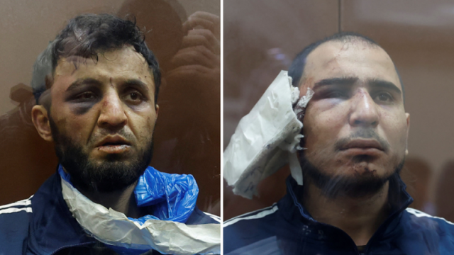
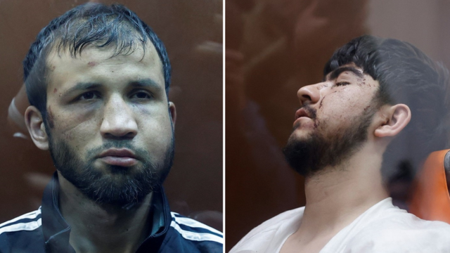
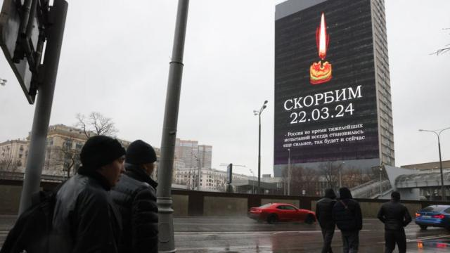
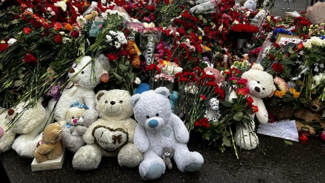
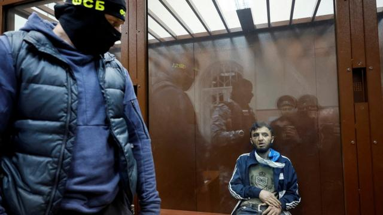

# [World] 莫斯科袭击：四名塔吉克斯坦枪手出庭 俄会否借机升级对乌作战

#  莫斯科袭击：四名塔吉克斯坦枪手出庭 俄会否借机升级对乌作战

  * 格雷姆·贝克(GraemeBaker) 
  * BBC记者 

**四名男子被控袭击莫斯科克罗库斯（Crocus）的音乐厅，至少已造成137人死亡。四人出现在莫斯科的一家法院里。**

其中三人双手被铐在背后，弯腰押送进法庭，第四人则坐在轮椅上。四人都被指控犯有恐怖主义罪行。

伊斯兰国组织（IS）称，周五在克罗库斯市政厅的袭击是由其实施的，并公布了视频。

俄罗斯官员在没有证据的情况下声称乌克兰参与其中。基辅称这一说法“荒谬”。

俄罗斯当局透露，这四人名为达勒德忠·米尔佐耶夫（Dalerdzhon Mirzoyev）、赛达克拉米·穆罗达利·拉恰巴利佐达（Saidakrami Murodali Rachabalizoda）、沙姆西丁·法里杜尼（Shamsidin Fariduni）和穆罕默德索比尔·法伊佐夫（Muhammadsobir Fayzov）。

视频显示，其中三人被蒙面警察押入莫斯科的巴斯曼尼地区法院。

> 图像来源，  Reuters
>
> 图像加注文字，达勒德忠·米尔佐耶夫（左）和赛达克拉米·穆罗达利·拉恰巴利佐达

他们似乎都遭到了殴打——俄罗斯安全部队显然泄露了残酷审讯的视频，有报道称至少有一人遭到了电击。

米尔佐耶夫和拉恰巴利佐达带着黑眼圈，后者的耳朵缠着厚厚的绷带——据说是因为在被捕时耳朵被部分弄断了。

米尔佐耶夫的脖子上似乎还缠着一个破塑料袋。

被指为法里杜尼的男子脸部严重肿胀，而被指为法伊佐夫的男子在坐着轮椅、穿着单薄的病号服，他被带上法庭时似乎已失去了知觉。据路透社报道，他似乎少了一只眼睛。

在庭审期间，所有人都被关押在一个玻璃板隔间里，并由蒙面警察看守。

Telegram上发的一份法庭声明称，米尔佐耶夫“完全认罪”，而拉恰巴利佐达也 “认罪”。

俄罗斯国家通讯社塔斯社称，这些人被确认为塔吉克斯坦公民。

法院补充说，所有四人都将被拘留到至少5月22日。

> 图像来源，  Reuters
>
> 图像加注文字，沙姆西丁·法里杜尼（左）和穆罕默德索比尔·法佐夫

当地时间周五傍晚，四名枪手冲进莫斯科北郊克拉斯诺戈尔斯克（Krasnogorsk）的克罗库斯市政厅，向正在参加摇滚音乐会的约6000名观众开火。袭击者还纵火，大火吞噬了会场，导致屋顶坍塌。

俄罗斯当局称已有137人死亡，100多人受伤。

俄罗斯联邦安全局（FSB）说，周日出庭的这些人是在袭击发生约14小时后在布良斯克（Bryansk）地区被捕的。布良斯克位于莫斯科西南约400公里。

伊斯兰国已经宣称这次袭击是由一个名为“呼罗珊伊斯兰国”（Islamic State in Khorasan，简称IS-K）的分支机构实施的。

该组织随后公布了袭击者向音乐厅内人群开火的画面。英国广播公司（BBC）证实了这段视频的真实性。

然而，没有一位俄罗斯官员承认这一说法，而是在没有证据的情况下暗示袭击者得到了乌克兰的帮助，指基辅“准备了一个窗口”让他们越过边境逃入乌克兰境内。

乌克兰总统泽连斯基（Volodymyr Zelensky）周日驳斥了这一说法，乌克兰军事情报局称，这些人试图越过布满地雷的边境到达安全地带的说法是“荒谬的”，因为那里有数十万俄罗斯士兵。

美国国家安全委员会发言人阿德里安娜·沃森（Adrienne Watson）说，IS “对此次袭击负有全部责任。乌克兰方面没有任何参与”。

另有七人因涉嫌协助此次袭击在俄罗斯被捕。

> 图像来源，  Getty Images
>
> 图像加注文字，莫斯科各地的屏幕上都显示着蜡烛燃烧的画面以及俄语单词Skorbim（“我们哀悼”）。

##  普京会作何反应？

**BBC俄罗斯** **事务** **编辑** **史蒂夫·罗森博格（Steve Rosenberg）**

莫斯科新阿尔巴特大道两旁有俄罗斯最大的视频屏幕。

今天，它们都在显示同一个巨幅画面：一支燃烧的蜡烛和俄语单词 “Skorbim”（“我们哀悼”）。

俄罗斯正在哀悼克罗库斯市政厅大屠杀的遇难者。目前还没有最终的死亡人数。搜寻尸体的工作仍在继续。

在全国各地，俄罗斯三色旗降下半旗，娱乐和体育活动被取消，电视新闻播报员身穿黑色衣服。

克罗库斯市政厅可能不在莫斯科市中心，但却是俄罗斯最著名的音乐会场地之一。

但周五的血案却将音乐厅变成了地狱。袭击者不仅用子弹，还用火焰杀人。他们点燃了大楼，制造了一场地狱之火。俄罗斯调查委员会公布的视频显示，屋顶坍塌。金属横梁也是如此。

大楼外的警戒线仍在原地。从我站的地方，可以看到娱乐中心被烧毁的部分。从这可以看出里面的惨状。

人们悼念遇难者，在自发搭建的祭坛边排队献花。祭品堆积如山，越来越多。除了献上玫瑰和康乃馨外，游客们还在花上摆放玩偶和玩具。因为死者中有儿童。

人们还纷纷留言。其中一条是写给袭击者的：

“你们是人渣。我们永远不会原谅你们。”

人们留下鲜花和泰迪熊，悼念莫斯科克洛库斯市政厅的遇难者。

这里的人群悲愤交加。

塔季扬娜（Tatyana）说：“国家的心在隐隐作痛”，她带来了一些鲜花放在这里。“我的灵魂在哭泣。俄罗斯在哭泣。这么多年轻人被杀害。感觉就像我自己的孩子死了一样。”

罗曼（Roman）说：“这是一个巨大的冲击。我就住在附近，我从窗户看到了发生的一切。这太可怕了，是个巨大的悲剧。”

“不管是谁干的，他们都不是人。他们是我们的敌人。”一位名叫叶夫根尼的老年人告诉我，“我认为我们应该取消暂停执行死刑。至少对恐怖分子是这样。”

四名嫌疑人因涉嫌参与枪击事件而被指控犯有恐怖主义罪行，莫斯科巴斯曼尼地区法院已下令将他们拘留两个月。

俄罗斯官员一直在鼓吹乌克兰以某种方式在幕后策划了这次残暴的袭击。

亲政府的《莫斯科共青团员报》在其网站上发表了一篇狂热反乌克兰的评论文章。文章以“必须宣布乌克兰为恐怖主义国家”为题，得出了这样的结论：“现在是摧毁基辅政权的时候了......所有这帮人都必须死。俄罗斯拥有这样做的资源”。

由此浮现出一个关键问题：克里姆林宫将如何应对这次毁灭性袭击？俄罗斯领导人是否计划利用在克罗库斯市政厅发生的事件，为俄罗斯在乌克兰的战争可能进一步升级进行辩护？

> 图像来源，  Reuters

美国本月早些时候警告莫斯科，俄罗斯可能发生针对大型集会的袭击，随后向该国公民发布了公共警告。

克里姆林宫将这一警告斥之为宣传和干涉其总统选举的企图。

华盛顿在袭击发生后表示，没有理由怀疑IS的说法。

这不是IS及其盟友第一次袭击俄罗斯或其海外利益。

该组织声称对2015年一架俄罗斯飞机在埃及上空被炸事件负责，机上有224人，其中大部分是俄罗斯公民。该组织还宣称2017年对圣彼得堡地铁发动了炸弹袭击，造成15人死亡。

安全分析人士称，该组织将俄罗斯视为主要目标有多种原因，包括俄罗斯在摧毁IS在叙利亚的权力基地的同时确保了总统巴沙尔·阿萨德的统治，1994-2009年莫斯科在穆斯林占多数的车臣发动了两场残酷的战争，以及苏联时期对阿富汗的入侵。

IS-K主要在阿富汗和中亚部分地区活动，其名称中的K代表“呼罗珊”源自对该地区的一个古老称谓。

在2021年8月和9月混乱的美国撤军期间，该组织在喀布尔机场发动了致命的自杀式袭击。

该分支在宣传中经常批评弗拉基米尔·普京总统。

