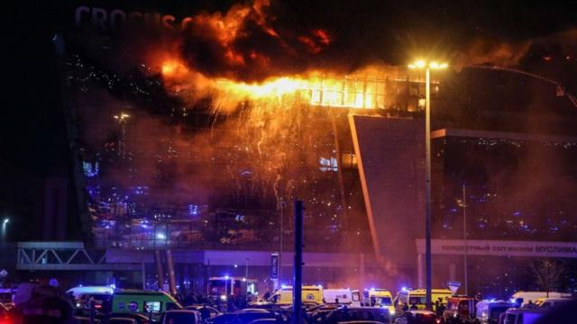
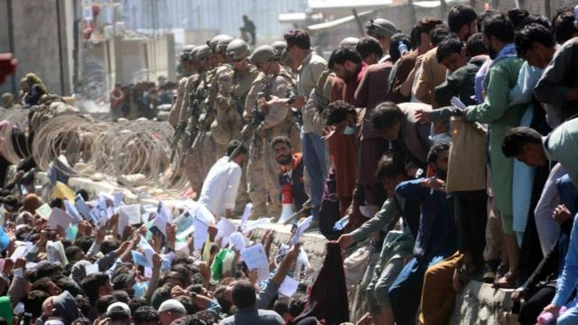
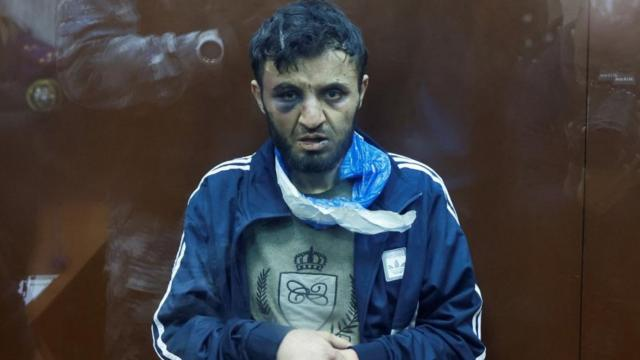
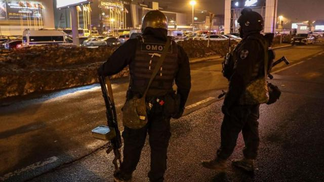

# [World] IS-K：莫斯科袭击案背后凶嫌与俄罗斯有何冤仇？

#  IS-K：莫斯科袭击案背后凶嫌与俄罗斯有何冤仇？

  * 弗兰克·加德纳（Frank Gardner） 
  * BBC安全事务记者 

> 图像来源，  EPA

**尽管俄罗斯总统普京和俄罗斯国家媒体试图将上周五莫斯科音乐厅致命袭击的责任归咎于乌克兰，但有关圣战组织IS- K的更多细节正在浮出水面，该组织声称对袭击负责。**

##  IS-K是什么组织？是什么人？

IS-K是伊斯兰国组织呼罗珊分支（Islamic State-Khorasan）的缩写。它是遭到全球禁止的的恐怖活动组织“伊斯兰国”（Islamic State group）在阿富汗、伊朗和巴基斯坦的分支机构。

该组织给自己起了呼罗珊这个名字，因为它是横跨这些国家的古伊斯兰帝国的组成部分，其地域还向北延伸至中亚地区。

IS-K已经存在了9年，但最近几个月，它已经成为伊斯兰国组织中最危险的分支，影响范围广泛并以极其野蛮和残忍而闻名。

与该组织在叙利亚和伊拉克的残余领导层一道，IS-K渴望建立一个泛民族的伊斯兰哈里发国，通过对伊斯兰教法的极端严格解释来进行统治。

在阿富汗，它正在发动零星但仍然致命的叛乱，反抗该国的统治者塔利班，因为它在意识形态上反对塔利班。

##  IS-K之前发动过袭击吗？

2021年，该组织在混乱的喀布尔机场撤离现场制造了一起自杀式炸弹袭击，造成170名阿富汗人和13名美国军人死亡。

次年，该组织袭击了俄罗斯驻喀布尔大使馆，造成至少6人死亡，多人受伤。

> 图像来源，  EPA
>
> 图像加注文字，炸弹在等待登上撤离飞机离开喀布尔的人群中引爆，造成100多人死亡。

该组织还曾经进行了无差别袭击，对象包括产科病房、公交车站和警察。

今年1月，IS-K在伊朗克尔曼的一处神社发动了连环爆炸袭击，造成近100名伊朗人死亡。

该组织在俄罗斯实施过多次小规模袭击，最近一次是在2020年。今年，俄罗斯联邦安全局(FSB)表示，他们已经阻止了几起恐怖行动阴谋。

##  枪手是谁？

据俄罗斯官方媒体报道，被捕和指控的四名男子都是来自中亚的塔吉克斯坦共和国的塔吉克人，该国曾经是苏联的一部分。

从他们在法庭上遍体鳞伤的样子可以明显看出，他们受到了十分严厉的审讯，甚至是酷刑。

但这样做的问题是，根据国际惯例，他们的忏悔将毫无价值——人们为了免受酷刑会说任何话，包括承认一个完全不真实的叙述。

> 图像来源，  Reuters
>
> 图像加注文字，其中一名嫌疑人米尔佐耶夫(DalerdzhonMirzoyev)在出庭时有明显伤痕。

有报道称，有人曾看到其中一名男子在3月初对该场馆进行侦察。当时美国警告俄罗斯，公共场所即将面临恐怖袭击的威胁——克里姆林宫将这一警告斥为“政治鼓吹”。

还有报道称，至少有两名袭击者近期抵达俄罗斯，这意味着这是IS-K派出的“暗杀小组”，而不是潜伏在当地的居民。

##  为什么他们要针对俄罗斯？

这其中有许多原因。

IS- K把世界上大部分国家都视为敌人。俄罗斯名列前茅，美国、欧洲、以色列、犹太人、基督徒、什叶派穆斯林、塔利班以及所有穆斯林占多数的国家的统治者也名列其中，他们称之为“叛教者”。

伊斯兰国对俄罗斯的敌意可以追溯到上世纪90年代和本世纪初的车臣战争，当时莫斯科军队扫荡了车臣（Chechen）首都格罗兹尼（Grozny）。

最近，俄罗斯卷入了叙利亚内战，支持其盟友巴沙尔·阿萨德（Bashar al- Assad）总统，俄罗斯空军对反对派和平民目标进行了无数次轰炸，杀死了大量伊斯兰国组织和与基地组织（Al Qaeda）有联系的武装分子。

在阿富汗，IS-K视俄罗斯为塔利班的盟友，这也是他们在2022年袭击俄罗斯驻喀布尔大使馆的原因。

他们还对苏联从1979年到1989年在该国长达10年的残酷占领怀恨在心。

然后就是俄罗斯国内状况。

IS-K认为俄罗斯是一个基督教国家，他们在莫斯科袭击事件后发布的视频谈到了杀害基督徒的相关内容。

因为俄罗斯联邦安全局试图阻止恐怖袭击，所以塔吉克人和其他中亚国家的移民工人有时会受到安全局一定程度的骚扰和怀疑。

最后，俄罗斯——正忙于与邻国乌克兰的全面战争——可能被IS-K视为一个容易攻击的目标。因为那里有武器，而且敌人（指俄罗斯）的警惕也下降了。

##  还有什么我们不知道的？

关于整个事件还有许多未解之谜。

例如，为什么枪手可以好不紧张地在克罗库斯市政厅周围随意游荡近一个小时?

在一个警察和特种部队，尤其是俄罗斯联邦安全局势力无处不在的国家，这些枪手表现得好像他们知道自己不会被特警打断。

> 图像来源，  EPA
>
> 图像加注文字，俄罗斯庞大的安全部门并没能阻止这次袭击。

还有武器（问题）——不只是手枪，还有威力强大的现代自动突击步枪。他们是怎么获得这些武器并且偷偷带进会场的?

他们被（俄罗斯）逮捕的速度之快也令人惊讶。

与许多参与此类突袭的圣战武装分子不同，这些人没有穿自杀背心或腰带，不像那些宁愿死也不愿被捕的人那样。

然而，没过多久，俄罗斯当局——也就是没能阻止20年来最严重的恐怖阴谋在他们眼皮底下展开的俄罗斯当局——就围捕到了嫌疑人，并对他们进行审判。

所有这些都促使一些分析人士猜测，这是克里姆林宫的某种所谓“内部工作”，或者一场嫁祸行动，目的是争取民众对乌克兰战争的支持。

然而，并没有确凿的证据支持这一猜测，美国情报部门已经证实，在他们看来，伊斯兰国才是这次可怕袭击的幕后黑手。

