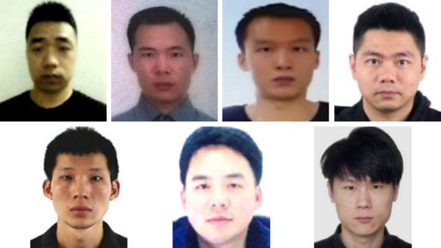
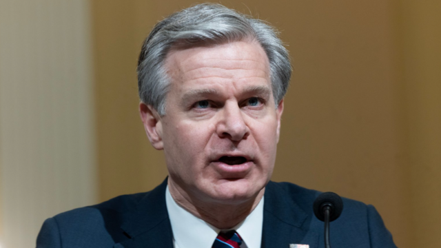
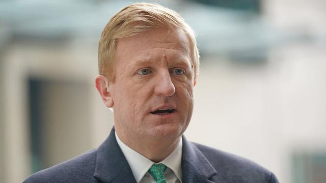

# [World] 英美指控七名“中国黑客”长期“恶意”实施网络攻击

#  英美指控七名“中国黑客”长期“恶意”实施网络攻击

> 图像来源，  US Department of Justice
>
> 图像加注文字，七名中国男子被控实施大规模“恶意”网络攻击活动。美方声明说，这七位中国公民分别是：38岁的倪高彬、34岁的程锋（Cheng Feng）、34岁的熊旺（Xiong Wang）、38岁的孙小辉（Sun Xiaohui）、38岁的彭耀文（Peng Yaowen）、38岁的赵光宗和37岁的翁明（Weng Ming）。

**英美两国先后指控中国是针对其议员、选举委员会、政府部门和官员等所谓“恶意”网络攻击的幕后黑手。**

英国副首相表示，英国及其国际合作伙伴将揭露中国“持续性敌对活动的模式”，并宣布制裁两名中国公民和一家公司。

英国副首相奥利弗·道登（Oliver Dowden）说，他们企图获取那些批评中国政府的议会议员的详细信息，以及4000万选民的数据。

中国驻英国大使馆表示， 这些说法“毫无根据”，属于“恶意中伤”  。

被英国制裁的两名中国公民是赵光宗（Zhao Guangzong）和倪高彬（Ni Gaobin），被制裁的企业是武汉晓睿智科技有限公司，英国政府称该公司为中国国家有关的网络间谍组织“APT31”工作。

英国的制裁措施包括，冻结其资产，禁止英国公民和企业处理其资金或资源。旅行禁令也将阻止他们进入或留在英国。

美国已宣布，在纽约面临共谋入侵计算机和共谋电信诈骗刑事指控的七人小组中也有这两名中国公民。

本周一，美国司法部和联邦调查局（FBI）表示，数百万美国人的在线账户卷入了一场针对美国官员的“邪恶”中国黑客阴谋。

七名中国公民被指控实施了广泛的网络攻击活动。他们被指控与一项长达14年的黑客行动有关。 美国国务院宣布悬赏1000万美元征集有关这七人的信息  。

美方声明说，这七位中国公民分别是：38岁的倪高彬、34岁的程锋（Cheng Feng）、34岁的熊旺（Xiong Wang）、38岁的孙小辉（Sun Xiaohui）、38岁的彭耀文（Peng Yaowen）、38岁的赵光宗和37岁的翁明（Weng Ming）。
 美国财政部  声明说，正如美国国家情报总监办公室最新年度威胁评估所强调的那样，“中国政府支持的恶意网络行为体仍然是对美国国家安全构成的最大、最持久的威胁之一”。

该声明还指出，“高级长期威胁”（APT）是一种复杂的网络参与者或组织，有能力进行高级且持续的恶意网络活动，其目标通常是保持对受害者网络的持续访问。

据美国国务院称，“高级长期威胁31”（缩写：APT31）是一群“由中国支持的情报人员与合同黑客组成的团体，他们为国家安全部的垂直管理机构湖北省国家安全厅进行恶意网络侵入行动” 。

除了英美，新西兰国防部长朱迪斯·柯林斯（Judith Collins）称，名为“APT40”的由中国国家支持的组织是黑客活动的幕后黑手。但新西兰表示不会实施制裁，因为这不是政府立法议程的一部分。

##  发生了什么？

美国司法部称，黑客的目标是美国和外国的中国批评者、企业和政治家。

据称，这七人寄送了一万多封“恶意电子邮件，影响了多个大洲的成千上万名受害者”，司法部称这是在中国政府支持下的“多产的全球黑客行动”。

> 图像来源，  EPA
>
> 图像加注文字，联邦调查局局长克里斯托弗·雷（Christopher Wray）

Skip podcast promotion and continue reading

* BBC 時事一周 Newsweek (Cantonese)   **

BBC國際台粵語節目，重溫一周國際大事，兩岸四地消息，英國境況。並備有專題環節：〈記者來鴻〉、〈英國生活點滴〉和〈華人談天下〉。

分集

End of podcast promotion

美国联邦调查局局长克里斯托弗·雷（Christopher Wray）说：“今天的声明揭露了中国不断蛮横地破坏我们国家的网络安全，并以美国人和我们的创新为目标。”

他补充说：“只要中国继续以美国和我们的合作伙伴为目标，联邦调查局就将继续发出明确的信息：网络间谍活动是不能容忍的，我们将不懈地追捕那些威胁我们国家安全和繁荣的人。”

中国驻华盛顿大使馆发言人说，“在没有有效证据的情况下，相关国家妄下结论”，“提出毫无根据的指控”。

美国检察官在起诉书中列出了对这七名中国男子的指控，称黑客行为导致工作账户、个人电子邮件、在线存储和电话通话记录被证实或可能泄露。

他们被指控向目标发送的电子邮件通常看起来像是来自知名新闻机构或记者，其中包含隐藏的跟踪链接。如果某人打开了发送给他的电子邮件，他的信息（包括位置和 IP 地址）就会被发送到据称由七名被告控制的服务器上。

美国检察官说，这些信息随后被用来进行更“直接和复杂的有针对性的黑客攻击，如侵入收件人的家庭路由器和其他电子设备”。

除了针对在白宫和美国国务院工作的美国政府官员，有时还针对他们的配偶，据说他们还针对全球的外国持不同政见者。

在美国司法部引用的一个例子中，这些人“成功地用相同的恶意软件攻击了香港民主活动人士及其在香港、美国和其他外国地点的同伙”。

美国公司也遭到黑客攻击，据称这些人的目标是国防、信息技术、电信、制造和贸易、金融、咨询、法律和研究行业。

司法部表示，目标公司包括为美国军方提供服务的国防承包商和“一家领先的5G网络设备供应商”。

在英国，2021年8月至2022年10月间对英国选举委员会的网络攻击是英国历史上最重大的攻击之一。

不仅包含人名和地址的数据库被访问，其“控制系统”和选举官员之间的敏感电子邮件也在六次补选中被访问。

不过，道登表示，选举安全并未受到损害，“通常不会对受影响者造成风险”。

受到攻击的议员都是“跨国议会对华政策联盟”（IPAC）的成员，该联盟负责审查并经常批评中国政府的活动。

前英国保守党领袖伊恩·邓肯·史密斯爵士（Sir Iain Duncan Smith）、前保守党教育部长蒂姆·劳顿（Tim Loughton）和苏格兰民族党议员斯图尔特·麦克唐纳（Stewart McDonald）都曾受到试图影响外国政要的组织的骚扰、黑客攻击和假冒。

##  英方反应

道登说，“英国不会容忍恶意网络活动。保护我们的民主制度和价值观是英国政府的首要任务。”

道登补充说，中国大使将被召见，“对中国在这些事件中的行为负责”。

麦克唐纳说，英国的反应就像“拿着木勺去打枪战”。

三位议员都呼吁英国更进一步，发出明确信息，将中国定为“威胁”。

伊恩·邓肯·史密斯爵士呼吁对中国政府行为者实施更多制裁，但他也称这一声明是“一个分水岭，英国在此刻为人权和基于规则的国际体系表明了立场”。

他说，一个被称为“战狼”的中国政府支持者一直在冒充他发送电子邮件，谎称他已经改变了对中国政府的看法。

中国应被列入新的外国影响力登记计划的“顶端”，这将加强对中国政府支持的英国行动的审查。

伊恩爵士说：“西方必须清醒地认识到，这是对我们生活方式的挑战。”

“我们对民主、人权、言论自由、信仰自由的信念受到了挑战。这些都是我们所珍视的东西，但我们似乎不愿意去捍卫这些东西，以对抗那些不具备这些美德和价值观并想夺走我们的东西的人。”
 伊恩爵士和劳顿因揭露维吾尔族穆斯林侵犯人权而被中国制裁的九名英国公民之一  。

劳顿警告说，中国“也在试图影响选举和民主”。

他说：“我们需要采取更有力的行动来向中国表明，这是绝对不可接受的，会有后果，而且这些后果会得到落实。但目前还没有。”

工党表示将支持政府打击试图“干涉或破坏选举进程”的国家行为者。

> 图像来源，  PA Media
>
> 图像加注文字，英国副首相奥利弗·道登（Oliver Dowden）

道登认为，“捍卫民主”特别工作组——一个追踪选举威胁的委员会——指出了网络行动背后与中国有关联的组织和个人。

制裁与中国有关联的组织使中英两国外交紧张局势的升级。

这标志着与几年前相比发生了重大变化，当时英国领导人的目标是开创与中国的 “黄金时代”。当时的首相是大卫·卡梅伦（David Cameron），他现在是外交大臣。

周一，卡梅伦勋爵在1922委员会的一次会议上向约40名保守党国会议员和议员做了约一个小时的简报，其中一人形容这是一次“世界之旅”。

几位议员认为，在复活节休会前的最后一次会议上，英国投票支持联合国安理会加沙问题决议的决定比与中国的关系得到了更多的讨论。

一位国会议员在会外告诉记者，卡梅伦勋爵曾表示，自从他作为首相实行与中国加强接触的政策以来，情况已经发生了变化。

然而，工党表示，卡梅伦勋爵作为英中投资基金副总裁的角色也应受到调查，以防他被选中“为中国投资以及更广泛的中国品牌提供背书”。

去年8月，选举委员会承认受到攻击，称“敌对分子”获取了选民登记册副本，并侵入了委员会的电子邮件和“控制系统”，但补充说，这既没有对任何选举造成影响，也没有对任何人的登记状态造成影响。

此后，选举委员会已采取措施确保其系统免受未来活动的影响。

中国驻英国大使馆在一份声明中驳斥了英国关于中国参与其中的说法， “英国毫无根据地炒作所谓‘中国网络攻击’并宣布制裁，是彻头彻尾的政治操纵和恶意中伤”，“我们没有兴趣也没有必要干涉英国内政”。

声明还说，中国敦促英国“立即停止散布有关中国的不实信息”。

英国政府对中国间谍活动和议会干预的担忧一直在上升。

2023年9月，一名议会研究员根据《官方保密法》被捕，罪名是为中国从事间谍活动。

而在一年前，针对 英国律师克里斯蒂娜·李（Christine Lee）  的活动发出了不寻常的议会干预警报。

英国政府强调，近年来已以国家安全为由拒绝或削减了中国投资在基础设施领域的份额。

_BBC记者萨姆·弗朗西斯_ _（_ _Sam Francis_ _）、_ _詹妮弗·麦基南_ _（Jennifer McKiernan）和马蒂亚·布巴洛（Mattea Bubalo）报道。_

