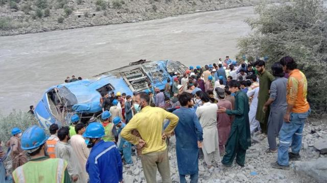
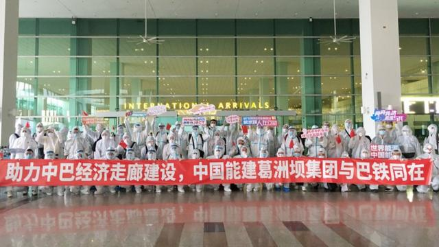
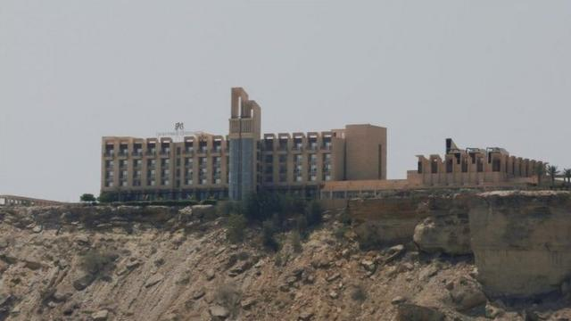

# [World] 中巴经济走廊：中国人为何成为袭击目标？谁组织了这些袭击？

#  中巴经济走廊：中国人为何成为袭击目标？谁组织了这些袭击？

  * 萨哈尔·伯路杰(SaharBaloch) 
  * BBC乌尔都语 

> 图像来源，  Getty Images
>
> 图像加注文字，3月26日发生的自杀式炸弹袭击现场。此次袭击共导致5位中国公民和1名巴基斯坦司机丧生。

**截至目前，还没有组织声称对周二（3月26日）发生在巴基斯坦开伯尔-普赫图赫瓦省（Khyber Pakhtunkhwa）贝沙姆（Besham）地区的针对中国工程师的袭击事件负责。巴基斯坦和中国都已宣布这是一个恐怖主义事件。**

当地警方称，五位中国公民和一位巴基斯坦籍司机在此次袭击中丧生。巴基斯坦政府对此表示强烈谴责，总理夏巴兹·谢里夫（Shahbaz Sharif）在与中国外交官会面时表示哀悼。中国政府要求对此次事件进行调查。

这已不是巴基斯坦的武装力量第一次袭击“中巴经济走廊”（CEPC，China-Pakistan Economic Corridor）的中国工程师和相关人员。

现在的问题是，谁在针对巴基斯坦的中国官员或工人？他们又为什么要这样做？

需要注意的是，中国在巴基斯坦投资了620亿美元，用于建设道路、水坝、管道和港口等项目。

2021年，一辆载有中国工程师的巴士在达苏项目（Dasu Project）附近遭到袭击，此事与在巴基斯坦和中国境内被取缔的巴基斯坦塔利班组织(TTP，Tehreek-e-TalibanPakistan)有关。13人在此次袭击中丧生，其中9人为中国公民，两名被告因此被判处死刑。

达苏项目是在中巴两国签署协议建设的一处水坝，这已是该项目中方人员第二次遭受到袭击。

##  巴基斯坦塔利班声称与袭击无关

> 图像来源，  Getty Images
>
> 图像加注文字，巴基斯坦塔利班已与此事划清界限。巴当局称此次事件为自杀式恐怖袭击，但尚未归咎任何一个组织。汽车在被袭后坠入了山谷。

在周二的袭击事件发生几个小时后，巴基斯坦塔利班便与此次事件划清界限。巴基斯坦当局称此次事件为自杀式恐怖袭击，但尚未归咎任何一个组织。

香拉（Shangla）区是开伯尔-普赫图赫瓦省马拉坎德（Malakand）的一部分。3月26日的袭击发生在香拉区的比沙姆。被袭汽车最终翻进了山沟。

巴基斯坦警方表示，袭击发生时，中国工程师正乘车从伊斯兰堡去往工作地达苏水坝。警方进一步表示，该地区与吉尔吉特-巴尔蒂斯坦接壤。

早些时候针对在巴中国工人的一些袭击中，有两个组织曾声称负责：俾路支极端分子（Baloch extremists）和极端组织“伊斯兰国”（Islamic State）。

> 图像来源，  Anadolu Agency / Getty Images
>
> 图像加注文字，2021年7月，一辆客车发生爆炸之后翻下河谷，车上多名在巴基斯坦开伯尔—普赫图赫瓦省的水坝工作的中国公民死亡。

2022年4月，一名女性自杀式袭击者在卡拉奇大学的中文中心前引爆炸弹，三名中国教师遇害。这次袭击发生后，当地官员们曾表示，中巴经济走廊项目被搁置了一段时间。

中巴经济走廊项目的发言人曾告诉BBC，中国公民，特别是那些与此类项目有关的公民，在2022年袭击事件发生后被送回了国。项目还在继续，但已经决定减少这类人手。

但时任巴基斯坦规划和发展部联邦部长阿赫桑·伊克巴尔（Ahsan Iqbal）称并没有接到此类信息，中国仍在规划新项目并且愿意继续。

阿赫桑·伊克巴尔曾对BBC表示，“情报部门被前政府用作政治目的，并最终导致这些极端行为的增加。”

他说：“现在其中一个最主要的问题是我们应该做什么来保证安全。中国政府曾说他们会安排自己的安保措施，但在情况改善后，巴基斯坦军队又重新参与进来。”

分析师扎伊汉·汗（Zaigham Khan）也提出了关于如何保障中国工程师在公共场合工作时的安全这一问题。

他说，中巴经济走廊项目启动时，对俾路支（Balochistan）省沿海地区和吉尔吉特-巴尔蒂斯坦（Gilgit- Baltistan）北部地区作出了很多难以兑现的承诺。

> 图像来源，  Getty Images
>
> 图像加注文字，即使在新冠疫情期间，也有中国工程人员前往巴基斯坦从事项目建设。2020年7月，中国葛洲坝集团工程师和其他工作人员乘机抵达伊斯兰堡机场。

##  袭击者“仇视”中国的原因

中国正通过“中巴经济走廊”合作，投资620亿美元用于巴基斯坦的道路、农业、电力和水利项目建设。

“中巴经济走廊”是中国“一带一路”倡议的重要组成部分，于2013年由巴基斯坦穆斯林联盟（谢里夫派）（PML-N）政府启动。

具体计划被称为“一加四”，即“一个中巴经济走廊”和旗下“四大项目”：瓜达尔港、能源、通讯系统以及工业区升级。

> 图像来源，  Reuters
>
> 图像加注文字，2019年5月瓜达尔港口附近的"珍珠大陆酒店"曾遭到俾路支分离主义武装的袭击。

前总统穆沙拉夫（Pervez Musharraf）2006年与中国签署了谅解备忘录，其中涉及约50个项目。

俾路支省首席部长的前顾问凯撒·孟加拉（Qaiser Bengali）博士说，相比于计划，这更像是一个愿景。很明显，工作不可能在这些谅解备忘录下完成。

分析师扎伊汉·汗说，俾路支极端分子担心中国的项目会破坏该地区的人口现状和稀缺的本地资源，担心这些资源将被移交给那些不属于本省的人。因此，该组织持续将中国工人作为目标。

另一方面，扎伊汉·汗表示，吉尔吉特-巴尔蒂斯坦和科希斯坦交界区域存在对中国的仇视。这与中国在新疆对穆斯林的虐待相关。

他说，伊斯兰国组织想要制造混乱，为自己营造空间。它想通过攻击中国来实现这一目标。由于在中国发生的针对穆斯林的事件，它能够在当地获得同情。

在一份声明中，中国政府敦促巴当局对巴基斯坦境内的武装分子采取行动。巴基斯坦外交部和军方在各自的声明中警告称，所有这类组织都想破坏巴中关系。

扎伊汉·汗认为，巴政府这次将采取严厉行动。在巴基斯坦的中国居民经常遭到袭击，如果这种情况持续，包括中国在内的一些在巴基斯坦投资的国家将撤走。

由于目前还没有组织声称对此次袭击负责，一些观察人士还认为，没有正式隶属于任何被禁组织的“个人圣战分子”可能是幕后黑手。

##  “个人圣战分子”可能涉入这场袭击

长期关注极端组织的记者马苏德（Ehsanullah Tipu Mehsud）说，除了一些圣战组织，一些“个人圣战分子”也可能被动员去执行具体任务。

他说，在开伯尔-普赫图赫瓦省，一些圣战组织与巴基斯坦塔利班还有一些独立组织有关联。

在巴基斯坦，针对中国公民的两起最严重袭击都发生在开伯尔- 普赫图赫瓦省。一起发生在2021年，目标是在达苏水电站项目工作的9名中国工程师和其他工人，另一起就是发生在比沙姆的最新袭击。

马苏德说，“没有任何组织声称对这两起袭击负责，被取缔的巴基斯坦塔利班也和最近这次袭击撇清了关系。我原本预计这可能是伊斯兰国呼罗珊组织（Islamic State of Khorasan）的行动，但到目前为止，他们还没有发表声明承担责任。”

马苏德认为，被怀疑参与这次袭击的人是个人圣战分子。这些人过去与圣战组织比如巴基斯坦塔利班或在印度次大陆的基地组织有联系。如今他们独立运作并承接袭击任务，随后招募自杀式炸弹袭击者并执行袭击。

