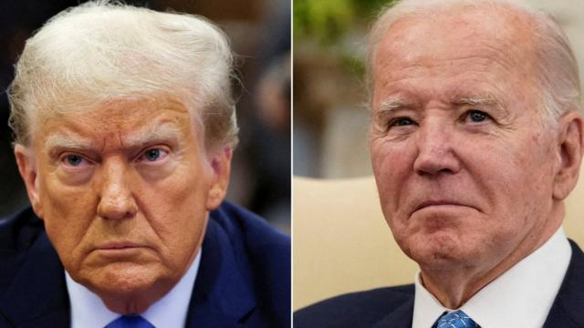
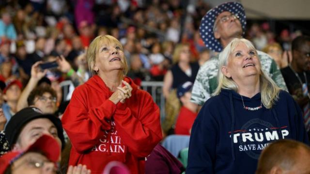

# [World] 美国大选：特朗普转发“五花大绑拜登”图案 被民主党人批评“煽动政治暴力”

#  美国大选：特朗普转发“五花大绑拜登”图案 被民主党人批评“煽动政治暴力”

> 图像来源，  Reuters

**美国前总统特朗普（Donald Trump）因在社交媒体上分享支持者制作的一段影片，其中一个画面是一辆货车的后车门上画着现任总统拜登（Joe Biden）被绑住手脚平躺的图像，引发拜登团队批评。**

拜登竞选团队指责特朗普为了11月的总统大选“经常煽动政治暴力”。

特朗普竞选团队的一位发言人则表示，民主党人一直在呼吁对特朗普采取“恶劣的暴行”。

特朗普上周五（3月29日）在社交媒体平台Truth Social上分享了这段影片。字幕显示，影片是在纽约长岛拍摄的，当时特朗普参加完一位在交通检查时被杀的一名纽约市警察的追悼会。之后，影片显示了两辆经过的卡车，都覆盖着美国国旗和支持警察的旗帜。但第二辆卡车上印有“特朗普2024”的字样，而车辆后部有一张拜登手脚被五花大绑的图像。

这段影片被转发后，立即引发拜登竞选团队抨击。拜登竞选团队发言人迈克尔·泰勒（Michael Tyler）说，特朗普经常煽动政治暴力，人们是时候认真对待这个问题：“问问1月6日为保护我们的民主而遭到袭击的国会大厦警察就知道了。”

他指的是特朗普前总统的支持者在特朗普无依据地声称2020年选举胜利被偷走后，他的支持者闯入国会大厦的事件。

但特朗普竞选团队的发言人史蒂芬·张（Steven Cheung）回应说：“那张图片是贴在一辆行驶在公路上的皮卡车上的。民主党人和疯狂的人士不仅煽动对特朗普先生和他的家人采取卑劣的暴行，他们还实际上正在将司法系统武器化，用来针对特朗普。”

事实上，这位共和党总统候选人面临四起刑事案件，其中选举破坏案和纽约封口费案最有可能在11月5日选举前审理。不过，特朗普在所有案件中都宣称无罪，并声称自己正在遭受政治迫害。

> 图像来源，  Getty Images

围绕车辆尾门图像的争议，是这两位总统候选人在选举前的一系列激烈交锋中的最新风波。

为了重返白宫，特朗普加大了他的言论尺度。他经常称那些因2021年1月6日美国国会暴动而被定罪的支持者是美国法律上的“人质”。

此外，他还因本月早些时候在俄亥俄州的一次讲话中发表的评论而遭致批评。当时特朗普警告说，如果他大选失败，美国将面临“大屠杀”。他是在谈到外国汽车进口对美国经济的影响时提到了这一点。

拜登竞选团队针对特朗普的出位发言紧追不舍，但特朗普指责民主党人和媒体将他的话断章取义。

